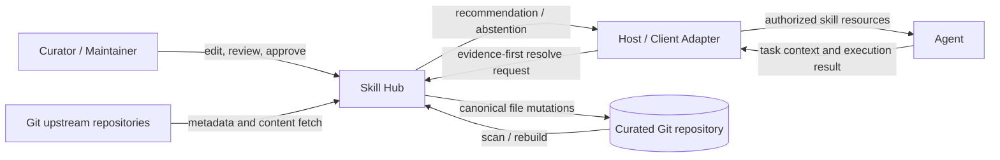
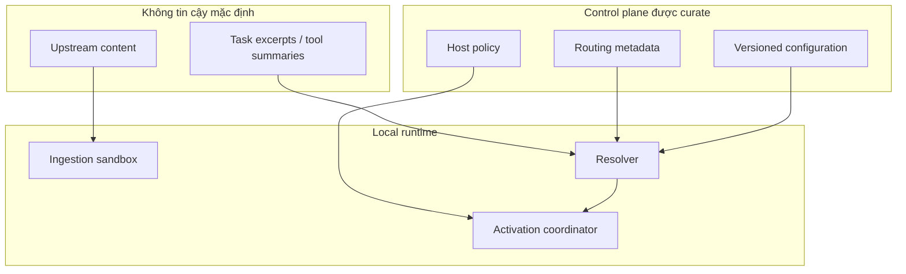
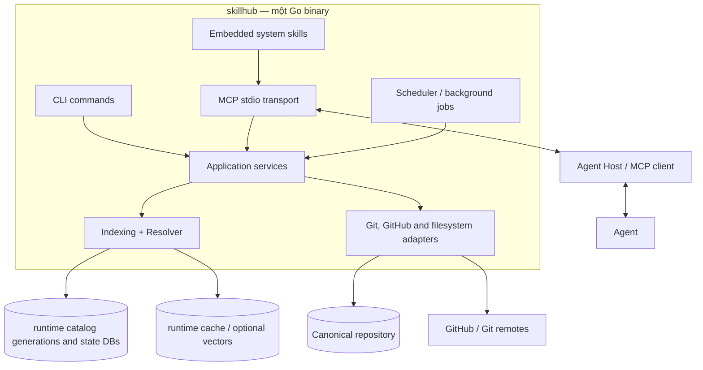
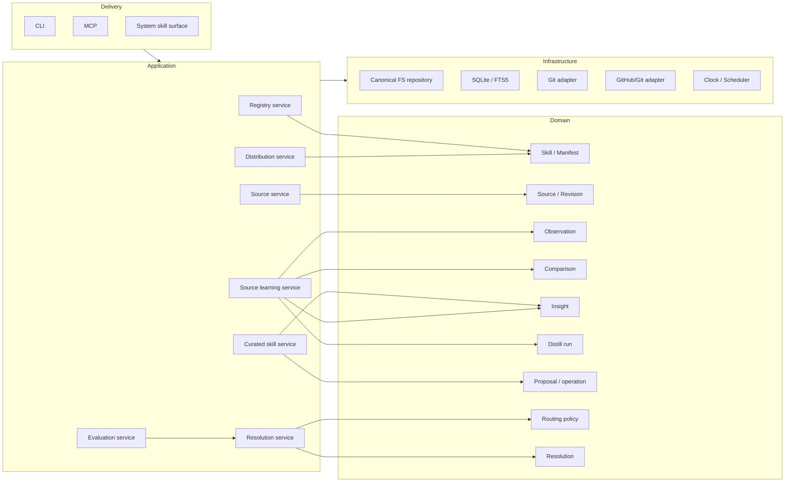
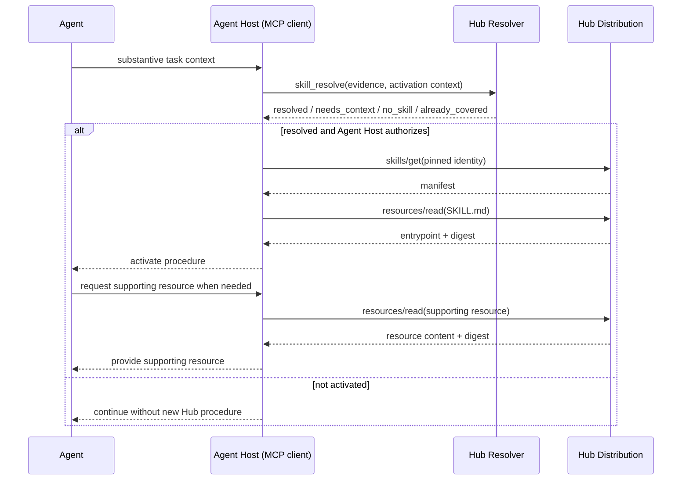
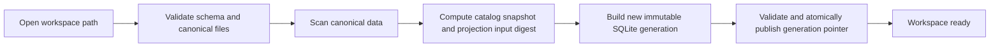
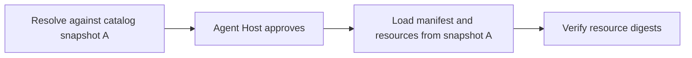
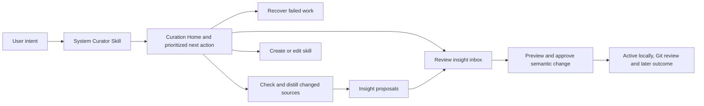
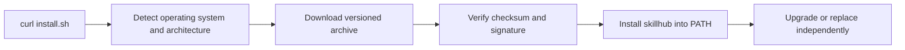
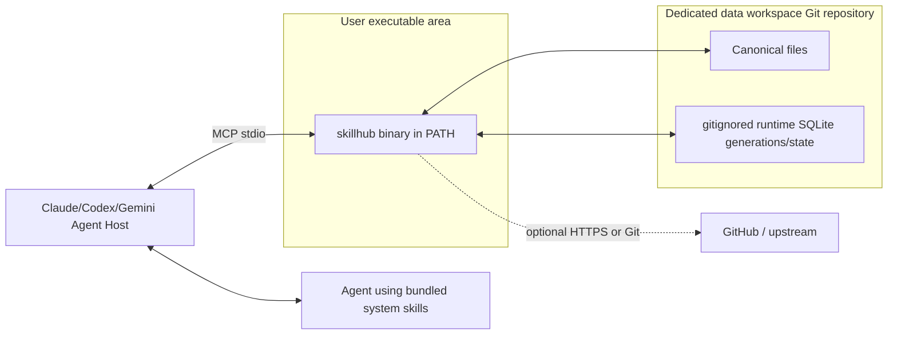

# Thiết kế hệ thống tổng thể — Curated Skill Hub

**Trạng thái:** Baseline architecture cho V1  
**Phạm vi:** Toàn bộ hệ thống, ranh giới module, dữ liệu, triển khai và công nghệ  
**Chi tiết liên quan:**

- [Agent ↔ Hub protocol](02-agent-hub-protocol.md)
- [Resolver](03-resolver-design.md)
- [Telemetry, reproducibility và evaluation](04-telemetry-reproducibility-evaluation.md)
- [Curation lifecycle](05-curation-lifecycle.md)
- [Source learning và distillation](06-source-learning-and-distillation.md)
- [Quyết định kiến trúc](../../final.md)

## 1. Mục tiêu kiến trúc

Skill Hub là một **hệ thống quản trị procedural knowledge được curate**, không chỉ là công cụ search qua MCP. Hệ thống phải:

1. Duy trì skill, provenance, lịch sử distill và routing policy trong Git.
2. Theo dõi nhiều upstream nhưng không tự ghi đè curated knowledge.
3. Rebuild toàn bộ operational state từ repository.
4. Tìm một procedure phù hợp mà không load toàn catalog vào context agent.
5. Phân phối skill theo progressive disclosure.
6. Chạy local, cài bằng một binary, không đòi Node/Python runtime.
7. Tách quyền **recommendation** của Hub khỏi quyền **activation** của host.

## 2. Nguyên tắc bất biến

| Nguyên tắc | Hệ quả thiết kế |
|---|---|
| Git owns durable knowledge | YAML/JSON/Markdown/skill files là canonical; DB có thể xóa |
| Filesystem-first mutation | Ghi canonical files thành công trước, rồi refresh index |
| Curated skill ≠ upstream | Upstream change tạo proposal/insight, không overwrite |
| Server owns Hub routing | Agent không học taxonomy hoặc rerank catalog bình thường |
| Host owns activation | Hub không tự thay procedure local/host-locked |
| Evidence before ontology | Request giữ task, constraints và facts thay vì rich semantic labels |
| Progressive disclosure | Resolve trước, activate, rồi mới load `SKILL.md` và resources cần thiết |
| Abstention is success | `no_skill` tốt hơn ép một skill không hữu ích |
| Reproducible policy | Metadata, weights, thresholds và eval cases đã duyệt nằm trong Git |

## 3. System context



### Trust boundaries



Upstream text, task text và skill content là **data**, không tự trở thành policy. Digest chứng minh integrity, không chứng minh nội dung an toàn.

## 4. Container view



**Modular monolith:** CLI và MCP gọi cùng application services. Bundled system skills là Agent-facing UX surface, version cùng binary và điều phối MCP tools; chúng không chứa domain mutation logic riêng. Web UI không thuộc V1.

## 5. Module view



### Trách nhiệm module

| Module | Trách nhiệm | Không được làm |
|---|---|---|
| Registry | Scan/validate skill, manifest, relationship, alias | Fetch upstream hoặc quyết định activation |
| Source | Intake, source adapters, revision/digest checks, snapshot tùy chọn | Sửa curated skill hoặc chạy semantic judgment |
| Source Learning | Distill runs, observations, comparisons, coverage, insight proposals | Apply proposal hoặc advance cursor trước finalize |
| Curation | Skill editing, insight decisions, approved apply, history/outcome | Auto-merge upstream |
| Indexing | Build SQLite/FTS/vector derived state | Sở hữu durable policy |
| Resolver | Retrieve, score, clarify, abstain | Activate skill hoặc tự đọc private workspace |
| Distribution | `skills/get`, resource manifest/read, digest pinning | Recommend bằng `skills/list` |
| Evaluation | Replay corpus, compare variants, publish reports | Online-learn hidden weights |
| Delivery | Validate transport, map errors/status | Chứa business logic riêng |

## 6. Agent ↔ Hub resolution và progressive loading

Đây là runtime path chính của sản phẩm: agent cung cấp task context, Hub recommend trong catalog, Agent Host quyết định activation, sau đó content mới được load theo nhu cầu.

**Agent Host (MCP client)** là ứng dụng đang vận hành agent và kết nối tới Skill Hub, ví dụ Claude Code, Codex CLI hoặc Gemini CLI. Nó quản lý tool calls, instruction hierarchy, permissions và procedure đang active. Một integration adapter có thể được cài bên trong Agent Host, nhưng không phải component trung gian bắt buộc và vì vậy không xuất hiện như một actor riêng.



Các ranh giới quan trọng:

- Hub sở hữu recommendation trong catalog nhưng không tự activate procedure.
- Agent Host kiểm tra policy, capability và local procedure đang active.
- Resolve response không chứa `SKILL.md`; manifest và content chỉ được đọc sau approval.
- Skill identity, manifest và resources phải được pin vào cùng catalog snapshot/digest.
- `no_skill` và `already_covered` là kết quả hợp lệ, không phải lỗi.

Chi tiết contract, state machine và error model nằm trong [02-agent-hub-protocol.md](02-agent-hub-protocol.md); thuật toán retrieval/ranking nằm trong [03-resolver-design.md](03-resolver-design.md).

## 7. Data workspace lifecycle và consistency

### 7.1 Ranh giới giữa binary và workspace

Binary và data workspace là hai artifact độc lập. Binary được cài vào PATH và không nằm trong workspace. Mỗi workspace là một Git repository riêng do `skillhub init` khởi tạo; repository này chỉ chứa dữ liệu, policy và cấu hình do hệ thống/người dùng quản lý.

Nâng cấp hoặc xóa binary không được ngầm sửa/xóa workspace. Thay đổi schema phải đi qua migration command có validate, preview và recovery rõ ràng.

> **Deployment note — V1:** Một machine/OS user **nên có một bản cài `skillhub` và một primary data workspace**. Tất cả Agent Host trên machine nên trỏ tới cùng workspace để chia sẻ một catalog, provenance và curated state thống nhất. Đây là topology mặc định, chưa phải hard restriction trong binary.
>
> “Một instance” ở đây là **một logical installation + một primary workspace**, không nhất thiết là đúng một OS process. MCP stdio có thể khiến nhiều Agent Host khởi chạy nhiều process `skillhub`; các process vẫn phải bind cùng workspace và tuân thủ read/write lock của workspace. Nếu sau này yêu cầu strict single-process, cần daemon mode hoặc IPC thay vì dựa riêng vào stdio.

### 7.2 Workspace repository layout

```text
skillhub-workspace/               # Git repository; không chứa skillhub binary/source
├── skills/<collection>/<skill>/
│   ├── SKILL.md
│   ├── skill.meta.yaml
│   ├── references/
│   ├── scripts/
│   └── assets/
├── sources/
│   ├── intake/<candidate-id>.yaml
│   ├── catalog/<source-id>.yaml
│   └── skills/<skill-id>.sources.yaml
├── distill/
│   ├── sources/<source-id>/
│   │   ├── observations/<observation-id>.yaml
│   │   └── runs/<run-id>.yaml
│   ├── comparisons/<comparison-id>.yaml
│   └── skills/<skill-id>/
│       ├── insights/<insight-id>.yaml
│       ├── incorporations/<incorporation-id>.yaml
│       └── outcomes/<outcome-id>.yaml
├── history/operations/<yyyy>/<mm>/<operation-id>.yaml
├── registry/
│   ├── collections/<collection-id>.yaml
│   ├── aliases.yaml
│   └── equivalences.yaml
├── config/
│   ├── recommendation.yaml
│   ├── telemetry.yaml
│   └── schemas/
├── evals/routing/
│   ├── cases/*.yaml
│   └── suites/*.yaml
├── .skillhub/
│   ├── schema-version           # tracked
│   └── transactions/            # gitignored crash-recovery WAL
└── runtime/                      # gitignored
    ├── catalog/
    │   ├── current.json
    │   └── generations/*.db
    ├── operational.db
    ├── telemetry.db
    └── cache/
```

### 7.3 Data ownership

| Data | Canonical | Derived/disposable |
|---|---|---|
| Skill content và metadata | Git files | Parsed rows, FTS documents |
| Source intake/current/distilled revisions | Git files | API response cache |
| Observations, comparisons và distill runs | Git files | Learning FTS/query index |
| Insights, incorporations, outcomes và decisions | Git files | Inbox query/index |
| Routing examples, policy, thresholds | Git files | Compiled scorer/index |
| Resource digests | Có thể rebuild; manifest release nên pin | Runtime lookup table |
| Operation receipts | Git files | SQLite lookup projection |
| Resolution/session events | Không | `runtime/telemetry.db` theo retention |
| Check/scheduler state | Không | `runtime/operational.db` |
| Eval reports | Có thể regenerate; summary được commit khi cần | Raw run artifacts |

### 7.4 Doctor, init, open và rebuild

`doctor` là entry point thống nhất cho diagnostics và remediation:

```text
skillhub doctor          → chỉ kiểm tra, không mutation
skillhub doctor --fix    → lập kế hoạch và áp dụng các fix được duyệt
```

First-time setup:

```bash
skillhub init ~/skillhub-data
skillhub --workspace ~/skillhub-data serve
```

`skillhub init ~/skillhub-data` là convenience shortcut vào toàn bộ `doctor --fix` flow và cung cấp workspace path mong muốn, tương đương về hành vi với:

```bash
skillhub doctor --fix --workspace ~/skillhub-data
```

Khi không truyền path, `skillhub init` dùng current directory (`.`); explicit path vẫn được hỗ trợ cho dedicated workspace.

Không nên shell-exec chính CLI; cả hai command gọi cùng application service và sinh cùng finding/fix IDs để test, telemetry và recovery nhất quán. Flow kiểm tra/sửa toàn bộ workspace, MCP client registration và bootstrap instructions; không có partial scope model trong V1.

Workspace fix phải:

1. Tạo directory nếu chưa tồn tại, hoặc chỉ chấp nhận directory rỗng/Git repository tương thích.
2. Từ chối ghi vào source checkout hay nested repository không được xác nhận rõ.
3. Chạy `git init` nếu target chưa là Git repository.
4. Tạo canonical skeleton, `.skillhub/schema-version` và `.gitignore` cho `runtime/` cùng `.skillhub/transactions/`.
5. Validate files vừa tạo rồi build/publish SQLite/FTS derived generation.
6. Không copy binary, source code hoặc frontend source vào workspace.
7. Không tự commit; người dùng/automation quyết định commit và remote Git.
8. Idempotent: chạy lại chỉ sửa finding còn tồn tại, không reset valid user data.

`doctor --fix` xử lý mọi finding có thể sửa theo dependency order: workspace trước, sau đó MCP registrations và bootstrap instructions. Nó phải preview plan/file diffs và yêu cầu confirmation trước mutation; automation dùng `--yes` một cách explicit. Nếu chưa có workspace path, interactive mode hỏi user, còn non-interactive mode yêu cầu `--workspace`.

Mở hoặc rebuild workspace có sẵn:



Mọi command data-oriented nhận `--workspace <path>`. Khi bỏ option, CLI có thể tìm workspace từ current directory đi lên tới `.skillhub/schema-version`, nhưng không tự scan home directory.

Để đồng bộ hoặc phục hồi trên máy khác, người dùng có thể clone **data workspace repository** rồi chạy `skillhub --workspace <path> rebuild`; đây không phải cách cài executable.

Acceptance:

- Xóa `runtime/` rồi rebuild phải phục hồi canonical knowledge và routing policy tương đương.
- Rebuild không cần network, trừ derived artifact optional được cấu hình rõ.
- Init/rebuild không tự commit canonical files.
- Binary upgrade không chạy migration ghi dữ liệu một cách ngầm định.

### 7.5 Version consistency — recommend version nào, load version đó



Mỗi resolution pin skill identity, manifest và resource digests vào một **catalog snapshot**. Snapshot phản ánh canonical content thực tế, kể cả thay đổi Git chưa commit; vì vậy không dùng riêng Git HEAD làm version.

Nếu snapshot/resource đã resolve không còn phục vụ được, Hub trả `snapshot_expired` để Agent Host resolve lại. Hub không lặng lẽ trả phiên bản mới hơn vì recommendation cũ có thể không còn đúng với content mới.

## 8. Curation lifecycle

Curation UX là status-first và intent-driven. Bundled System Curator Skill là primary interactive surface; CLI phục vụ operations, recovery và automation. User bắt đầu bằng “Curate Skill Hub của tôi”, không cần điều hướng domain entities.



Findings/observations, comparisons, revisions và coverage là evidence layer được mở theo nhu cầu hoặc khi có exception; user không phải review chúng trong normal path.

Các use case chính:

- tạo skill từ đầu hoặc từ source material;
- capture source candidate trước khi quyết định onboarding;
- thêm, pause, unlink và check upstream source;
- distill revision thành observations có evidence/coverage;
- compare nhiều sources trước khi tạo insight;
- plan/reject/apply/obsolete individual insights;
- review patch trước khi cập nhật skill, ledger và history;
- edit content hoặc routing metadata trực tiếp;
- deprecate/archive skill nhưng giữ provenance;
- xem canonical diff và tự quyết định Git commit.

Skill, source, distill run, observation và insight có lifecycle độc lập. Một skill `active` có thể đồng thời có source `changed`, failed run, tombstoned observations và insights `pending`.

Distill submission hợp lệ được binary auto-finalize và chỉ advance `last_distilled_revision` cùng observations, comparisons, coverage và run artifacts trong một logical mutation. User chỉ bị hỏi khi ambiguity/coverage issue blocking. Diff xác định affected scope nhưng evidence phải đọc từ current source revision.

Routine unchanged source checks chỉ cập nhật runtime operational state và không làm Git dirty. Revision change/human decision mới là canonical state.

Mọi approved/direct save đi qua staged write-ahead transaction: validate virtual result, ghi canonical files có recovery journal, build immutable SQLite generation rồi atomically publish generation pointer. Proposal chưa approved không ảnh hưởng skill đang được serve. Git commit là durability/sharing boundary, không phải publish gate của local runtime.

Authoritative transaction, recovery, operation receipt và database-generation semantics nằm trong [07-storage-and-mutation-model.md](07-storage-and-mutation-model.md).

User-facing surfaces, use cases, Git boundary và apply workflow nằm trong [05-curation-lifecycle.md](05-curation-lifecycle.md). Source adapters, observation/comparison model, run finalization, coverage, staleness và distillation rules nằm trong [06-source-learning-and-distillation.md](06-source-learning-and-distillation.md).

## 9. Deployment và executable lifecycle

### 9.1 Install và upgrade executable



```bash
curl -fsSL https://example.org/skillhub/install.sh | sh
skillhub version
skillhub doctor
skillhub doctor --fix
```

Installer chỉ quản lý executable và shell integration cần thiết; không tự tạo, tìm hoặc sửa data workspace. Sau install/upgrade, `doctor` phát hiện workspace/client integration còn thiếu hoặc không tương thích; `doctor --fix` là đường sửa chuẩn. Upgrade thay binary độc lập. Nếu binary mới yêu cầu workspace schema mới, command bình thường phải báo finding/migration cần thiết thay vì tự mutate dữ liệu.

### 9.2 V1 local



Binary không được đặt hoặc vendored vào data workspace. Process khởi động với một workspace path rõ ràng; canonical files và runtime DB của workspace đó không được ghi sang workspace khác.

Defaults:

- MCP qua stdio.
- System Curator Skill là interactive curation surface; CLI là recovery/automation surface.
- Không Web UI trong V1.
- Không telemetry network mặc định.
- Scheduler chỉ chạy trong `serve` hoặc bằng command/OS timer rõ ràng.
- Repository path explicit; không tự scan home directory.

### 9.3 Multiple workspaces — exceptional mode

Normal V1 deployment dùng một primary workspace cho mỗi machine/OS user. Khả năng chỉ định workspace khác được giữ cho development, test, migration, recovery hoặc isolation có chủ đích:

```text
skillhub --workspace ~/hub-primary serve
skillhub --workspace ~/hub-migration-test validate
```

Mỗi process/MCP session chỉ bind một workspace. Process lock, runtime DB, catalog snapshot và telemetry thuộc workspace tương ứng. Không có cross-workspace search, aggregation hoặc mutation ngầm trong V1.

Khi vận hành nhiều workspace, host configuration phải khai báo rõ client nào dùng workspace nào; hệ thống không tự chọn theo task. Đây là advanced/exceptional mode và không được làm suy yếu mặc định “một machine, một primary workspace”.

### 9.4 Future remote mode

Remote deployment cần authn/authz, tenant isolation, encrypted transport, redaction và không được giả định filesystem access. Đây không phải V1; protocol phải hoạt động khi không có workspace scan.

## 10. Quyết định công nghệ: Go

### 10.1 Quyết định

Dùng **Go** cho CLI, MCP server, scheduler, indexing và resolver. System skill definitions được `go:embed` vào binary và version cùng tool contracts. Release artifact là một executable được cài theo Section 9; build/runtime không cần Node/Python.

### 10.2 Vì sao Go thay vì Rust

| Tiêu chí V1 | Go | Rust |
|---|---|---|
| Một binary/cross-compile | Rất tốt | Rất tốt |
| Tốc độ phát triển service/CLI | Tốt hơn cho đội phổ thông | Learning/compile cost cao hơn |
| Startup và memory | Đủ tốt | Tốt nhất |
| Concurrency/jobs/MCP service | Đơn giản | Mạnh nhưng phức tạp hơn |
| SQLite pure runtime dependency | Có driver pure-Go | `bundled` tạo binary độc lập nhưng build phức tạp hơn |
| MCP ecosystem | Phải pin/test SDK | Cũng phải pin/test SDK |
| Curation/search bottleneck dự kiến | I/O + SQLite; Go đủ | Lợi thế chưa chứng minh |

Rust không bị loại vĩnh viễn. Chuyển/viết component Rust chỉ khi profiling cho thấy bottleneck native đáng kể hoặc đội ngũ đã chuẩn hóa Rust. Không chọn Rust chỉ vì kỳ vọng “nhanh hơn” khi workload chính là Git, filesystem và SQLite I/O.

### 10.3 Dependencies định hướng

- CLI/config: thư viện Go nhỏ, tránh framework nặng.
- SQLite: driver pure-Go để release không phụ thuộc CGO; kiểm thử FTS5 trên mọi target phát hành.
- YAML/JSON schema: strict decoding + explicit schema migration.
- Git: ưu tiên gọi `git` CLI với argument-safe process API cho operations phức tạp; có pure-Go fallback chỉ khi có lý do.
- MCP: dùng SDK/protocol implementation đã pin; interoperability tests quyết định feature support.
- System skills: embed immutable release assets; metadata pin tool API compatibility.

Không coi tên dependency là quyết định vĩnh viễn trước prototype/licensing review.

## 11. Security và operational constraints

- Chỉ cho phép repository protocol đã cấu hình; timeout và size limits.
- Normalize và containment-check mọi resource path; reject symlink/path escape.
- Không execute upstream script trong ingestion/distillation.
- Không log secrets, absolute paths hoặc source snippets mặc định.
- File permissions hạn chế cho DB/event logs.
- `install.sh` không thực thi binary trước khi checksum verification; hỗ trợ pin version và uninstall path rõ ràng.
- Release CI tạo SBOM, checksums và ký artifact khi hạ tầng cho phép.

## 12. Non-goals V1

- Microservices hoặc distributed database.
- Online-learning tự thay routing policy.
- Marketplace/public federation.
- Tự execute skill scripts.
- Tự merge upstream.
- Universal control đối với native/local skills của mọi client.
- Generated multi-skill procedural package.
- Server-side LLM bật mặc định.
- Web UI trong V1.

## 13. Quality attributes và budgets ban đầu

Các con số sau là **budget cần kiểm chứng**, không phải benchmark đã đạt:

| Thuộc tính | V1 target |
|---|---|
| Rebuild correctness | 100% canonical entities validate hoặc fail rõ ràng |
| Resolve availability local | Không phụ thuộc network trên normal path |
| Resolve p95 | ≤300 ms không embeddings/LLM, đo trên catalog mục tiêu |
| Startup | ≤2 s cho catalog đã index; rebuild là command riêng |
| Recommendation payload | Không chứa skill body trước activation |
| Clarification | Tối đa 1 vòng bình thường |
| Re-resolution | Tối đa 2 lần mỗi stable task scope |
| Supporting skills | Tối đa 2, on-demand |
| Installation | Binary cài vào PATH; data workspace Git riêng; không runtime Node/Python |

## 14. Các quyết định chưa freeze

- MCP SDK và mức tương thích `roots`/Skills extension theo từng client.
- Exact JSON Schema, enum và payload limits.
- Driver SQLite cuối cùng sau cross-platform/FTS benchmark.
- Có bật vector retrieval hay không.
- Retention mặc định cho local telemetry.
- Cách ký release và update channel.

Những điểm này không thay đổi ranh giới cốt lõi: Git-first, Hub-owned recommendation, host-owned activation và evidence-first request.
