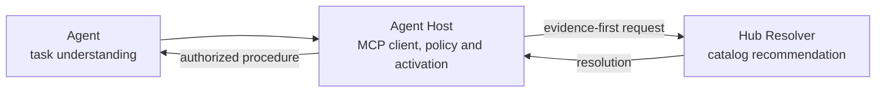
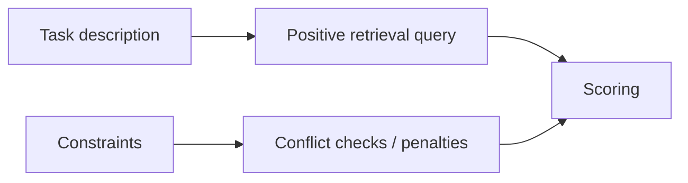
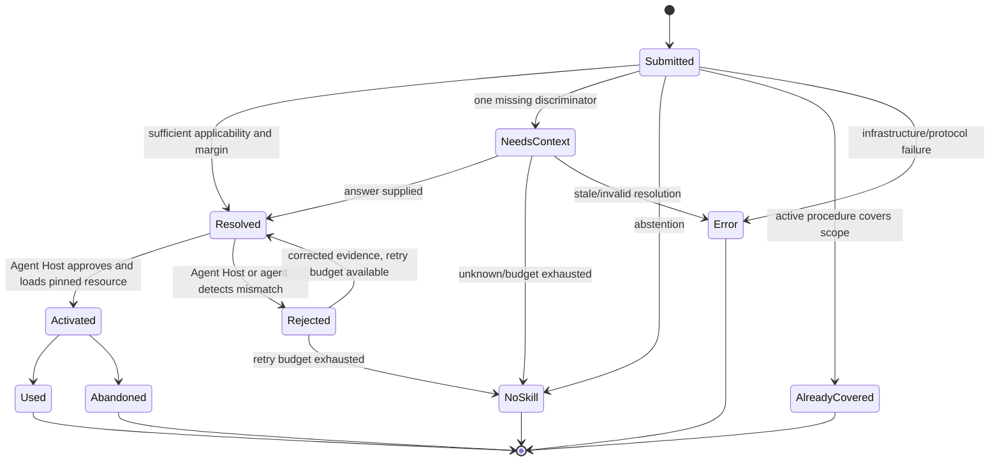
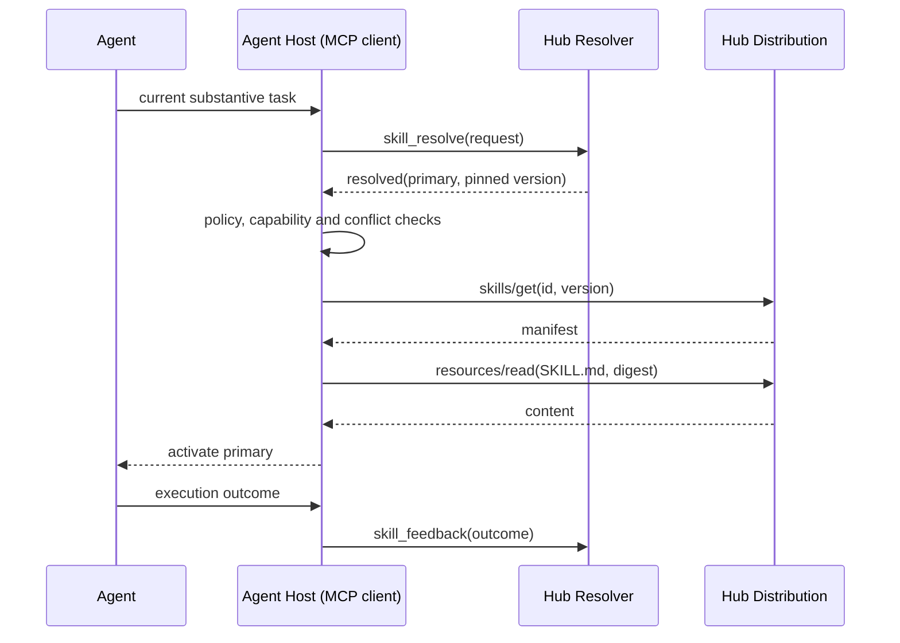
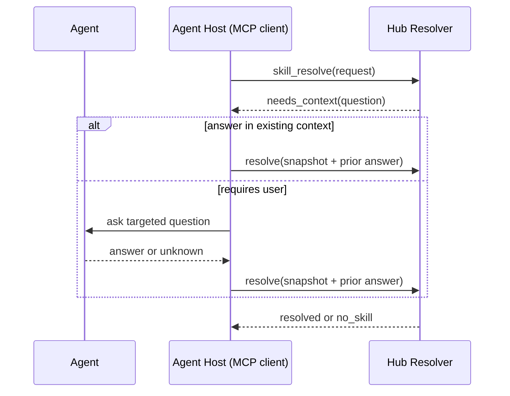
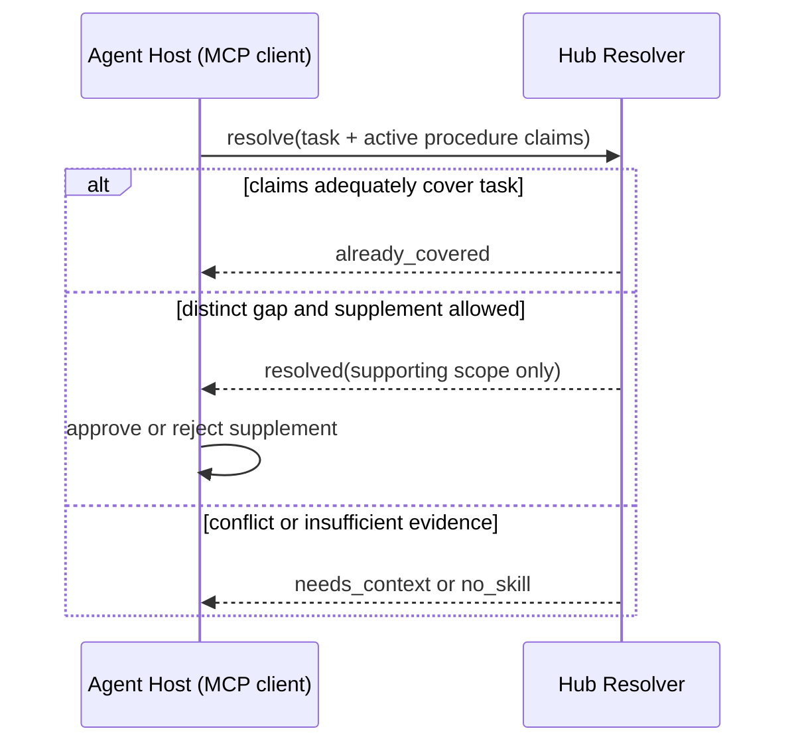
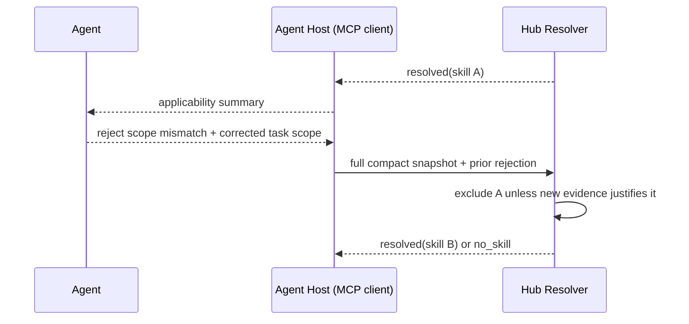

# Thiết kế giao tiếp Agent ↔ Skill Hub

**Trạng thái:** V1 protocol design; JSON Schema chính thức sẽ được sinh sau prototype  
**Phạm vi:** Resolve, clarification, activation coordination, distribution, feedback và lỗi  
**Phụ thuộc:** [Tổng thể](01-system-architecture.md), [Resolver](03-resolver-design.md), [Curation UX](05-curation-lifecycle.md), [Storage/mutation model](07-storage-and-mutation-model.md)

## 1. Mục tiêu

Protocol phải truyền đủ evidence để Hub recommend chính xác mà không:

- bắt agent biết taxonomy/catalog;
- gửi full conversation hoặc source code;
- cho Hub quyền activation vượt quá thông tin và quyền hạn của nó;
- buộc agent chọn giữa một shortlist trong normal path;
- load full skill trước khi Agent Host cho phép.

**Agent Host (MCP client)** là ứng dụng vận hành agent và kết nối tới Skill Hub, ví dụ Claude Code, Codex CLI hoặc Gemini CLI. Agent Host quản lý tool calls, instruction hierarchy, permissions và procedure đang active. Một integration adapter có thể tồn tại bên trong Agent Host nhưng không phải actor hoặc service bắt buộc của protocol.

Ranh giới trách nhiệm:



| Actor | Sở hữu |
|---|---|
| Agent | Context tác vụ, observed execution state, thực thi procedure |
| Agent Host | Instruction hierarchy, permissions, activation state, redaction và MCP calls |
| Hub | Hub catalog, retrieval/ranking, clarification, abstention và resource manifests |
| User | Goal, constraints và explicit choice trong giới hạn policy |

## 2. Bootstrap và invocation policy

### 2.1 Khi nào gọi resolver

Agent Host gọi `skill_resolve` thay mặt agent khi:

- bắt đầu một tác vụ substantive mới;
- operation/scope/constraint thay đổi đáng kể;
- procedure hiện tại bị reject do mismatch;
- cần kiểm tra Hub có procedure bổ sung trong delegated scope.

Không gọi:

- mỗi turn;
- mỗi file read/tool call;
- cho typo hoặc edit hiển nhiên không hưởng lợi từ procedure;
- chỉ vì một skill vừa được load và nội dung skill nhắc lại bootstrap instruction.

Resolution có `valid_for` để reuse. Prior `no_skill` cũng được reuse đến khi scope liên quan thay đổi.

### 2.2 Cài bootstrap instructions bằng `doctor`

V1 không giả định mọi Agent Host có native activation registry hoặc lifecycle hook. Hành vi gọi Hub và phối hợp procedure được hướng dẫn bằng một versioned bootstrap instruction trong instruction surface mà client hỗ trợ, ví dụ `AGENTS.md`, `CLAUDE.md`, `GEMINI.md` hoặc MCP client configuration.

Không có command `integrate` riêng. Quy ước vận hành là:

```bash
skillhub doctor
skillhub doctor --fix
```

`doctor` chỉ đọc và báo findings, gồm:

- MCP client đã đăng ký đúng `skillhub` binary và workspace chưa;
- bootstrap instruction đã tồn tại, đúng version và đúng scope chưa;
- có block cũ/trùng/conflict do Skill Hub từng tạo không;
- client capability nào có thật và capability nào chỉ chạy best-effort.

`doctor --fix` dùng cùng remediation engine để:

1. Trình bày plan và diff trước khi sửa client config hoặc instruction file.
2. Chỉ quản lý block có marker/version của Skill Hub; không rewrite phần prose do user sở hữu.
3. Yêu cầu confirmation cho file mutation; automation phải truyền `--yes` explicit.
4. Chạy idempotent và giữ thay đổi dễ review bằng Git diff khi file nằm trong repository.
5. Ghi rõ integration là native, adapter-backed hay instruction-only.

`skillhub init [path]` là convenience shortcut vào cùng toàn bộ remediation flow; khi bỏ qua `[path]`, current directory (`.`) được dùng làm workspace hint. Nó tương đương về hành vi với `skillhub doctor --fix --workspace <resolved-path>`. V1 không có `--scope`: một fix plan xử lý workspace, MCP registration và bootstrap instructions theo dependency order, sau khi user review/confirm.

Bootstrap block chính thức (từ `internal/hostintegration/bootstrap.go`) hướng dẫn Agent Host và Agent:

```markdown
<!-- skillhub:bootstrap:v1:start -->
## Skill Hub

For each new task, or when its operation, scope, or constraints change significantly, call the configured Skill Hub MCP tool `skill_resolve` before choosing a skill. Do not call it for trivial edits or on every turn. Follow at most one primary procedure for the current operation.

Send `task.description` in English; translate the user's request first if it is in another language.

When an activated skill response includes `local.path`, resolve the skill's relative file references (for example `scripts/…`) against that directory, and export the variables in `local.env` (`SKILLHUB_SKILL_DIR`, `SKILLHUB_STATE_DIR`, and `SKILLHUB_CONFIG_DIR`) whenever you run its `check`, `setup`, or scripts, using your shell's syntax (POSIX `export NAME=value`, PowerShell `$env:NAME = "value"`). If `local.path` no longer exists, for example in a long session, call `skill_get` again.

If `$SKILLHUB_CONFIG_DIR/env` exists, load it before running `check`, `setup`, or scripts (POSIX: `set -a; . "$SKILLHUB_CONFIG_DIR/env"; set +a`; PowerShell: set `$env:NAME` for each `NAME=value` line), and never print, echo, or log its values. If a required variable is missing, tell the user to run `skillhub skill env set <id> <NAME>`; never ask for the value in chat.

If it includes `local.preflight`, run its `check` command in `working_directory` under your own permissions before using the scripts, and ask the user before running `setup`. If the skill describes installation only in prose, treat those steps as setup: ask the user first, install into `SKILLHUB_STATE_DIR`, and never install globally. Do not run `setup` for the same skill concurrently: if `$SKILLHUB_STATE_DIR/.setup.lock` exists and is recent, wait or ask the user.

If `local.status` is `review_required`, the skill's content has not been approved: do not use the skill, and tell the user to run `skillhub skill review <id>`.

If a skill's script fails because a dependency is missing, stop, tell the user, and call `skill_feedback` with `outcome: failed` and `reason_code: setup_failed`.

When the user explicitly asks to manage, curate, check, distill, repair, or inspect Skill Hub itself, load the native `system-curator` skill and follow it. Do not use the curator as the primary procedure for ordinary work.

Skill Hub instructions are recommendations; your agent environment controls tool permissions and execution.
<!-- skillhub:bootstrap:v1:end -->
```

Instruction-only integration là behavioral contract: Agent tuân thủ nguyên tắc progressive loading và bảo vệ an toàn execution qua các biến môi trường và thư mục state riêng biệt.

## 3. Protocol layers

```mermaid
flowchart TB
    P1[1. Resolve<br/>custom MCP tool skill_resolve]
    P2[2. Activation decision<br/>Agent Host responsibility]
    P3[3. Manifest lookup<br/>skills/get]
    P4[4. Content loading<br/>resources/read]
    P5[5. Feedback<br/>custom MCP tool skill_feedback]
    P1 --> P2 --> P3 --> P4 --> P5
Recommendation và distribution là hai bước tách biệt. Khi activate skill qua `skill_get` (hoặc `skills/get`), response trả về kèm object `local`:

```json
{
  "path": "/path/to/runtime/cache/skills/<id>@<d16>",
  "state_directory": "/path/to/runtime/envs/<id>@<deps16>",
  "env": {
    "SKILLHUB_SKILL_DIR": "/path/to/runtime/cache/skills/<id>@<d16>",
    "SKILLHUB_STATE_DIR": "/path/to/runtime/envs/<id>@<deps16>",
    "SKILLHUB_CONFIG_DIR": "/path/to/runtime/config/<id>"
  },
  "status": "ready",
  "preflight": {
    "working_directory": "/path/to/runtime/envs/<id>@<deps16>",
    "check": "python3 scripts/check.py",
    "setup": "pip install -r requirements.txt",
    "live_checks": [
      {"name": "platform", "status": "ready", "detail": "platform supported"}
    ]
  }
}
```

Hub kiểm tra platform live (`live_checks`), không chạy script bin/setup trong MCP process. Đối với `resources/read`, Hub gắn thêm metadata `_meta["io.skillhub/local_path"]` trỏ tới đường dẫn file trong snapshot cục bộ. Nếu skill là third-party chưa duyệt (`local.status == "review_required"`), content bị bỏ trống và `resources/read` trả lỗi `content_review_required`.
### 3.1 Curation system-skill tools

Bundled System Curator Skill là primary interactive UX surface của binary. Nó không bắt user biết domain commands mà map natural-language intent vào structured tools dùng chung application services với CLI:

```text
hub_status
source_intake_add / source_intake_list / source_triage
source_check

curation_run_start / curation_run_submit
curation_run_get / curation_run_retry / curation_run_cancel
observation_list / comparison_get

inbox_list / insight_get / insight_decide
insight_apply_preview / insight_apply_confirm
skill_update_preview / skill_update_confirm
routing_evaluate
outcome_record

workspace_validate / workspace_rebuild / workspace_diff
```

Normal distillation contract:

```text
curation_run_start
→ agent extracts findings + coverage + comparisons + insight proposals
→ curation_run_submit
→ binary validates and auto-finalizes valid runs
→ cursor advances only with finalized artifacts
```

Nếu có blocking ambiguity/coverage issue, submission trả `needs_decision`; user không phải nhớ một `finalize` command trong normal path. Retry/cancel là recovery actions.

Semantic mutation dùng preview/confirm tách biệt. Preview trả `proposal_id`, digest và `base_version`; confirm phải pin cả ba để tránh stale/TOCTOU apply. System skill điều phối interaction/progressive disclosure; binary enforce validation, authorization, locking và canonical mutation.

Tool responses có compact summary + suggested actions cho Agent và structured fields cho automation. Raw findings/diffs chỉ trả on demand hoặc qua paged resources.

UX contract nằm trong [05-curation-lifecycle.md](05-curation-lifecycle.md); domain semantics nằm trong [06-source-learning-and-distillation.md](06-source-learning-and-distillation.md).

## 4. Request envelope

### 4.1 Định dạng đề xuất

```json
{
  "schema_version": "1",
  "request_id": "req_01J...",
  "task": {
    "description": "Review retry and idempotency in the order consumer",
    "constraints": [
      "Do not redesign service boundaries",
      "Limit changes to the consumer package"
    ]
  },
  "operation": "review",
  "context": {
    "active_artifact": {
      "kind": "source-file",
      "path_hint": "services/order/consumer/retry.go",
      "language": "go"
    },
    "facts": [
      {
        "key": "dependency",
        "value": "kafka",
        "basis": "tool",
        "scope": "active-component",
        "observed_at": "2026-09-28T06:00:00Z"
      }
    ],
    "execution": {
      "signal": {
        "kind": "test_failure",
        "summary": "Restart test observes duplicate handling"
      },
      "capabilities": ["read-files", "run-tests"]
    }
  },
  "activation_context": {
    "mode": "allow-primary",
    "active_procedures": []
  },
  "prior": null
}
```

### 4.2 Required và optional

| Field | Required | Ghi chú |
|---|---:|---|
| `schema_version` | Có | Major contract version |
| `request_id` | Có | Idempotency/correlation; không mang semantics |
| `task.description` | Có | Current substantive action, không phải full conversation |
| `task.constraints` | Không | Max count/length do schema quy định |
| `operation` | Không | Soft hint; enum nhỏ |
| `context.active_artifact` | Không | Active target, không phải repo inventory |
| `context.facts` | Không | Selective evidence có provenance/scope |
| `context.execution` | Không | Chỉ state ảnh hưởng procedure |
| `activation_context` | Không | Missing nghĩa là unknown local state |
| `prior` | Không | Clarification/re-resolution correlation |

### 4.3 Task description

Task description gửi tới `skill_resolve` **bắt buộc bằng tiếng Anh**. Nếu yêu cầu ban đầu của user viết bằng ngôn ngữ khác, Agent Host/Agent phải dịch sang tiếng Anh trước khi gửi resolver.

Task description nên chứa động từ, target và scope hiện tại. Ví dụ tốt:

> Diagnose duplicate message handling after consumer restart; focus on retry and acknowledgement ordering.

Không cần paraphrase một raw user task vốn đã ngắn và đầy đủ. Agent Host redact secrets/PII trước khi gửi. Khi paraphrase có nguy cơ mất nghĩa, có thể giữ một excerpt nhỏ trong description; không có field “raw conversation”.

### 4.4 Constraints

Constraints được xử lý tách positive query:



Không mặc định biến free-text constraint thành hard exclusion. Chỉ hard-exclude khi:

- match rule được curate và có confidence đủ cao;
- capability/policy conflict có cấu trúc;
- user cấm trực tiếp mục đích chính của skill một cách không mơ hồ.

Còn lại dùng penalty hoặc `needs_context`.

### 4.5 Operation enum ban đầu

```text
explore | design | implement | review | debug | test |
refactor | migrate | document | operate | research | other
```

Enum này là advisory. Resolver không hard-filter chỉ vì `operation`. Evaluation có quyền đề xuất thay đổi enum trước khi freeze.

### 4.6 Facts

```json
{
  "key": "test-result",
  "value": "Handler invoked twice after simulated restart",
  "basis": "tool",
  "scope": "current-task",
  "observed_at": "2026-09-28T06:00:00Z"
}
```

`basis` ban đầu:

```text
user | tool | agent-host | agent-inference
```

`agent-inference` chỉ là weak hint và không tự hard-filter. Unknown fields phải bỏ hoặc biểu diễn `unknown` ở answer có enum; không bịa default.

Facts do Hub derive qua workspace access phải đi qua cùng model provenance/scope. `roots` chỉ xác định roots; workspace read cần permission riêng và phải bounded.

### 4.7 Activation context

```json
{
  "mode": "allow-primary",
  "active_procedures": [
    {
      "id": "local:project/payment-review",
      "role": "primary",
      "scope": "current-review",
      "summary": "Repository-specific payment review conventions",
      "state_basis": "host-native",
      "replaceable": false,
      "locked_by": "project-policy",
      "identity": {
        "digest": "sha256:...",
        "origin": "project"
      }
    }
  ]
}
```

`mode`:

| Mode | Ý nghĩa |
|---|---|
| `allow-primary` | Hub có thể đề xuất primary nếu không conflict |
| `supplement-only` | Không thay primary; chỉ đề xuất supporting scope riêng |
| `coverage-check` | Kiểm tra procedure active có đủ theo claims được gửi |

Agent Host duy trì một **activation registry theo session/operation**. Registry phân biệt:

```text
discovered  = biết procedure tồn tại
loaded      = content đã được đưa vào context
active      = procedure đang điều khiển operation hiện tại
locked      = Agent Host không cho thay primary nếu chưa có authority phù hợp
```

Chỉ procedure ở trạng thái `active` được gửi trong `active_procedures`. `replaceable` và `locked_by` do Agent Host, explicit user choice hoặc policy xác nhận; local skill không được tự tuyên bố mình có quyền khóa/override.

`state_basis` cho biết Agent Host biết trạng thái bằng cách nào:

| Basis | Ý nghĩa | Có thể dùng để kết luận coverage? |
|---|---|---:|
| `host-native` | Client có native activation manager/hook | Có |
| `adapter-tracked` | Plugin/adapter trong Agent Host theo dõi activation lifecycle | Có, trong scope adapter quản lý |
| `user-selected` | User vừa explicit chọn procedure | Có, subject to higher policy |
| `agent-reported` | Agent tự nhớ/nhận định procedure đang dùng | Chỉ là hint; không đủ một mình |

Khi Agent Host không quan sát được local activation state, nó phải bỏ `active_procedures` hoặc đánh dấu basis yếu; **missing nghĩa là unknown, không phải không có procedure active**. Trong chế độ instruction-only không có integration hook, Hub không được trả `already_covered` chỉ dựa trên lời Agent.

Hub không nhận full local skill mặc định và không tuyên bố hiểu content chưa được gửi.

### 4.8 Prior context

Clarification:

```json
{
  "resolution_id": "res_01J...",
  "context_revision": 1,
  "kind": "clarification",
  "question_id": "artifact-kind",
  "answer": "pull-request",
  "basis": "existing-context"
}
```

Re-resolution:

```json
{
  "resolution_id": "res_01J...",
  "context_revision": 1,
  "kind": "rejected",
  "reason_code": "scope_mismatch"
}
```

Request re-resolution gửi lại compact current snapshot đã sửa, không tích lũy arbitrary patch chain. `context_revision` chống delayed response ghi đè context mới.

## 5. Response model

### 5.1 Common envelope

```json
{
  "schema_version": "1",
  "resolution_id": "res_01J...",
  "request_id": "req_01J...",
  "context_revision": 1,
  "status": "resolved",
  "catalog_snapshot": "sha256:...",
  "policy_revision": "sha256:...",
  "reason_codes": ["task_match", "fact_match"],
  "valid_for": {
    "operation": "review",
    "scope_fingerprint": "sha256:..."
  }
}
```

Không echo raw request. Reason codes là enum/mã ngắn, không phải chain-of-thought.

### 5.2 `resolved`

```json
{
  "status": "resolved",
  "primary": {
    "id": "consumer-reliability-review",
    "version": "sha256:manifest...",
    "uri": "skill://software/consumer-reliability-review",
    "applicability": "Review retry, acknowledgement and duplicate-processing behavior.",
    "confidence": "high",
    "setup": {
      "state": "ready",
      "basis": "terminal",
      "checked_at": "2026-10-04T12:00:00Z",
      "reason_codes": []
    }
  },
  "supporting": [
    {
      "id": "idempotency-test-design",
      "version": "sha256:manifest...",
      "role": "Use only when retry paths lack tests",
      "activation": "on-demand"
    }
  ]
}
```

Object `setup` đính kèm sau bước ranking:
- `state`: `ready`, `setup_required`, `review_required`, `unsupported_platform`, `unknown`.
- `basis`: `terminal` khi lấy từ kết quả `skill doctor` gần nhất trong terminal; không có basis khi chưa chạy doctor.
- `reason_codes`: `platform_unsupported`, `doctor_setup_required`, `doctor_not_run`, v.v.

Một primary; tối đa hai supporting đã có quan hệ curated và scope riêng. Agent Host vẫn quyết định activation.

### 5.3 `needs_context`

```json
{
  "status": "needs_context",
  "question": {
    "id": "review-target",
    "field": "context.active_artifact.kind",
    "text": "Artifact đang review là pull request hay design document?",
    "choices": ["pull-request", "design-document", "unknown"],
    "answer_from": "existing-context-first"
  }
}
```

Một câu hỏi có expected information gain cao. Không hỏi lại điều request đã có. Một clarification round mặc định; sau đó resolve best-effort nếu đủ điều kiện hoặc `no_skill`.

### 5.4 `no_skill`

```json
{
  "status": "no_skill",
  "reason_code": "low_expected_benefit",
  "retry_when": "task_scope_changes"
}
```

Reason codes định hướng:

```text
below_applicability_floor
low_expected_benefit
catalog_gap
constraint_conflict
capability_unavailable
unresolved_ambiguity
below_min_scope
```

`no_skill` không đại diện cho DB/network/internal error.

### 5.5 `already_covered`

`already_covered` có nghĩa là **Agent Host đã khai báo một procedure đang active và phạm vi của procedure đó đã bao phủ tác vụ hiện tại**, nên Hub không đề xuất hoặc load thêm skill. Procedure đang active có thể là project-local, user-local, plugin-provided hoặc một Hub skill đã được activate trước đó.

Status này ngăn hai procedure cùng điều khiển một operation, tránh duplicate activation và context thừa:

```text
active procedure đã bao phủ task
        ↓
Hub không chọn thêm primary skill
        ↓
Agent tiếp tục dùng procedure hiện tại
```

Nó khác với:

- `resolved`: Hub tìm được một skill mới để Agent Host cân nhắc activate.
- `no_skill`: Hub không tìm được skill đủ phù hợp/hữu ích; không khẳng định task đã có procedure bao phủ.

Hub chỉ trả `already_covered` dựa trên `activation_context` do Agent Host cung cấp, chẳng hạn procedure identity, role, scope và summary/capability claims. Hub không được suy ra coverage chỉ từ tên skill và không được tuyên bố đã audit nội dung local mà nó chưa nhận.

```json
{
  "status": "already_covered",
  "covered_by": "local:project/payment-review",
  "reason_code": "declared_active_scope_covers_task",
  "coverage_basis": "agent-host-declared"
}
```

`coverage_basis` phải nêu rõ nguồn bằng chứng. Nếu chỉ có name mà không có summary/scope, Hub phải dùng `needs_context`, tiếp tục resolve trong delegated scope hoặc abstain; không đủ cơ sở trả `already_covered`.

## 6. State machine



`choose` không thuộc production V1. Nó chỉ là evaluation challenger.

## 7. Interaction sequences

### 7.1 Normal path

Sequence này được kích hoạt khi Agent bắt đầu một tác vụ substantive mới hoặc task scope thay đổi đáng kể, không có procedure active nào đã biết là bao phủ task, và Hub có đủ evidence để trả `resolved` ngay mà không cần hỏi thêm.

Điều kiện đi tiếp tới content loading là Agent Host chấp nhận recommendation sau policy, capability và conflict checks. Nếu Agent Host không approve, sequence dừng trước `skills/get`; Hub không tự activate skill.



### 7.2 Clarification

Sequence này được kích hoạt khi Hub đã tìm thấy các candidate plausible nhưng thiếu **một discriminator cụ thể** có khả năng làm thay đổi quyết định, nên response đầu tiên là `needs_context` thay vì đoán hoặc chọn tùy ý.

Agent Host ưu tiên trả lời từ context hiện có. Chỉ chuyển câu hỏi cho user khi Agent/Agent Host không biết và câu trả lời đủ quan trọng. V1 cho phép tối đa một clarification round bình thường; sau đó Hub phải resolve hoặc trả `no_skill`.



### 7.3 Local procedure already active

Sequence này được kích hoạt khi Agent Host gửi `activation_context` có ít nhất một procedure đang **active** cho operation hiện tại. Procedure có thể đồng thời là **locked**, nghĩa là Agent Host không cho phép Hub recommendation thay thế nó nếu chưa có user/policy authority phù hợp.

**Ai quản lý trạng thái này?** Agent Host quản lý activation registry; Agent và Hub không phải nguồn authoritative.

```text
Hub/local resolver đề xuất procedure
        ↓
Agent Host kiểm policy và approve activation
        ↓
Agent Host ghi activation record cho operation scope
        ↓
Agent thực thi procedure
        ↓
Operation kết thúc hoặc đổi phase
        ↓
Agent Host deactivate hoặc thay activation record
```

Một activation record tối thiểu gồm procedure identity/version, role, operation scope, `state_basis`, `replaceable` và optional `locked_by`. Với local procedure được native client activate trước khi gọi Hub, Agent Host lấy state từ native activation manager. Với Hub skill, Agent Host ghi record sau khi approve và load thành công.

Agent có thể yêu cầu activation, báo procedure đang được dùng hoặc đề nghị re-resolution, nhưng không tự gán `locked=true`. Hub chỉ đọc claims do Agent Host gửi và không lưu activation state như durable catalog data.

- Nếu claims có basis đủ mạnh và scope/summary chứng minh coverage: trả `already_covered`.
- Nếu procedure hiện tại để lại một gap riêng biệt và mode cho phép supplement: Hub có thể trả supporting skill.
- Nếu state chỉ là `agent-reported`, evidence không đủ hoặc procedures có nguy cơ conflict: hỏi context hoặc abstain; không tự replace primary.
- Nếu Agent Host không có activation hooks, sequence này chỉ best-effort và `already_covered` không được xem là mechanically enforced.



### 7.4 Re-resolution

Sequence này được kích hoạt **sau một response `resolved`** khi Agent Host hoặc Agent phát hiện recommendation không áp dụng được vì scope, operation, stack, capability hoặc constraint mà request trước chưa phản ánh đúng. Đây là correction path, không phải cơ chế để Agent tự chọn candidate khác.

Agent Host gửi lại compact current snapshot cùng `prior.resolution_id`, context revision và reason code. Resolver tránh trả lại skill vừa bị reject nếu không có evidence mới biện minh; retry budget mặc định tối đa hai lần cho cùng stable task scope.



## 8. Distribution consistency

1. Resolve trả identity + manifest/content version.
2. Agent Host approve activation.
3. `skills/get` phải lấy manifest cùng version.
4. `resources/read` phải kiểm digest từng resource.
5. Nếu version không còn available, trả `snapshot_expired`; Agent Host resolve lại.

Không embed `SKILL.md` trong resolve response ở V1. Điều này giữ recommendation nhỏ, cho Agent Host cơ hội kiểm policy và tương thích với MCP clients không xử lý embedded resource đồng nhất.

## 9. Feedback contract

```json
{
  "schema_version": "1",
  "resolution_id": "res_01J...",
  "event_id": "evt_01J...",
  "outcome": "used",
  "reason_code": null,
  "selected_skill": "consumer-reliability-review"
}
```

`outcome`:

```text
activated | used | abandoned | rejected | completed | failed
```

Không suy ra “useful” chỉ từ `activated` hoặc `used`. Nếu Agent Host/user có đánh giá:

```json
{
  "outcome": "completed",
  "utility": "helpful",
  "basis": "user"
}
```

Feedback là telemetry runtime; không tự mutate routing metadata. Promote thành eval case/policy change phải redact và review.

## 10. Error model

MCP/application error có machine code ổn định:

| Code | Retry | Ý nghĩa |
|---|---:|---|
| `invalid_request` | Không | Schema/limit sai |
| `unsupported_schema` | Không | Major version không hỗ trợ |
| `stale_context` | Có | Context revision cũ; gửi snapshot mới |
| `unknown_resolution` | Có thể | Session/retention hết; resolve mới |
| `clarification_budget_exhausted` | Không | Server phải chuyển abstention, không loop |
| `resolution_retry_exhausted` | Không | Stable scope đã quá số lần |
| `index_stale` | Có | Rebuild/refresh index |
| `snapshot_expired` | Có | Resolve lại |
| `resource_digest_mismatch` | Không tự động | Integrity failure, không dùng content |
| `permission_denied` | Sau policy change | Agent Host hoặc Hub không có quyền |
| `internal_error` | Có giới hạn | Correlation ID, không leak internals |

`no_skill` là outcome hợp lệ, không phải error.

## 11. Privacy và security

- Payload có byte limits, count limits và string limits.
- Path phải relative, normalized; reject `..`/absolute paths.
- Facts/tool summaries được xem là untrusted data.
- Không chấp nhận chain-of-thought field.
- Redact trước transport và trước event persistence.
- Local stdio không đồng nghĩa toàn quyền filesystem.
- LLM fallback, nếu bật, chỉ nhận minimized request và curated cards; không nhận full skills/source.
- Activation không cho skill quyền cao hơn Agent Host policy.

## 12. Compatibility và versioning

- Major schema version trong request/response.
- Additive optional fields được phép trong cùng major.
- Unknown fields: server reject trong strict mode để tránh silent semantic mismatch; capability negotiation có thể cho phép forward compatibility sau.
- Tool capability metadata công bố support cho activation context, feedback và resource version pinning.
- Contract tests chạy với từng client được hỗ trợ; không giả định `roots`, embedded resources hoặc extension methods giống nhau.

## 13. Acceptance criteria

- Request chỉ có `task.description` vẫn hoạt động.
- Thiếu local activation context không bị hiểu là không có local skills.
- Agent không phải sinh domain/topics hoặc xem shortlist bình thường.
- Constraints không bị trộn vào positive query.
- Một resolution không load skill content trước Agent Host approval.
- Resource được load đúng version/digest đã resolve.
- Tối đa một clarification bình thường và hai re-resolutions mỗi stable scope.
- Infrastructure error không bị trả thành `no_skill`.
- Feedback không tự thay durable routing policy.
