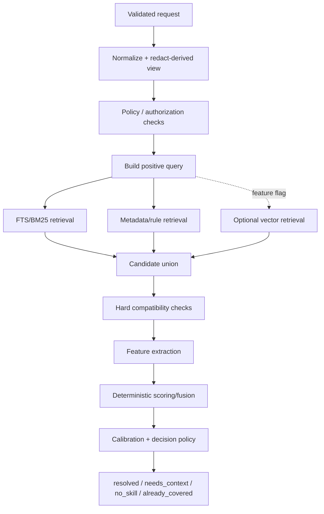
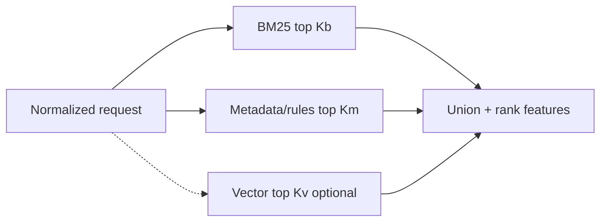
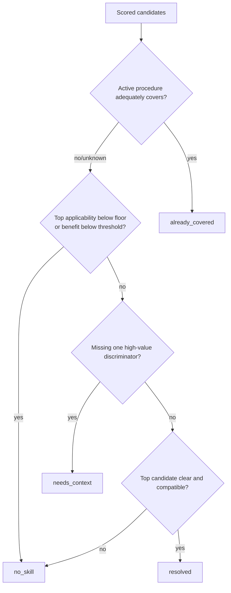
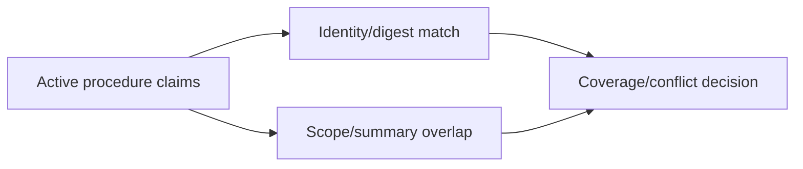

# Thiết kế chi tiết Resolver

**Trạng thái:** Deterministic-first V1  
**Phạm vi:** Index documents, candidate generation, scoring, ambiguity, abstention, workspace facts và optional LLM/vector extensions  
**Protocol:** [Agent ↔ Hub](02-agent-hub-protocol.md)

## 1. Mục tiêu và invariants

Resolver tối ưu **expected task benefit**, không tối ưu tỷ lệ luôn trả một skill.

```text
recommend S khi:
  applicability(S)
  + expected incremental benefit(S)
  - activation/context cost(S)
  - constraint/capability risk(S)
  đủ cao so với tiếp tục không dùng skill
```

V1 không cần utility model hoàn hảo nhưng phải giữ các invariants:

1. Task-local evidence > ambient repository facts.
2. Constraint/user scope không bị positive retrieval lấn át.
3. Unknown ≠ false ≠ true.
4. Semantic hints của agent không hard-filter.
5. Một large score margin không chứng minh candidate có liên quan tuyệt đối.
6. Tie giữa near-duplicates không nhất thiết cần hỏi user.
7. `no_skill` là first-class result.
8. Cùng request + catalog snapshot + policy revision phải cho cùng deterministic result.

## 2. Pipeline



Không có hard hierarchical classifier trước retrieval. Có thể search family index để tăng tốc nhưng luôn giữ global fallback.

## 3. Routing metadata

`skill.meta.yaml` định hướng:

```yaml
id: consumer-reliability-review
name: Consumer Reliability Review
status: active
description: Review retry, acknowledgement and duplicate-processing behavior.

routing:
  operations: [review, debug]
  triggers:
    - review retry and idempotency handling in a message consumer
    - investigate duplicate handling after consumer restart
    - check acknowledgement ordering around side effects
  not_for:
    - design a new event-driven service topology
    - tune broker cluster configuration
  min_scope: multi_step

  requirements:
    facts:
      any:
        - { key: dependency, value: kafka }
        - { key: dependency, value: rabbitmq }
        - { key: dependency, value: sqs }
    capabilities:
      all: [read-files]

  boosts:
    artifact_kind: [source-file, pull-request, diff]
    fact:
      - { key: dependency, value: kafka, weight: 0.10 }

  distinguish_from:
    - skill: event-driven-architecture-review
      discriminator:
        field: task.scope
        question: Is the task limited to consumer behavior or does it change service boundaries?
        choices: [consumer-only, service-boundaries, unknown]

  supporting:
    - skill: idempotency-test-design
      when:
        operation: test
      role: Design tests for retry and duplicate paths
      activation: on-demand

quality:
  reviewed: true
```

### Validation rules

Active skill phải có:

- stable `id`, name, description;
- ít nhất một trigger/activation example;
- `not_for` hoặc explicit empty + review rationale;
- min scope;
- valid requirement semantics;
- mọi relationship target tồn tại và không self-cycle bất hợp lệ;
- discriminator field/question/choices nhất quán nếu khai báo.

Không bắt `distinguish_from` với mọi cặp. Duplicate detection/evaluation tạo curation warning cho cặp thường xuyên ambiguity.

## 4. Index design

### 4.1 SQLite tables định hướng

```text
skills
skill_versions
routing_documents
routing_triggers
routing_exclusions
skill_requirements
skill_relationships
resource_manifests
catalog_snapshots
```

Các tables này nằm trong immutable catalog generation được build từ canonical files, không được row-by-row update như durable state. Operational/telemetry tables nằm ở database riêng và không tham gia durable policy. Storage authority/generation lifecycle nằm trong [07-storage-and-mutation-model.md](07-storage-and-mutation-model.md).

### 4.2 FTS document

Mỗi skill có một document metadata và các trigger row riêng:

```text
name             high boost
aliases          high boost
description      medium-high
triggers         high
artifact kinds   medium
topic/technology curated metadata  medium
not_for          separate exclusion index; không ghép positive document
```

Không index toàn `SKILL.md`, references hoặc assets mặc định. Điều đó làm general prose và code noise lấn routing signals.

### 4.3 Normalization

- Unicode normalization và case folding.
- Stable tokenization theo ngôn ngữ được hỗ trợ.
- Alias/synonym map nằm trong Git.
- Không stemming hoặc synonym expansion mù quáng nếu làm mất technical token.
- Path chỉ đóng góp basename/kind có kiểm soát; không index username/absolute path.

### 4.4 Tách routing catalog khỏi source-learning index

Source observations, comparisons, distill reports và pending insights có thể có derived FTS riêng cho curation/consult, nhưng **không tự trở thành normal skill candidates**. Chỉ active curated skill metadata đi vào resolver index.

Bundled system skills như curator/distiller/applier dùng reserved identity và `explicit-only` activation. Chúng được bootstrap bởi curation intent/instructions, không cạnh tranh score với user-task skills.

Không thêm vector/search infrastructure chỉ để phục vụ source learning nếu FTS + structured evidence lookup chưa chứng minh thiếu. Chi tiết learning entities ở [06-source-learning-and-distillation.md](06-source-learning-and-distillation.md).

## 5. Candidate generation

### 5.1 Positive query

Nguồn:

1. `task.description`.
2. Execution signal summary nếu liên quan trực tiếp.
3. Active artifact kind/language.
4. Selected factual values có routing allowlist.
5. `operation` như soft channel.

Không đưa constraints vào positive query. Không đưa full dependency inventory.

### 5.2 Parallel channels



Defaults phải tune bằng eval. Ví dụ prototype có thể bắt đầu `Kb=30`, `Km=30`; đây không phải contract.

### 5.3 Rule retrieval

Rule channel đưa skill vào candidate set khi:

- exact alias/identity match từ explicit user choice;
- strong artifact/capability mapping;
- active procedure identity/provenance liên quan;
- declared relationship từ một primary đang xét;
- deterministic fact match.

Rule retrieval không đồng nghĩa resolved; candidate vẫn qua applicability checks.

## 6. Compatibility và tri-state logic

Mọi requirement fact có ba trạng thái:

```text
SATISFIED | VIOLATED | UNKNOWN
```

| Requirement | Satisfied | Violated | Unknown |
|---|---|---|---|
| Required capability | capability có | host khai báo không có | không khai báo |
| Required fact | observed match | observed contradictory fact trong cùng scope | chưa quan sát |
| Authorization | policy allow | policy deny | policy unavailable |

Decision:

- `VIOLATED` trên hard requirement → loại candidate.
- `UNKNOWN` trên safety/capability-critical requirement → không resolve; có thể hỏi.
- `UNKNOWN` trên relevance enhancer → không boost/penalize nhẹ, không coi là violation.
- `SATISFIED` → compatibility pass/boost theo policy.

Hard rules chỉ cho disabled/unauthorized/incompatible facts được xác nhận. Agent-inference không đủ để tạo hard pass/fail.

## 7. Feature model

V1 dùng interpretable features:

| Feature | Range | Ý nghĩa |
|---|---:|---|
| `lexical_task` | 0..1 | BM25 task ↔ metadata/triggers normalized |
| `trigger_match` | 0..1 | Best/aggregate activation example match |
| `artifact_match` | 0..1 | Artifact kind/language relevance |
| `fact_match` | 0..1 | Scoped observed facts support |
| `operation_match` | 0..1 | Soft enum agreement |
| `quality_prior` | 0..1 | Human-reviewed status; low weight |
| `constraint_conflict` | 0..1 | Constraint vs purpose/not_for conflict |
| `not_for_match` | 0..1 | Task resembles negative examples |
| `scope_cost` | 0..1 | Skill overhead vs task size |
| `missing_critical` | boolean | Required evidence unknown |
| `semantic_task` | 0..1 | Optional vector channel |

Feature values và reasons được log ở runtime theo privacy policy; không trả internal model rationale đầy đủ cho agent.

### 7.1 Score skeleton

```text
base =
    w_lexical  * lexical_task
  + w_trigger  * trigger_match
  + w_artifact * artifact_match
  + w_fact     * fact_match
  + w_operation* operation_match
  + w_quality  * quality_prior
  + w_semantic * semantic_task

penalty =
    p_constraint * constraint_conflict
  + p_not_for    * not_for_match
  + p_scope      * scope_cost

score = clamp(base - penalty, 0, 1)
```

Weights không được hard-code rải rác. Chúng nằm trong `config/recommendation.yaml`, có policy revision và được thay qua reviewed change.

BM25/vector raw scores phải normalize theo method versioned. `score` là ranking score, không tự nhận là probability.

### 7.2 Ambient fact cap

Tổng boost từ workspace facts không được vượt task/trigger evidence. Config nên có cap:

```yaml
feature_caps:
  ambient_workspace_facts: 0.15
  operation_hint: 0.10
```

Mục tiêu: repo có Kafka không khiến task sửa README bị route vào Kafka skill.

## 8. Decision policy



### 8.1 `resolved`

Chỉ khi:

- top candidate qua hard compatibility;
- absolute applicability/benefit qua floor;
- confidence band đạt policy yêu cầu;
- không thiếu safety/capability evidence critical;
- ambiguity không thay đổi workflow materially, hoặc canonical equivalent preference giải quyết được.

### 8.2 `needs_context`

Chỉ hỏi nếu:

- có một field/fact cụ thể chưa biết;
- answer có khả năng đổi primary hoặc abstention;
- server có câu hỏi bounded, dễ trả lời;
- clarification budget còn.

Chọn câu hỏi có expected information gain lớn nhất:

```text
EIG(q) ≈ current decision loss
         - Σ P(answer) * expected loss after answer
         - interruption cost(q)
```

V1 có thể dùng heuristic: discriminator được curate + candidate score gần + answer partitions candidates rõ. Không cần probabilistic model đầy đủ.

### 8.3 Near-duplicates/equivalents

Nếu candidates tương đương về workflow và cùng acceptable set:

- dùng canonical preference/pin/version policy;
- ghi duplicate warning;
- không hỏi agent/user câu không ảnh hưởng execution.

Nếu workflows khác nhau và thiếu discriminator: `needs_context`. Nếu không có discriminator tốt: `no_skill: unresolved_ambiguity`, không đưa shortlist ở V1.

### 8.4 `no_skill`

Return khi dưới absolute floor, below min scope, constraint/capability conflict, catalog gap hoặc ambiguity không giải quyết trong budget.

Không dùng margin đơn độc: một candidate tệ có thể thắng với margin lớn.

## 9. Confidence và calibration

Tách ba khái niệm:

1. **Applicability:** skill có phù hợp task không?
2. **Selection uncertainty:** có workflow khác cũng plausible không?
3. **Expected benefit:** activation có đáng cost không?

External response trả `high|medium`, không expose pseudo-probability. Internal calibration được fit trên held-out eval set, ví dụ isotonic/Platt nếu dữ liệu đủ. Khi chưa đủ dữ liệu, dùng conservative deterministic thresholds.

`recommendation.yaml` lưu:

```yaml
policy_version: 1
normalization_version: bm25-v1
weights: { ... }
thresholds:
  applicability_floor: 0.55
  high_confidence: 0.80
  minimum_margin: 0.12
calibration:
  method: none
  artifact: null
```

Các số trên chỉ minh họa. Mọi thay đổi phải kèm eval report và catalog snapshot.

## 10. Supporting skill selection

Chỉ xét supporting sau khi primary được chọn. Candidate supporting phải:

- có relationship curated (`requires`, `supporting`, `usually_followed_by` có điều kiện);
- giải quyết distinct sub-procedure;
- không conflict primary/constraints/capabilities;
- có applicability evidence độc lập;
- giới hạn tối đa hai;
- mặc định `on-demand`.

Không graph-expand recursively. Không synthesize package. Operation đổi (review → implement → test) thường trigger resolution mới thay vì preload kế hoạch nhiều skill.

## 11. Active local procedure handling

Resolver chỉ biết claims host gửi:



- Exact same identity/version: tránh duplicate activation.
- Same provenance/different digest: xem là pinned/fork state, không tự chọn newest.
- Summary/scope bao phủ rõ: có thể `already_covered` với basis `host-declared`.
- Không đủ evidence: không tuyên bố coverage; hỏi hoặc abstain nếu overlap nguy hiểm.
- `supplement-only`: chỉ trả supporting scope riêng, không primary replacement.

## 12. Workspace fact derivation

Optional fact provider interface:

```go
type FactProvider interface {
    Detect(ctx context.Context, req DetectionRequest) ([]Fact, error)
}
```

Providers có thể phát hiện package manifests, framework dependency, Dockerfile, OpenAPI, migrations hoặc test framework. Quy tắc:

- explicit permission và root containment;
- budget file count/bytes/time;
- active-component first;
- no source body persistence;
- cache key gồm root identity + relevant file digest/mtime + provider version;
- facts có provenance/freshness;
- failure không làm resolver ngừng nếu request tự đủ evidence.

## 13. Optional vector retrieval

Vector là plugin channel, tắt mặc định đến khi eval chứng minh lợi ích.

Interface:

```go
type SemanticRetriever interface {
    Search(ctx context.Context, query string, snapshot SnapshotID, limit int) ([]Hit, error)
}
```

Requirements:

- embeddings do Hub tạo bằng model/version pin, không nhận arbitrary client vectors;
- trigger/examples được embed, không mặc định full skill;
- index derived và rebuildable;
- model artifact có immutable identity và distribution policy;
- failure degrade về lexical/rules, reason code ghi channel unavailable;
- chỉ bật nếu held-out quality gain vượt cost/size/latency threshold đã định.

So sánh tối thiểu: BM25 baseline vs BM25+vector trên cùng candidate/ranker và corpus.

## 14. Optional LLM fallback

MVP: disabled.

Chỉ được gọi khi:

1. Top candidates đều qua applicability floor.
2. Không thiếu fact có thể hỏi.
3. Workflows khác nhau và deterministic ranker chưa phân biệt.
4. Privacy/deployment policy cho phép.
5. Eval chứng minh incremental downstream benefit.

Input: minimized request + tối đa N curated cards (id, description, triggers/not_for, requirements). Không gửi full skills/upstream metadata. Output constrained:

```json
{ "decision": "pick|none|ask", "skill_id": "...", "question_id": "..." }
```

Timeout/error → deterministic result nếu vẫn đạt threshold; nếu không, `no_skill: unresolved_ambiguity` hoặc infrastructure error theo failure type. Không fallback sang agent shortlist.

## 15. Caching và concurrency

Cache keys bao gồm:

```text
request_fingerprint
+ catalog_snapshot
+ policy_revision
+ derived_fact_snapshot
+ activation_context_fingerprint
```

Không cache raw secrets/text làm key plaintext; dùng keyed hash khi cần. `no_skill` cache ngắn trong task/session scope. Catalog mutation tạo snapshot mới, không mutate cache entries cũ.

Resolver đọc immutable catalog generation được pin bởi `runtime/catalog/current.json`. Rebuild tạo generation file mới, validate rồi atomically swap pointer; không replace/truncate live DB. In-flight requests hoàn thành trên old generation và old files được GC sau. Cross-process workspace writer lock bảo đảm một rebuild/mutation writer. Chi tiết ở [07-storage-and-mutation-model.md](07-storage-and-mutation-model.md).

## 16. Explainability

Reason codes công khai:

```text
task_match
trigger_match
artifact_match
fact_match
authorization_pass
constraint_penalty
not_for_penalty
below_min_scope
missing_required_capability
active_procedure_coverage
```

Debug UI có thể xem feature values đã sanitize. Agent chỉ cần applicability và reason codes ngắn. Không expose chain-of-thought hoặc raw LLM reasoning.

## 17. Test strategy

### Unit

- tri-state requirements;
- score normalization/fusion;
- constraint separation;
- snapshot fingerprints;
- loop budgets;
- deterministic tie-breaking.

### Property/metamorphic

- thêm irrelevant repo fact không đổi recommendation;
- paraphrase giữ outcome trong acceptable set;
- thêm explicit exclusion không tăng score skill bị cấm;
- unknown không trở thành satisfied;
- candidate order input không đổi winner;
- rebuild cùng snapshot cho cùng ranking.

### Integration

- SQLite/FTS on all release targets;
- dirty working-tree snapshot;
- atomic index generation swap;
- stale/expired resource version;
- roots unavailable/permission denied;
- active local procedure conflict.

### Evaluation

Chi tiết corpus, metrics, experiment manifests và promotion workflow ở [04-telemetry-reproducibility-evaluation.md](04-telemetry-reproducibility-evaluation.md).

## 18. Failure modes và mitigations

| Failure | Detection | Mitigation |
|---|---|---|
| Hub skill generic thắng mọi query | dominance metric | generic penalty, refine min scope/triggers |
| Metadata rot | regression suite/dead skill | validation + curation review |
| Near-duplicates chia score | ambiguity/duplicate metric | canonical equivalence hoặc merge |
| Ambient stack dominates task | metamorphic tests | fact cap, task-local weighting |
| Constraints mất nghĩa | negation suite | separate channel, hard/soft conflict rules |
| Confidence drift khi catalog lớn | calibration by snapshot | periodic held-out recalibration |
| Clarification loops | per-resolution budget | one round then abstain |
| Hidden online learning | config/rebuild diff | prohibit runtime weight mutation |
| Semantic plugin unavailable | channel health | lexical deterministic degradation |

## 19. Acceptance criteria V1

- Deterministic replay cho cùng request/snapshot/policy.
- FTS/rule normal path không cần network hoặc LLM.
- Unknown requirements không bị xem là pass.
- Constraints không đi vào positive query.
- Workspace facts là optional, scoped và capped.
- Absolute applicability floor tồn tại ngoài margin.
- Resolver có thể trả `no_skill` cho task trivial hoặc out-of-catalog.
- Không trả shortlist cho agent trong production path.
- Supporting selection chỉ dùng curated relationships.
- Mọi behavior-changing config có Git representation.
