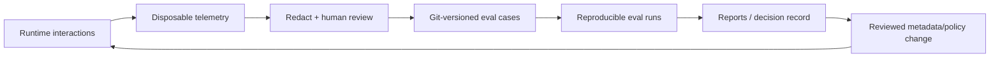
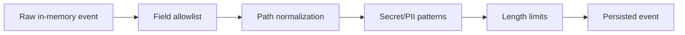
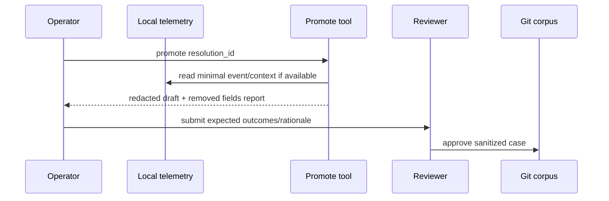
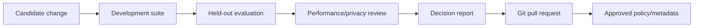

# Thiết kế Telemetry, Reproducibility và Evaluation

**Trạng thái:** V1 design  
**Phạm vi:** Event model, privacy/retention, reproducible routing, golden corpus, experiments, metrics, CI gates và promotion workflow  
**Liên quan:** [System architecture](01-system-architecture.md), [Resolver](03-resolver-design.md)

## 1. Mục tiêu

Ba concern liên quan nhưng không đồng nhất:

- **Telemetry:** điều gì đã xảy ra trong runtime?
- **Reproducibility:** có tái lập được một quyết định từ versioned inputs/policy không?
- **Evaluation:** kiến trúc/ranker có thực sự tốt hơn alternatives và no-skill baseline không?



Không có đường tự động `telemetry → production weights`. Online events chỉ tạo evidence/proposal; durable behavior phải đi qua review và Git.

## 2. Data classification

| Class | Ví dụ | Storage | Git? |
|---|---|---|---:|
| Canonical policy | weights, thresholds, aliases, triggers | repository | Có |
| Canonical eval input | sanitized task/facts/acceptable outcomes | repository | Có |
| Runtime operational | latency, candidate IDs, status | `runtime/operational.db` / `telemetry.db` | Không |
| Sensitive request content | task text, tool summary, paths | mặc định không persist hoặc redact/hash | Không |
| Derived experiment artifacts | per-case traces, raw output | runtime/artifacts | Không bắt buộc |
| Approved eval report | summary + manifest + deltas | repository hoặc release artifact | Có khi dùng quyết định |
| Cache/model index | FTS/vector compiled state | runtime | Không |

Git-first không có nghĩa commit raw conversations. Rebuild guarantee áp dụng knowledge và routing behavior, không áp dụng session history.

## 3. Event model

### 3.1 Event envelope

```json
{
  "event_version": "1",
  "event_id": "evt_01J...",
  "event_type": "resolution.completed",
  "occurred_at": "2026-09-28T06:00:00Z",
  "session_id_hash": "hmac:...",
  "request_id": "req_01J...",
  "resolution_id": "res_01J...",
  "catalog_snapshot": "sha256:...",
  "policy_revision": "sha256:...",
  "client": {
    "name": "codex",
    "version": "..."
  },
  "privacy": {
    "content_mode": "none",
    "redaction_version": "redact-v1"
  },
  "payload": {}
}
```

Rules:

- ULID/UUID ngẫu nhiên, không encode user/project.
- Session ID dùng rotating keyed hash nếu cần grouping.
- Không lưu absolute path, secret, full task, source snippet mặc định.
- Event schema append-only/versioned; reader hỗ trợ migrations hoặc reject rõ.
- Wall clock phục vụ timeline; duration dùng monotonic clock trong process.

### 3.2 Core events

```text
resolution.started
resolution.completed
resolution.failed
clarification.requested
clarification.answered
activation.approved
activation.rejected
skill.loaded                  # server-observed trên skill_get, skills/get, resources/read; mang status review_required khi bị chặn
skill.doctor_checked          # terminal doctor check results
transcript.tool_observed      # tool usage quan sát từ transcript Claude Code
skill.used
skill.abandoned
task.outcome_reported
source_candidate.captured
source_candidate.triaged
source.checked
distill_run.prepared
distill_run.submitted
distill_run.finalized
distill_run.failed
observation.created
observation.updated
observation.tombstoned
coverage_gap.recorded
comparison.updated
insight.proposed
insight.reopened
incorporation.outcome_recorded

index.rebuilt
catalog.changed
evaluation.run_completed
```

### 3.3 Resolution event payload

```json
{
  "status": "resolved",
  "operation": "review",
  "artifact_kind": "source-file",
  "constraint_count": 2,
  "fact_keys": ["dependency", "test-result"],
  "request_fingerprint": "hmac:...",
  "candidate_count": 2,
  "retrieval_candidate_count": 17,
  "prior_resolution_id": "res_01J...",
  "prior_kind": "rejected",
  "prior_verified": true,
  "top_skill_id": "consumer-reliability-review",
  "confidence_band": "high",
  "reason_codes": ["trigger_match", "fact_match"],
  "channels": ["fts", "rules"],
  "stage_ms": {
    "validation": 1,
    "retrieval": 8,
    "scoring": 2,
    "total": 13
  }
}
```

Ý nghĩa các trường đếm ứng viên và liên kết chuỗi:
- `candidate_count`: Số lượng skill **được gợi ý** (primary + supporting; `len(supporting) + 1` nếu có primary, 0 nếu `no_skill`). Tên lịch sử được giữ nguyên để tương thích ngược với schema v1.
- `retrieval_candidate_count`: Số lượng ứng viên thực tế được tìm kiếm và truy xuất từ catalog (FTS + rules) trước khi áp dụng hard-exclusion và scoring.
- `prior_resolution_id`, `prior_kind`, `prior_verified`: Dữ liệu nối chuỗi re-resolution. `prior_verified` mang giá trị `true` **chỉ khi** `prior_resolution_id` đã được cấp cho chính session này (được server-side tracker xác minh).
- `channels`: Danh sách các kênh truy xuất đóng góp ứng viên (`fts`, `rules`).
- `stage_ms`: Monotonic timing chi tiết của các giai đoạn trong resolver process (`validation`, `retrieval`, `scoring`, `total`).

`top_skill_id` có thể persist local; remote/organization mode cần policy cho catalog sensitivity. Internal feature vector chỉ bật debug và có retention ngắn.

### 3.4 Outcome semantics

Phân biệt rõ funnel:


- `recommended`: resolver đề xuất skill (primary hoặc supporting).
- `activated`: server ghi nhận qua lượt load đầu tiên của entrypoint từ host sau khi được recommend (phân loại attribution: `recommended`, `supporting`, `override`, `after_no_skill`, `after_needs_context`, `unsolicited`).
- `loaded`: nội dung/tài nguyên được fetch qua `skill_get`, `skills/get` hoặc `resources/read`. Nếu skill là third-party chưa duyệt, load bị chặn (`status: review_required`) và được ghi nhận riêng vào `blocked:review_required` mà không tính là activation. Thao tác inspect của curator qua `skill_get` được xếp vào `unsolicited`; lượt đọc draft skill không được tính.
- `used`: agent thực hiện ít nhất một phần workflow (host claim).
- `completed`: task kết thúc.
- `helpful/harmful/neutral`: chỉ khi có basis rõ (`user`, evaluator, controlled benchmark).

Không suy ra helpful từ accepted/used. Lượt phản hồi mang cả `outcome: failed` và `utility: harmful` chỉ tăng counter `feedback:negative` tối đa một lần.
### 3.5 Distillation event semantics

Telemetry events không thay thế canonical run/observation/insight records. Chúng đo execution và UX; mất telemetry không được làm thay đổi cursor hoặc durable decisions.

Distinguish:

```text
distill_run.prepared   = revisions/scope đã pin
distill_run.submitted  = observations + coverage đã được agent gửi
distill_run.finalized  = artifacts validate và cursor advance atomically
distill_run.failed     = run chưa finalized, cursor không advance
```

`observation.*` event chỉ lưu IDs/status/timing mặc định, không lưu raw source content. `coverage_gap.recorded` phân loại `deferred`, `unreadable`, `out_of_scope` hoặc `ruled_out`; nó không chứa sensitive resource body.

`incorporation.outcome_recorded` khác `task.outcome_reported`: cái đầu là curator đánh giá bài học đã incorporate sau thời gian sử dụng, cái sau là outcome của một task execution cụ thể.

## 4. Privacy, retention và local defaults

### 4.1 Default V1

```yaml
telemetry:
  enabled: true
  destination: local
  content_mode: none
  retention_days: 14
  max_size_mb: 100
  persist_candidate_scores: false
  export_network: false
```

Aggregate operational metrics có thể bật mặc định local; content logging opt-in.

Content modes:

| Mode | Persist |
|---|---|
| `none` | IDs, enums, counts, timing, reason codes |
| `fingerprint` | Thêm keyed request fingerprint |
| `redacted` | Thêm redacted/minimized task fields cho case journal; explicit opt-in |
| `debug` | Feature/candidate traces ngắn hạn; cảnh báo rõ |

Không có chế độ lưu full conversation.

### 4.2 Retention

- **Raw events:** 14 ngày (time + size based rotation).
- **Daily rollups:** 180 ngày tại `telemetry_daily_rollups` theo ngày UTC.
- `skillhub telemetry purge` xóa ngay.
- `skillhub telemetry export` tạo bundle đã sanitize, preview trước khi ghi.
- HMAC key local có rotation; mất key chỉ làm mất khả năng correlate, không ảnh hưởng routing.
- Crash recovery bỏ qua/truncate event segment cuối hỏng, không làm Hub không khởi động.
### 4.3 Redaction

Pipeline:



Allowlist tốt hơn blacklist. Redaction không được xem là bảo đảm tuyệt đối; vì vậy default không persist content.

## 5. Storage architecture

SQLite tables định hướng:

```text
telemetry_events
telemetry_daily_rollups
telemetry_meta

Có thể dùng normalized core columns + JSON payload versioned. Index theo timestamp, resolution ID, catalog snapshot và status. Telemetry writes:

- bounded async buffer;
- không block resolution normal path quá budget;
- drop counter khi buffer đầy;
- flush on graceful shutdown;
- tuyệt đối không thay đổi routing outcome nếu telemetry lỗi.

V1 mặc định dùng `runtime/telemetry.db` riêng ở WAL mode; `runtime/operational.db` giữ scheduler/check state và immutable catalog generations giữ search projections. Việc merge physical DB chỉ được cân nhắc sau benchmark, không thay logical/disposable boundary.

Không có canonical `eventlog.jsonl`. `skillhub telemetry export` có thể tạo versioned JSONL artifact, nhưng rebuild không replay nó. Storage authority và database lifecycle nằm trong [07-storage-and-mutation-model.md](07-storage-and-mutation-model.md).

## 6. Reproducibility model

### 6.1 Quyết định deterministic cần pin

```text
Resolution Replay Identity =
  protocol schema version
  + normalized request fixture
  + catalog snapshot
  + policy revision
  + index/normalization implementation version
  + optional model identity
  + fact-provider fixture/version
```

Binary version chỉ là diagnostic; behavior-affecting algorithm version phải explicit.

### 6.2 Catalog snapshot

Snapshot bao gồm canonical content hiện tại, kể cả dirty working tree:

```text
snapshot = SHA-256(canonical serialization of:
  schema version
  routing config digest
  ordered skill IDs + routing metadata digests
  aliases/relationships
  resource manifests needed for version pinning
)
```

Canonical serialization phải quy định ordering, newline, omitted/default fields và Unicode normalization. Timestamp/cache state không tham gia hash.

### 6.3 Experiment manifest

```yaml
experiment_id: routing-2026-09-28-bm25-v1
suite: evals/routing/suites/core-v1.yaml
corpus_revision: git:abc123
catalog_snapshot: sha256:...
policy_revision: sha256:...
binary:
  version: 0.1.0
  commit: abc123
resolver:
  variant: bm25-rules
  normalization: bm25-v1
  vector: disabled
  llm: disabled
seed: 42
environment:
  os: linux
  arch: amd64
```

Với deterministic resolver, seed vẫn được ghi để future samplers/tie experiments reproducible. External LLM results không được gọi là bit-reproducible; phải lưu provider/model/config và raw structured output trong protected artifact hoặc dùng recorded responses cho replay.

### 6.4 Replay command

```text
skillhub eval run evals/routing/suites/core-v1.yaml \
  --variant bm25-rules \
  --output runtime/evals/run-...

skillhub resolution replay \
  --case evals/routing/cases/retry-review.yaml \
  --snapshot <id> --policy <id>
```

Replay fail nếu required snapshot/model artifact unavailable; không âm thầm dùng latest.

## 7. Golden evaluation corpus và routing eval gate

Ngoài các suite đánh giá tĩnh, hệ thống hỗ trợ **Routing Evaluation** (`skillhub eval routing`) tự động sinh test cases từ `routing.examples` (positive cases) và `routing.counter_examples` (counter cases) của tất cả active skills theo cơ chế **leave-one-out** (loại bỏ example tương ứng khỏi bộ nhớ tính score của candidate để đo lường độ khái quát hóa, chấp nhận rò rỉ candidacy tại FTS).

Bộ eval kết hợp tập đối chứng âm `testdata/routing/no-skill-v1.yaml` (các truy vấn phi kỹ thuật, chit-chat, typo nhỏ hoặc ngoài danh mục), và được gác cổng tự động trong `make check` (`TestRoutingEvalGate`) qua các ngưỡng tối thiểu được thiết lập trong `testdata/routing/gate-v1.json`.

### 7.1 Case schema

```yaml
id: retry-review-narrow-scope
schema_version: 1
tags: [review, constraint, kafka]

request:
  task:
    description: Review retry and idempotency in the order consumer
    constraints:
      - Do not redesign service boundaries
  operation: review
  context:
    active_artifact:
      kind: source-file
      language: go
    facts:
      - key: dependency
        value: kafka
        basis: tool
        scope: active-component

expected:
  acceptable_statuses: [resolved]
  acceptable_primary:
    - consumer-reliability-review
  unacceptable_primary:
    - event-driven-architecture-review
  clarification:
    allowed: false
  rationale: Narrow consumer review; architecture redesign is excluded.

provenance:
  source: synthetic
  reviewed_by: [maintainer-a, maintainer-b]
  reviewed_at: 2026-09-28
```

### 7.2 Multiple valid outcomes

Corpus không ép đúng một ID khi procedures tương đương. `acceptable_primary` có thể nhiều skill/equivalence class. Cases có thể chấp nhận `needs_context` rồi định nghĩa branches:

```yaml
expected:
  acceptable_statuses: [needs_context]
  question:
    field: context.active_artifact.kind
  branches:
    pull-request:
      acceptable_primary: [code-review]
    design-document:
      acceptable_primary: [architecture-review]
```

### 7.3 Dataset slices

Tối thiểu:

- normal resolved;
- no-skill/trivial;
- out-of-catalog;
- negation/narrow constraints;
- misleading ambient repo facts;
- missing capability/unknown fact;
- near-duplicates/equivalents;
- cross-domain tasks;
- local active procedure conflict/coverage;
- correction/re-resolution;
- paraphrase variants;
- catalog growth/adversarial additions;
- multiple client/model-generated request variants.

Khởi đầu đề xuất khoảng 150 cases cho 30–50 skills, nhưng release gate dựa trên coverage/slices và confidence interval, không chỉ số lượng.

### 7.4 Promotion từ telemetry



Không promote tự động. Reviewer phải xác nhận không còn secret/PII và label có rationale.

## 8. Experiment design

### 8.1 Boundary architectures

Giữ retrieval backend cố định, so sánh:

- A: rich agent-generated SRC;
- B: evidence-first;
- C: raw task + server interpretation;
- E: server shortlist + agent selection.

Nhiều frontier models encode cùng execution-state fixtures. Đo information retention, invented fields, routing agreement, tokens và downstream result.

### 8.2 Resolver ablations

Incremental experiments:

1. BM25 + metadata + abstention baseline.
2. Thêm fact rules.
3. Thêm constraints/not_for channel.
4. Thêm vector retrieval.
5. Thêm calibrated ranker.
6. Thêm clarification.
7. Thêm LLM fallback.
8. Supporting-skill selection.

Mỗi bước dùng cùng held-out set; không thay nhiều biến rồi gán công lao cho một component.

### 8.3 Catalog growth tests

Replay suites với:

- catalog baseline;
- + near-duplicates;
- + generic hub skills;
- x2/x5 catalog bằng realistic distractors.

Đo accuracy, abstention, confidence drift, latency và skill dominance.

### 8.4 End-to-end utility

Một subset task thực thi dưới các arms:

```text
no skill
server-selected skill
expert-selected skill
agent-selected shortlist winner
```

Blind evaluator hoặc executable test đánh giá outcome. Đây là phép đo quan trọng hơn top-1 routing đơn thuần.

## 9. Metrics

### 9.1 Routing quality

Nếu case cho phép nhiều acceptable IDs:

```text
top1_acceptability = selected ∈ acceptable_set
```

#### Đơn vị đo lường chuẩn hóa: Chuỗi sự kiện (Chain)

Để phản ánh chính xác hành vi thực tế của agent và loại bỏ sai lệch do cùng một request task sinh cùng `resolution_id`, **đơn vị chuẩn hóa là một chuỗi (Chain)**:
- **Khóa chuỗi (Chain Key):** `(session_hash, resolution_id, event_id)`. CLI-origin events không mang session hash và mỗi resolution tạo thành một chuỗi độc lập.
- **Liên kết chuỗi:** Khi một request mang `prior_resolution_id` với `prior_verified: true` (đã được cấp cho chính session đó), nó nối dài chuỗi trước đó thay vì tạo chuỗi mới.
- **Quy tắc gán tải (Load Attribution):** Một lượt tải nội dung (`skill.loaded`) chỉ được gán cho resolution **mới nhất** trong chuỗi của nó.
- **Bucket riêng:** `already_covered` được tách thành một bucket riêng biệt, không tính gộp vào `resolved` hay `no_skill`.

#### Bảng định nghĩa Metric chuẩn hóa (O5)

Mọi rate đều nằm nghiêm ngặt trong khoảng $[0, 1]$. Kèm theo mỗi rate, hệ thống luôn hiển thị số đếm thô (`numerator / denominator`) để tránh ngộ nhận khi mẫu số nhỏ.

| Metric | Công thức | Ý nghĩa |
|---|---|---|
| `acceptance_rate` | chuỗi có load đúng primary / chuỗi `resolved` | Gợi ý được chấp nhận và sử dụng |
| `override_rate` | chuỗi `resolved` có load skill khác / chuỗi `resolved` | Gợi ý sai skill, agent phải tự chọn skill khác |
| `false_no_skill_rate` | chuỗi `no_skill` có load / chuỗi `no_skill` | Hệ thống báo không có skill nhưng thực tế agent vẫn load được |
| `true_no_skill` | chuỗi `no_skill` không load trong TTL (offline) | Catalog thực sự không có skill phù hợp |
| `reformulation_rate` | chuỗi có `prior_kind: rejected` **verified** / tổng chuỗi | Agent phải diễn đạt lại yêu cầu |
| `ignore_rate` | chuỗi `resolved` không load trong TTL (offline) / chuỗi `resolved` | Gợi ý bị bỏ qua lặng lẽ |
| `needs_context_answer_rate` | `clarification.answered` / `clarification.requested` | Câu hỏi làm rõ có được trả lời không |
| `bypass_rate` | `native:no_resolve` / transcript skill uses | Agent tự dùng skill mà không qua hub (đo từ transcript) |
| `negative_after_load` | feedback negative sau khi có server-observed load | Load skill rồi mới thấy không có ích |

#### Tính toán Offline và Xử lý Biên
- `ignore_rate` và `true_no_skill` được tính **offline** từ các sự kiện bền vững trong kho lưu trữ raw: xác định chuỗi không có lượt load nào cùng session trong khoảng thời gian TTL (2 giờ). Khi chưa đủ dữ liệu hoặc chuỗi diễn ra trong cửa sổ TTL chưa kết thúc, giá trị được báo cáo là `unknown`, không bao giờ báo 0. Không thêm event type runtime mới.
- **Cắt lát (Cuts):** Hỗ trợ phân tích cắt lát theo `--by client|operation|snapshot` bên trong cửa sổ lưu trữ sự kiện thô (raw retention window).
- **Lưu trữ Raw Retention:** Tăng thời gian lưu trữ mặc định sự kiện thô (`defaultRetention`, `recorder.go:18`) lên 30 ngày để bao phủ trọn vẹn cửa sổ baseline chuẩn 30 ngày (đồng bộ với `--since 30d` mặc định của funnel). Khóa rollup `(day, skill_id, metric)` được giữ nguyên.
### 9.2 Calibration

Tính theo confidence band/applicability label:

- ECE/Brier nếu có probability calibrated;
- empirical correctness theo `high|medium`;
- coverage-risk curve;
- confidence drift theo catalog snapshot.

Raw rank score không tham gia calibration report như probability nếu chưa map/calibrate.

### 9.3 Operational

- resolve p50/p95/p99;
- stage latency;
- index rebuild duration/memory;
- payload bytes/tokens;
- candidate count;
- cache hit rate;
- dropped telemetry events;
- vector/LLM fallback rate;
- error rate theo code.

### 9.4 Catalog health

- top skills share/hub dominance;
- dead skills không bao giờ retrievable/selected;
- near-duplicate ambiguity frequency;
- `needs_context` theo skill pair;
- metadata validation warnings;
- generic trigger/not_for coverage;
- skills loaded rồi abandoned.

### 9.5 Distillation quality và health

- distill run completion/failure/retry rate;
- finalized-run/cursor atomicity violations (target = 0);
- changed resources analyzed/deferred/unreadable;
- coverage gap rate và silent-omission failures;
- observation create/update/tombstone counts;
- stable-ID churn không có supersedes mapping;
- evidence locator validation failures;
- stale comparison/deep-dive count;
- repeated insight proposal từ cùng evidence;
- rejected insight reopen rate và presence of new-evidence rationale;
- source-to-local mapping coverage;
- incorporation outcomes: confirmed/ineffective/adjusted/unknown;
- status command network calls (target = 0).

Evaluation fixtures phải kiểm:

```text
failed run không advance cursor
finalized run luôn có valid artifacts + coverage
changed file được đọc ở target revision, không chỉ diff
removed knowledge tạo tombstone
same evidence không tự reopen rejection
stale derived synthesis được phát hiện
```

Chi tiết entities/invariants nằm trong [06-source-learning-and-distillation.md](06-source-learning-and-distillation.md).

### 9.6 Curation UX

- default “Curate my Skill Hub” trả prioritized local status mà không network;
- time/turns từ default intent tới một actionable recommendation;
- average confirmation prompts per requested batch (không tăng tuyến tính theo source count);
- unnecessary clarification/confirmation rate;
- batch completion với partial source failures;
- percentage normal distill runs auto-finalized;
- percentage runs requiring blocking user decision;
- default response size và raw evidence disclosure rate;
- insight review turns trước decision;
- stale proposal rejection rate (must be enforced, not silently applied);
- interrupted-run recovery completion/abandonment;
- routine unchanged scheduler checks that dirty Git (target = 0);
- percentage mutations reporting operation ID + active/uncommitted state;
- curation sessions abandoned before next action.

Conversation fixtures phải kiểm:

```text
healthy home fits one concise response
failed work is recommended before optional work
batch distill asks no per-source confirmation
normal user never needs cursor/snapshot terminology
findings are hidden until requested or exceptional
apply always previews and pins proposal digest/base version
post-apply response says active locally and Git status
```

UX contract nằm trong [05-curation-lifecycle.md](05-curation-lifecycle.md).

### 9.7 Invocation

Protocol không tự sửa under-invocation. Đo trên controlled transcripts/sessions:

- substantive tasks có gọi resolver;
- trivial tasks gọi thừa;
- resolution reuse đúng;
- reconsult khi operation đổi.

Chỉ đo được nếu host cung cấp task-boundary annotation hoặc benchmark fixture; telemetry tự thân không biết mọi task bị bỏ lỡ.

## 10. Statistical reporting

- Báo point estimate + bootstrap confidence interval cho quality metrics.
- Dùng paired comparison trên cùng cases giữa variants.
- Tách development/tuning và held-out test; không tune threshold trên test.
- Breakdown theo slices/client/catalog size.
- Ghi sample count; không kết luận từ slice quá nhỏ.
- Multiple runs cho external LLM/non-deterministic model; báo variance và failure rate.
- Mọi report nêu rõ exclusions, missing cases và policy revision.

## 11. CI và release gates

### Pull request gates

1. Schema/metadata validation.
2. Deterministic unit/property tests.
3. Core eval suite không regression quá tolerance.
4. No-skill false-positive không vượt budget.
5. Snapshot/replay reproducibility test.
6. Cross-platform SQLite/FTS smoke test.

### Nightly/release gates

- Full corpus và catalog-growth suites.
- Cross-client contract/interoperability tests.
- Performance benchmark trên reference hardware.
- Optional vector/LLM experiments.
- End-to-end task utility subset.

Gate thresholds nằm trong Git:

```yaml
quality_gates:
  acceptable_top1_min: 0.85
  no_skill_false_positive_max: 0.08
  high_band_empirical_accuracy_min: 0.90
  p95_resolve_ms_max: 300
  deterministic_replay_mismatch_max: 0
```

Các số trên là initial hypotheses. Chúng chỉ được freeze sau baseline; thay đổi cần rationale để tránh “nới gate cho pass”.

## 12. Policy/model promotion



PR thay routing behavior phải chứa:

- changed canonical files;
- experiment manifest;
- baseline vs candidate metrics và slice breakdown;
- regressions/known limitations;
- privacy/latency effect;
- rollback commit/config.

Runtime DB không được là nơi duy nhất chứa fitted thresholds/model. Với learned model nhỏ, commit immutable artifact nếu phù hợp; nếu không, commit training data/config + artifact digest và bảo đảm release/rebuild có thể lấy artifact bền vững. Tránh pointer dễ biến mất.

## 13. Operational views and reports

### Runtime health

- requests/status distribution;
- latency percentiles;
- clarification/re-resolution loops;
- errors/index freshness;
- telemetry drop count.

### Routing quality

- acceptance không đồng nghĩa utility; hiển thị cả hai nếu có;
- no-skill false positives từ reviewed feedback;
- abandonment/veto;
- skill dominance/dead catalog;
- top ambiguous pairs.

### Reproducibility

- active catalog snapshot/policy revision;
- binary/index version;
- latest eval report;
- uncommitted canonical changes;
- whether index matches canonical snapshot.

Không hiển thị raw sensitive content nếu operator chưa bật/authorized debug mode.

## 14. Failure handling

| Failure | Behavior |
|---|---|
| Telemetry DB full/corrupt | Drop/rotate, report health warning; routing tiếp tục |
| Event schema newer than reader | Preserve file, skip with warning; không reinterpret sai |
| Eval snapshot missing | Fail run rõ ràng; không dùng latest |
| Non-deterministic replay | Emit diff gồm feature/policy/index versions |
| Redaction uncertain | Không export content; yêu cầu manual review |
| External model unavailable | Mark experiment incomplete; không thay bằng model khác |
| Metric denominator quá nhỏ | Report N/CI; không gate slice đó như kết luận chắc chắn |
| Outcome feedback biased | Tách by basis; không xem acceptance là ground truth |

## 15. Acceptance criteria V1

- Telemetry lỗi không thay resolution result.
- Default không persist task text, absolute paths, source snippets hoặc secrets.
- Mọi event liên kết được tới catalog snapshot và policy revision.
- Một eval case có thể chấp nhận nhiều correct skills hoặc `no_skill`.
- Có held-out set và paired variant comparison.
- Rebuild từ Git tái tạo routing behavior/config, không cần telemetry DB.
- Không có online-learning hidden state.
- Policy promotion yêu cầu eval report và review.
- Có metrics cho no-skill, under/over-invocation, local/Hub duplicate activation và downstream utility.
- Distill run/cursor atomicity và coverage được kiểm trong evaluation.
- Telemetry mất không làm mất observation/insight/outcome canonical state.
- Có command purge/export/replay, với safe defaults.
