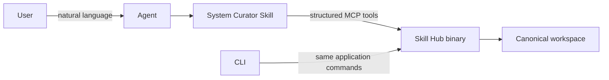
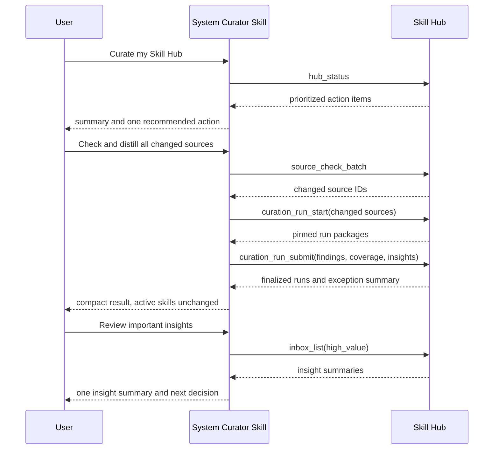
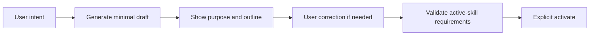
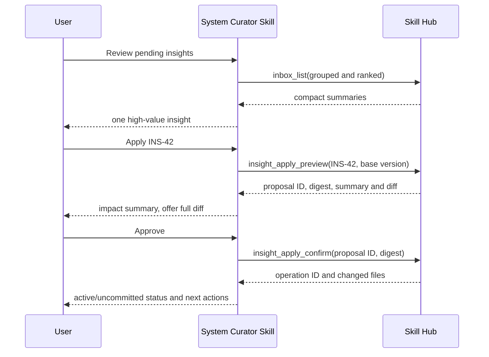

# Curation UX và Lifecycle

**Trạng thái:** V1 UX-first product/design baseline  
**Phạm vi:** Agent-facing curation UX, CLI fallback, approval model, application commands và lifecycle mapping  
**Không bao gồm:** Web UI  
**Phụ thuộc:** [Kiến trúc tổng thể](01-system-architecture.md), [Agent ↔ Hub protocol](02-agent-hub-protocol.md), [Source learning và distillation](06-source-learning-and-distillation.md), [Storage/mutation model](07-storage-and-mutation-model.md), [Telemetry/evaluation](04-telemetry-reproducibility-evaluation.md)

## 1. Product decision

V1 có hai surfaces:

```text
Primary interactive surface = bundled System Curator Skill
Operational fallback         = CLI
```

User không cần biết entity/state/command để curate. Họ nói mục tiêu bằng ngôn ngữ tự nhiên; System Curator Skill dùng structured MCP tools gọi Skill Hub binary.



Binary sở hữu validation, authorization, source access, locking, durable mutation, indexing và recovery. Skill sở hữu conversation flow, progressive disclosure, next-action guidance và approval dialogue.

## 2. UX goals

1. User có thể bắt đầu bằng một câu: **“Curate Skill Hub của tôi.”**
2. Hệ thống luôn trả lời câu hỏi: **“Có gì cần xử lý tiếp?”**
3. Normal path không bắt user hiểu cursor, snapshot, observation hay index generation.
4. Safe/mechanical work chạy theo intent đã cho; semantic changes luôn có preview và approval.
5. Chỉ exceptions, conflicts và high-value decisions interrupt user.
6. Mọi output dẫn tới một số ít next actions rõ ràng.
7. User có thể dừng sau bất kỳ proposal phase nào mà active skills không đổi.
8. Agent, CLI và automation dùng cùng application semantics.
9. Git-first không được tạo noise sau mỗi heartbeat/scheduler check.
10. Recovery path luôn tồn tại qua `skillhub doctor` ngay cả khi Agent/MCP không hoạt động.

## 3. UX principles

### 3.1 Status-first

System skill luôn bắt đầu bằng local `hub_status`, không enumerate catalog hoặc fetch network.

### 3.2 Intent-driven

User nói việc muốn làm; skill chọn tools. Không yêu cầu user nhớ subcommand, entity ID hoặc state transition trừ khi cần disambiguation.

### 3.3 Exception-oriented

Unambiguous mechanical work được xử lý trong batch. User chỉ bị hỏi khi:

- có semantic adoption decision;
- source/path/target skill ambiguous;
- evidence conflict hoặc coverage gap đáng kể;
- action destructive;
- policy/capability thiếu;
- proposal stale;
- recovery có nhiều phương án.

### 3.4 Progressive disclosure

```text
L0: status + recommended next action
L1: item summary + impact
L2: evidence/comparison/diff
L3: raw canonical artifacts and technical diagnostics
```

Mặc định không dump observations, revisions, digests hoặc full diffs.

### 3.5 One primary question

Mỗi turn chỉ hỏi một decision có giá trị cao. Gom defaults hợp lý vào một proposal thay vì hỏi branch, path, target, cadence qua nhiều turn.

### 3.6 Explicit semantic approval

Distillation có thể tạo findings/proposals; active skill content chỉ đổi sau preview + explicit approval pin vào proposal digest.

### 3.7 Actionable errors

Mọi lỗi user-facing có shape:

```text
ERROR: điều gì thất bại
WHY: vì sao hoặc evidence hiện có
FIX: action cụ thể tiếp theo
```

## 4. Primary surface — Curation Home

### 4.1 Default invocation

Triggers:

```text
Curate Skill Hub của tôi.
Có gì cần xử lý?
Kiểm tra kho skill.
Maintain the skill hub.
```

System skill gọi `hub_status` và trả một dashboard ngắn:

```text
Skill Hub cần xử lý 3 việc:

1. Một distill run bị gián đoạn; cursor chưa thay đổi.
2. Ba sources có revision mới.
3. Năm insights đang chờ review, trong đó hai insight có evidence cao.

Workspace hợp lệ. Git có 4 files chưa commit.

Đề xuất: resume run bị gián đoạn trước.
Tiếp tục?
```

Không có việc cần làm:

```text
Skill Hub đang up to date.

12 sources đang được theo dõi
42 active skills
0 failed runs
0 pending high-priority insights
Git workspace clean
```

### 4.2 Priority order

```text
1. Workspace invalid / recovery journal
2. Interrupted or failed operations
3. Integrity/security errors
4. Source unavailable requiring user action
5. Changed sources ready to distill
6. Sources due/overdue for an update check
7. Blocking coverage/outstanding decisions
8. Pending high-value insights
9. Routing changes needing evaluation
10. Uncommitted Git changes
11. Healthy/up-to-date summary
```

### 4.3 Curation Home read model

```json
{
  "workspace": {"health": "valid", "index": "current", "git_dirty": true},
  "actions": [
    {"kind": "resume_run", "id": "RUN-42", "priority": 100},
    {"kind": "distill_changed_sources", "count": 3, "priority": 80},
    {"kind": "check_due_sources", "count": 7, "priority": 70},
    {"kind": "review_insights", "count": 5, "high_value": 2, "priority": 60}
  ],
  "summary": {
    "active_skills": 42,
    "watching_sources": 12
  }
}
```

Đây là derived read model, không phải canonical entity mới.

## 5. Natural-language intent contract

| User intent | System skill behavior |
|---|---|
| “Curate/check my hub” | Show Curation Home, recommend one next action |
| “Add/save this repo for later” | Capture Source Candidate with minimal metadata |
| “Start learning from this source” | Detect defaults, present one onboarding proposal |
| “Check for updates” | Check due/all requested sources; summarize changed/unavailable |
| “Distill all changed sources” | Batch distill to findings/insights; stop before semantic apply |
| “Show what source X taught us” | Summarize findings, open evidence on demand |
| “Review pending insights” | Rank/group inbox, present one decision at a time |
| “Apply INS-42” | Generate/pin diff, show summary, require approval |
| “Create a skill for X” | Create minimal draft, infer metadata, ask only blockers |
| “Edit skill X” | Produce proposed edit/diff, validate, request approval |
| “Why was this added?” | Traverse local artifact → incorporation → insight → source evidence |
| “What changed upstream for something we use?” | Traverse changed finding → source-to-local mapping |
| “Resume pending work” | List/resume interrupted runs in priority order |
| “Show workspace changes” | Show grouped curation diff, then raw Git diff on request |

Unknown intent should produce a small clarification, not a command list dump.

## 6. Action and approval policy

| Action | Default confirmation policy |
|---|---|
| Local status, list, show, validate | Run immediately |
| Show evidence/diff/history | Run immediately |
| Capture source candidate after explicit user request | Run immediately |
| Network source check | Explicit check/batch request serves as confirmation; otherwise ask once before network, never per source |
| Scheduler source check | Allowed by explicitly configured policy; no semantic work |
| Distill into findings/insight proposals | Explicit task/batch request serves as confirmation; never prompt per source |
| Finalize valid findings/run cursor | Automatic as part of requested distillation |
| Defer unreadable scope with durable coverage gap | Present in result; ask only if materially blocking |
| Plan insight | Explicit user intent |
| Reject insight | Explicit decision + rationale |
| Apply insight/direct skill edit | Preview + explicit approval pinned to digest |
| Change routing metadata | Impact preview + explicit approval |
| Deprecate/archive/unlink | Impact preview + confirmation |
| Git commit | Explicit user request |
| Git push | Never automatic in V1 |
| Migration/recovery with alternatives | Show plan and request confirmation |

“Explicit user request” includes a clear batch intent such as “distill all changed sources”; System Skill không hỏi lại từng mechanical step.

## 7. Response design and progressive disclosure

### 7.1 Status item

```text
3 sources changed
Latest: source-a@def456, source-b@92da10, source-c@v4
Action: Distill all
```

Revision details are hidden unless requested.

### 7.2 Distillation result

```text
Distilled 3 sources successfully.

Findings:
  11 new
  3 updated
  1 upstream feature removed

Proposals:
  5 insights
  2 coverage warnings

Active skills were not changed.

Recommended next action: review two high-evidence insights.
```

Use user-facing “finding”; technical detail may call it Observation.

### 7.3 Insight summary

```text
INS-42 — Add explicit failure-mode review
Evidence: 2 independent sources agree
Impact: one workflow section in consumer-reliability-review
Risk: low; routing metadata unchanged
Recommendation: incorporate
```

Drill-down intents:

```text
Show evidence.
Compare the sources.
Why is this recommended?
Show the affected files.
Show the full diff.
```

### 7.4 Successful mutation

```text
Applied INS-42.

The updated skill is active locally.
3 canonical files changed and are not committed to Git.
Operation: OP-81

Next: review the diff, review another insight, or stop.
```

### 7.5 Technical terminology translation

| Internal term | Default user-facing wording |
|---|---|
| Observation | Finding |
| Comparison | Cross-source evidence |
| Cursor advanced | Analyzed through revision X |
| Tombstone | Upstream removed/superseded this finding; history retained |
| Catalog snapshot | Catalog version |
| Index stale | Search index needs repair |
| Finalize run | Save completed analysis |
| Coverage gap | Part of the source was not analyzed |

## 8. Happy path — periodic maintenance



Batch default:

- process unambiguous sources without per-source prompts;
- isolate failures so one source does not fail the batch;
- show counts and exceptions;
- stop before applying insights.

## 9. Happy path — source intake and onboarding

### 9.1 Capture

```text
User: Save https://github.com/org/repo to review later.
Agent: Captured as SRCQ-42. No network fetch or skill changes were made.
```

Only locator + short reason are required.

### 9.2 Onboard

System detects defaults and asks one consolidated question:

```text
Detected:
  repository: org/repo
  default branch: main
  skill path: skills/reliability
  license: Apache-2.0
  trust: unreviewed community source

Recommended:
  watch this path weekly
  keep it unlinked until the first distillation

Proceed or change a setting?
```

Ask separate questions only when multiple paths/refs are genuinely ambiguous or policy blocks access.

### 9.3 Source check semantics

`hub_status` is local/offline. Network only occurs after explicit check intent or scheduler policy.

Routine unchanged checks update runtime operational state only. Canonical Git state changes only when meaningful durable state changes, such as:

- new revision/digest discovered;
- monitoring configuration changed;
- source linked/unlinked/retired;
- distilled cursor advanced;
- human decision recorded.

`last_checked_at`, latency, retry count and next schedule are runtime/disposable to avoid weekly Git noise.

## 10. Happy path — create or edit a skill

### 10.1 Create minimal draft

```text
User: Create a skill for reviewing Kafka consumer reliability.
Agent: proposes ID, description and initial SKILL.md outline.
```

Only blockers are asked. Collection, triggers and `not_for` can be proposed from intent and reviewed before activation.



Draft creation does not require upstream source.

### 10.2 Direct edit

Agent creates a proposal against a pinned base version, not an uncontrolled direct overwrite:

```text
request edit
→ generate proposed diff
→ validate
→ summarize impact
→ user approves proposal digest
→ canonical write
→ new catalog version
```

External editor remains supported. Invalid external state is reported and not published into a new valid read generation.

## 11. Happy path — review and apply insight



If base content or proposal changed after preview:

```text
Proposal is stale; nothing was applied.
The skill changed since the preview.
Regenerate and review the updated proposal?
```

User reviews Insight by default, not every underlying finding. Findings/comparisons open on demand or automatically when evidence conflicts.

## 12. Happy path — routing metadata

Routing metadata changes receive stronger review:

```text
edit triggers/not_for/requirements
→ schema/reference validation
→ affected routing evaluation
→ summarize top-1, no-skill and ambiguity deltas
→ explicit approval
→ canonical mutation
```

Agent presents meaningful deltas, not raw score dumps:

```text
This change fixes 4 expected routes and introduces 1 new false positive.
Recommendation: revise the generic trigger before applying.
```

## 13. Recovery and exceptional paths

### 13.1 Interrupted distillation

```text
RUN-42 stopped while reading two resources.
The source remains analyzed only through abc123; no cursor was advanced.

Options:
1. Retry failed resources.
2. Save completed work and mark both resources deferred.
3. Cancel the run.
```

User does not need to understand run state names.

### 13.2 Source unavailable

```text
Source A could not be reached for 3 scheduled checks.
Last known revision remains valid.
No curated skill changed.

Options: retry now, pause monitoring, or inspect error.
```

Transient availability timestamps remain runtime-only; pause/retire decisions are canonical.

### 13.3 Coverage gap

```text
Distillation completed with one gap:
  scripts/check.sh was not analyzed because executable review needs permission.

No insight depends on that file.
Options: accept deferred coverage or review the file now.
```

Blocking gap prevents finalization; non-blocking gap is durably recorded and surfaced.

### 13.4 Workspace invalid/index stale

```text
Search index does not match canonical files.
Canonical data is intact.

Fix: run skillhub doctor --fix.
```

System Curator Skill must not invent a repair that bypasses doctor/application services.

### 13.5 Conflicting edit

Return current version + conflict summary. Never silently last-write-wins. Agent offers regenerate/rebase/cancel.

## 14. Curation session and Git UX

A user request/batch gets a session/operation summary:

```text
Curation session CS-42

Generated learning artifacts:
  3 distill runs
  12 findings
  2 comparisons
  5 insight proposals

Changed active skill content:
  none

Git workspace:
  9 modified/untracked canonical files
```

Views:

```text
Show curation summary.
Show active-skill changes only.
Show generated learning artifacts.
Show raw Git diff.
```

### 14.1 Publish boundary

```text
Unapproved proposal
→ not active

Approved apply or active-skill edit
→ canonical content and local catalog update immediately

Git commit
→ durability/sharing/review boundary, not local publish gate
```

Every active mutation states explicitly: **active locally** and **committed/uncommitted**. Canonical staging, transaction journal, operation receipts và immutable database generations được định nghĩa trong [07-storage-and-mutation-model.md](07-storage-and-mutation-model.md); UX không tự triển khai write semantics.

### 14.2 Undo guidance

Every mutation returns operation ID, base version and changed files. V1 may not promise generic undo after later edits, but must provide safe guidance:

- show operation diff;
- revert before conflicting edits when possible;
- generate Git restore/revert instructions;
- never claim rollback succeeded without validation.

## 15. Outcome review UX

Outcome is requested only when evidence exists:

- skill used enough times after incorporation;
- periodic curator review;
- user reports ineffectiveness;
- incorporated source finding materially changes;
- insight is superseded.

```text
INS-42 has been used in 8 resolved tasks since incorporation.
Record outcome as confirmed, adjusted, ineffective, or leave unknown?
```

Outcome requires note/evidence and is not inferred from “applied” or “used”.

## 16. CLI derived from UX

CLI is not a second product model. Commands map to the same intents and application commands.

```text
skillhub status                         # Curation Home
skillhub check [--all-due]              # explicit network source check
skillhub source capture <locator>
skillhub source list
skillhub source show <id>

skillhub run list
skillhub run show <id>
skillhub run retry <id>
skillhub run cancel <id>

skillhub inbox
skillhub insight show <id>
skillhub insight plan <id>
skillhub insight reject <id> --reason <text>
skillhub insight apply <id>             # preview + interactive confirm

skillhub skill create
skillhub skill edit <id>
skillhub skill activate <id>
skillhub skill deprecate <id>

skillhub validate
skillhub rebuild
skillhub diff
skillhub doctor
skillhub doctor --fix
```

Distillation semantic work is primarily Agent-executed. CLI `run` commands inspect/retry/cancel prepared work; a future configured provider may add headless execution without changing lifecycle semantics.

### 16.1 CLI output rules

- Human default: concise summary + next action.
- `--json`: stable machine schema.
- `--quiet`: only requested IDs/paths/result.
- `--yes`: skips confirmation only where command policy permits; never skips validation.
- Long detail uses pager; edit uses `$EDITOR` where applicable.
- Automation never parses decorative terminal tables.

## 17. Tool and application-command mapping

| UX intent | MCP tool | Application command |
|---|---|---|
| Show Curation Home | `hub_status` | `GetCurationHome` |
| Capture source | `source_intake_add` | `CaptureSourceCandidate` |
| Triage/onboard source | `source_triage` | `TriageSourceCandidate` |
| Check updates | `source_check` | `CheckSources` |
| Start distillation | `curation_run_start` | `PrepareDistillRuns` |
| Submit findings | `curation_run_submit` | `SubmitDistillRun` |
| Retry/cancel run | `curation_run_retry/cancel` | `RetryDistillRun` / `CancelDistillRun` |
| List review work | `inbox_list` | `GetInsightInbox` |
| Inspect insight/evidence | `insight_get` | `GetInsightDetail` |
| Decide insight | `insight_decide` | `DecideInsight` |
| Preview apply | `insight_apply_preview` | `PreviewInsightApplication` |
| Confirm apply | `insight_apply_confirm` | `ConfirmInsightApplication` |
| Edit skill | `skill_update_preview/confirm` | `PreviewSkillUpdate` / `ConfirmSkillUpdate` |
| Routing impact | `routing_evaluate` | `EvaluateRoutingChange` |
| Validate | `workspace_validate` | `ValidateWorkspace` |
| Rebuild derived DB | `workspace_rebuild` | `BuildCatalogGeneration` |
| Show changes | `workspace_diff` | `GetCurationDiff` |
| Record outcome | `outcome_record` | `RecordIncorporationOutcome` |

Application commands own semantics; CLI and MCP adapters only validate transport and map results.

## 18. Internal model derived from UX

The UX requires these internal concepts:

| UX need | Internal model |
|---|---|
| Prioritized home | `CurationHome`, `ActionItem` derived read models |
| Batch summary | runtime/derived `CurationSession` + durable mutation `Operation` records |
| Resume work | `DistillRun` with recoverable states |
| Findings on demand | `Observation` |
| Cross-source evidence | `Comparison` |
| Review proposal | `Insight` |
| Safe confirm | `Proposal{id,digest,base_version}` |
| Traceability | `Incorporation`, source-to-local mapping |
| Later usefulness | `Outcome` |
| No Git heartbeat noise | Runtime `CheckState` separate from canonical Source state |

Detailed schemas/invariants belong to [06-source-learning-and-distillation.md](06-source-learning-and-distillation.md), not this UX document.

## 19. Lifecycle reference

Lifecycle states remain independent:

```text
Skill:       draft → active → deprecated → archived
Source:      discovered → watching → changed → distill_pending → watching
DistillRun:  prepared → in_progress → finalized | failed | cancelled
Observation: active → removed | superseded
Insight:     pending → planned → partially_incorporated → incorporated
                         └→ rejected | obsolete
Outcome:     unknown → confirmed | adjusted | ineffective
```

User-facing copy translates these states and normally exposes only actionable transitions.

## 20. Acceptance criteria — UX

### Default experience

- “Curate my Skill Hub” returns local status and one recommended action.
- Healthy state is explainable in one short response.
- User never needs entity/state knowledge for normal maintenance.

### Progressive disclosure

- Default distill result shows counts, warnings and insight summaries—not raw observations.
- Evidence/full diff/raw artifacts are available on demand.
- Internal terminology is translated by default.

### Efficiency

- One batch intent processes all unambiguous changed sources.
- No per-source confirmation in an approved batch.
- Failed source/run does not discard successful batch work.
- Interrupted work appears before new optional work.

### Safety

- Distillation never changes active skills.
- Semantic mutation requires pinned preview + explicit approval.
- Stale proposal cannot be confirmed.
- Destructive and routing changes show impact first.
- Git push is never automatic.

### Workspace/Git

- Routine unchanged scheduler checks do not dirty Git.
- Meaningful source revision changes and human decisions remain canonical.
- Every mutation reports active/uncommitted status and operation ID.
- `doctor --fix` remains independent recovery path.

### Surface consistency

- Agent, CLI and automation call the same application commands.
- Every response has structured machine form and actionable human form.
- Tool/CLI adapters do not duplicate domain logic.
