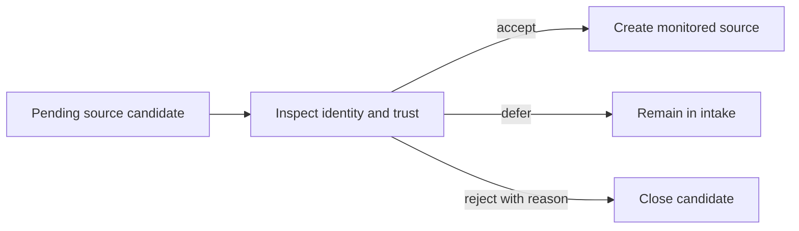
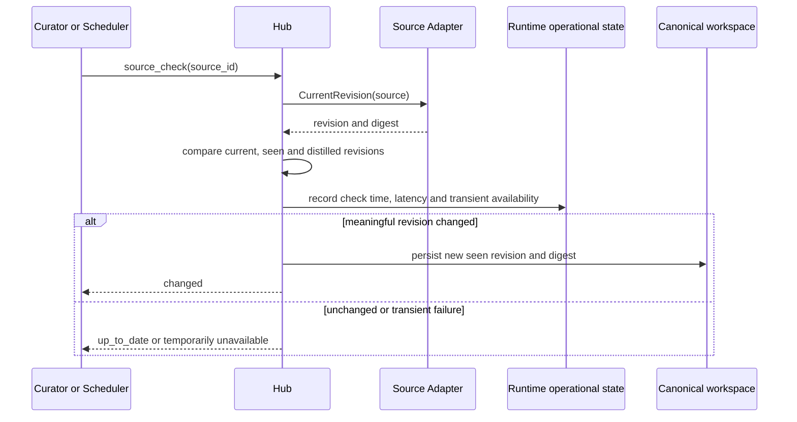
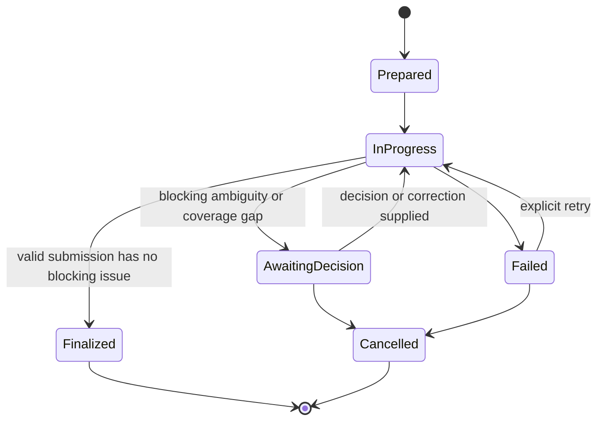

# Thiết kế Source Learning và Distillation

**Trạng thái:** V1 design baseline; deep-dive/consult are optional post-core capabilities  
**Phạm vi:** Source intake, adapters/revisions, observations, comparisons, distill runs, insights, incorporation mapping, staleness và validation  
**Phụ thuộc:** [System architecture](01-system-architecture.md), [Curation lifecycle](05-curation-lifecycle.md), [Storage/mutation model](07-storage-and-mutation-model.md), [Telemetry/evaluation](04-telemetry-reproducibility-evaluation.md)  
**Reference learning:** [forgentX distill learnings](../references/skills/distill-learnings.md)

## 1. Goals

Distillation phải biến upstream material thành reviewable curated knowledge mà không:

- đọc lại toàn bộ source ở mọi lần chạy;
- đồng nhất source facts với adoption decisions;
- mất knowledge khi upstream xóa/đổi tên;
- advance cursor khi analysis chưa hoàn tất;
- silently skip files/domains;
- tự sửa active curated skill;
- tạo durable state chỉ tồn tại trong SQLite.

Pipeline chuẩn:

```mermaid
flowchart LR
    CAP[Capture] --> ST[Source triage]
    ST --> REV[Revision check]
    REV --> RUN[Distill run]
    RUN --> OBS[Observations]
    OBS --> CMP[Cross-source comparison]
    CMP --> INS[Insight proposals]
    INS --> TRI[Human triage]
    TRI --> PATCH[Patch proposal]
    PATCH --> APPLY[Approved incorporation]
    APPLY --> OUT[Outcome]
```



## 2. Invariants

1. Source material là untrusted input.
2. Observation ghi “source chứa gì”; Insight ghi “curated skill nên học gì”.
3. Diff chỉ xác định scope thay đổi; evidence phải đọc từ current revision.
4. Mọi claim có source revision và evidence locator.
5. IDs ổn định; removed/moved/superseded dùng tombstone.
6. Distill run chỉ advance distilled cursor khi finalize atomically.
7. Ambiguity được persist, không bị bỏ hoặc quyết định ngầm.
8. Distiller tạo proposal; curator quyết định.
9. Canonical YAML/Markdown là durable authority; DB/index là derived.
10. Status command không network; source check/fetch là action explicit.
11. Routine unchanged checks không tạo canonical Git churn.
12. Valid normal run submission auto-finalizes; user chỉ xử lý blocking decisions.

## 3. Conceptual model

```mermaid
classDiagram
    class SourceCandidate {
      id
      locator
      captured_at
      status
    }
    class Source {
      id
      type
      locator
      monitoring
    }
    class SourceRevision {
      source_id
      kind
      value
      content_digest
    }
    class DistillRun {
      id
      from_revision
      to_revision
      state
      coverage
    }
    class Observation {
      id
      source_id
      revision
      status
      evidence
    }
    class Comparison {
      id
      topic
      observation_ids
      verdict
    }
    class Insight {
      id
      evidence_ids
      decision_state
    }
    class ApplicationProposal {
      id
      insight_id
      base_version
      digest
      status
    }
    class Incorporation {
      insight_id
      proposal_id
      target_files
      state
      revision
      operation_id
    }
    class Outcome {
      incorporation_id
      state
      evidence
    }

    SourceCandidate --> Source : accepted as
    Source --> SourceRevision : has
    SourceRevision --> DistillRun : bounds
    DistillRun --> Observation : produces
    Observation --> Comparison : participates in
    Observation --> Insight : supports
    Comparison --> Insight : supports
    Insight --> ApplicationProposal : previewed as
    ApplicationProposal --> Incorporation : confirmed as
    Incorporation --> Outcome : evaluated by
```



### 3.1 Source Candidate

Low-friction capture before commitment to monitor:

```yaml
id: SRCQ-0042
locator: https://github.com/example/repo
captured_at: 2026-09-28T10:00:00Z
reason: Contains a mature reliability review skill.
status: pending
```

States: `pending`, `accepted`, `rejected`, `deferred`. Rejection requires reason if the candidate was materially evaluated.

### 3.2 Source

A monitored source linked to zero or more curated skills:

```yaml
id: tech-leads-reliability
adapter: git
locator:
  repository: https://github.com/example/repo
  ref: main
  path: skills/reliability
monitoring:
  enabled: true
  cadence: weekly
links:
  - skill_id: consumer-reliability-review
    role: learning-source
```

A source may remain unlinked for general learning. Linkage does not copy/activate content.

### 3.3 Source Revision

Opaque adapter-owned revision identity:

```yaml
kind: git-tree
value: 84bd...
content_digest: sha256:...
observed_at: 2026-09-28T10:10:00Z
```

Core services compare revision identities/digests but do not assume every source has a Git commit.

### 3.4 Observation

Source-specific, evidence-bearing fact:

```yaml
id: tech-leads-reliability:retry-failure-analysis
source_id: tech-leads-reliability
first_seen: abc123
last_seen: def456
status: active
what: Upstream explicitly reviews retry failure modes before recommendations.
evidence:
  - revision: def456
    path: SKILL.md
    locator: section:failure-modes
keywords: [retry-storm, partial-failure]
```

Observation is not an adoption recommendation.

### 3.5 Comparison

Curated synthesis across observations:

```yaml
id: CMP-retry-review
subject: retry-failure-analysis
observations:
  - source-a:retry-failure-analysis
  - source-b:retry-budget
verdict: convergent-with-different-scope
tradeoffs: Source A emphasizes workflow; Source B emphasizes quantitative budgets.
based_on:
  source-a: abc123
  source-b: 92da10
```

Comparison can be stale when any pinned source revision advances and relevant observations change.

### 3.6 Insight

Curator-facing recommendation supported by observations/comparisons:

```yaml
id: INS-0042
skill_id: consumer-reliability-review
evidence:
  observations:
    - source-a:retry-failure-analysis
  comparisons:
    - CMP-retry-review
recommendation: Add explicit failure-mode review before recommendations.
status: pending
```

### 3.7 Application Proposal

`ApplicationProposal` is the immutable preview/approval boundary derived from an Insight or direct edit:

```yaml
id: PROP-0081
insight_id: INS-0042
base_catalog_version: sha256:...
digest: sha256:...
status: pending
changed_files:
  - skills/software/consumer-reliability-review/SKILL.md
```

Confirm must pin `id`, `digest` and `base_catalog_version`. Any changed input makes the proposal stale and requires regeneration. Proposal is distinct from Insight: one recommendation may need multiple revised previews before incorporation.

### 3.8 Incorporation and Outcome

Incorporation maps approved source learning to local artifacts and operation journal:

```yaml
insight_id: INS-0042
proposal_id: PROP-0081
operation_id: OP-0081
state: incorporated
targets:
  - skills/software/consumer-reliability-review/SKILL.md
catalog_snapshot: sha256:...
source_to_local:
  "source-a:retry-failure-analysis": failure-mode-review-step
outcome:
  state: unknown
```

Outcome states are optional: `unknown`, `confirmed`, `ineffective`, `adjusted`. Outcome cannot be inferred merely because the patch was applied.

## 4. Source Adapter interface

```go
type SourceAdapter interface {
    Identify(ctx context.Context, locator Locator) (SourceIdentity, error)
    CurrentRevision(ctx context.Context, source Source) (Revision, error)
    Diff(ctx context.Context, source Source, from, to Revision) (ChangeSet, error)
    Read(ctx context.Context, source Source, rev Revision, path string) ([]byte, error)
    List(ctx context.Context, source Source, rev Revision, scope Scope) ([]Resource, error)
}
```

Adapter rules:

- bounded I/O, size and traversal;
- explicit network action;
- immutable revision reads where possible;
- path containment and symlink checks;
- no script execution;
- credentials never persisted in canonical source files;
- adapter errors map to structured ERROR/WHY/FIX diagnostics.

### 4.1 Git source

```text
revision.kind = git-tree or git-commit
change = commit range + changed paths
```

Read evidence from the target revision, not mutable working tree state. A local mirror/cache is runtime data unless snapshot policy explicitly vendors material.

### 4.2 Immutable document

```text
revision.kind = content-digest
change = none after first identical digest
```

Examples: paper/PDF release. Extraction can be once per digest.

### 4.3 Living document

```text
revision.kind = declared-version or content-digest
change = adapter-specific version/digest gap
```

Fetch timestamp alone is not a reliable content revision unless no better identity exists; then mark confidence/limitations.

## 5. Source Intake and triage

### 5.1 Capture

Capture must be low friction:

```text
user/agent finds source
→ record locator + short reason
→ no clone, taxonomy or target skill required
```

MCP/CLI surfaces return candidate ID. Duplicate locator/digest detection warns but does not silently merge conceptual sources.

### 5.2 Triage



Acceptance chooses adapter/ref/path, monitoring policy and optional curated-skill links. Human owns the decision.

### 5.3 Import existing skills as drafts

When onboarding or watching a repository that already contains canonical `SKILL.md` skill definitions, the user or agent can import them directly as **draft** skills:

- **Discovery:** Scans the watched revision (bounded by source limits) for directories containing `SKILL.md`.
- **Preview & confirmation:** Previews target IDs, collections, and conflicts with existing workspace skills before writing canonical state.
- **Safety & governance:** Imported skills are always created in the `draft` state with provenance metadata (`source_id`, `revision`, `path`). They are never auto-activated. Existing IDs are skipped with an informative message and never overwritten.
- **Activation:** The user or agent must explicitly review and activate each imported skill with `skillhub skill activate <id> --yes`.

## 6. Revision check

`hub_status` reads local canonical/runtime state only. `source_check` is explicit network work.



Canonical state:

```text
last_seen_revision
last_distilled_revision
current_content_digest
last_distilled_content_digest
monitoring configuration and human decisions
```

Runtime/disposable operational state:

```text
last_checked_at
fetch latency
retry/error count
next scheduled check
transient availability
```

Routine unchanged checks do not dirty Git. A meaningful new revision/digest is canonical because it creates durable curation work. Pause/retire/unavailable decisions become canonical only after policy/user action, not from one transient fetch failure.

A check never edits curated content and does not auto-start semantic analysis unless policy explicitly schedules proposal-only work.

## 7. Distill Run lifecycle



### 7.1 Prepare

Binary pins:

- source ID;
- from/to revisions;
- changed paths/change groups;
- existing observations/comparisons/insights relevant to source;
- run and schema versions.

Preparation does not change `last_distilled_revision`.

### 7.2 Extract

System skill/agent performs semantic work. Mechanical inventory may be parallelized, but classification/judgment is consolidated by the primary distiller.

### 7.3 Awaiting decision

Normal valid submission auto-finalizes. Run chỉ dừng ở `AwaitingDecision` khi ambiguity/coverage gap có thể làm thay đổi semantic output hoặc vi phạm policy. System Curator Skill trình bày một câu hỏi/action có giá trị cao; user không phải review mọi observation.

Run contains proposed observations, tombstones, comparisons, insights, coverage and outstanding questions. Curated skill remains unchanged.

### 7.4 Automatic finalize

`curation_run_submit` validates and performs one logical mutation when no blocker remains:

```text
validate run artifacts
→ write observations/comparisons/insights
→ write human-readable run summary
→ set run finalized
→ advance last_distilled_revision
→ refresh derived index
```

Cursor advancement and run artifacts are one canonical WriteSet and must not diverge. A crash is detected through the write-ahead transaction journal; `doctor` proposes digest-based forward recovery/rebuild according to [07-storage-and-mutation-model.md](07-storage-and-mutation-model.md).

## 8. Extraction protocol

### 8.1 Delta discipline

```text
change set
→ group paths/commits by theme
→ read touched resources at target revision
→ compare against existing observations
→ propose create/update/tombstone
```

Hard gate:

> Never create or update an observation from a diff hunk alone.

A diff proves something changed; current target-revision content proves what exists now.

### 8.2 Stable identity

Observation ID is source-scoped stable slug. Rules:

- same mechanism evolving → update in place, preserve ID;
- new mechanism → new observation;
- rename/restructure → tombstone/supersede old ID, add new ID;
- delete → status `removed`, retain evidence/history;
- never silently reuse an ID for another concept.

### 8.3 Evidence

Every observation records revision + locator. Validators check:

- revision is known/retrievable according to snapshot policy;
- evidence path exists at pinned revision;
- structural locator/anchor is valid when supported;
- digest matches cached/snapshotted resource;
- evidence does not escape source scope.

### 8.4 Source vocabulary

Keep source-native keywords/synonyms in observation metadata. They improve later retrieval when host taxonomy and upstream terminology differ.

## 9. Coverage ledger

Each run declares what was analyzed:

```yaml
coverage:
  changed_resources:
    SKILL.md: analyzed
    references/retry.md: analyzed
    scripts/check.sh: deferred
  domains:
    workflow: consulted
    examples: consulted
    scripts: ruled_out
  gaps:
    - resource: scripts/check.sh
      reason: executable review requires explicit permission
```

Allowed statuses:

```text
analyzed
consulted
ruled_out_with_reason
deferred
unreadable
out_of_scope
```

“No insights” is valid only when coverage demonstrates the intended scope was examined. Coverage is per run/source scope, not a requirement that every source covers every global domain.

Adding a new taxonomy/domain may produce targeted backfill tasks for relevant sources. It does not globally block serving.

## 10. Compare layer

Comparison is optional per observation but required when:

- multiple sources describe the same procedure;
- evidence conflicts;
- near-duplicate insights appear;
- adoption depends on a trade-off;
- independent convergence raises evidence strength.

Comparison outcomes:

```text
convergent
complementary
conflicting
same-mechanism-different-scope
probable-duplicate
insufficient-evidence
```

Comparison rows are curated, not exhaustive. They pin observation IDs and source revisions. Resolver search index may help discovery, but comparison verdict remains reviewed knowledge.

## 11. Insight proposal and triage

Insight evidence may include observations and comparisons from many sources. Distiller may propose importance/category and optional explainable triage dimensions, but humans decide lifecycle transitions.

Optional priority hint:

```text
priority_hint = Reach × Evidence / Effort
```

Store dimensions and rationale, not a false-precision authority. The score orders inbox review only; it never auto-applies/rejects.

Rejection requires rationale. Reopen requires:

- materially new source evidence;
- link to prior rejection;
- explicit reopen decision/reason.

## 12. Incorporation mapping

Maintain two-way traceability:

```text
source observation → insight → local artifact/concept
local artifact/concept → incorporated insights → source observations
```

Uses:

- upstream changed something locally incorporated;
- curator asks where local workflow came from;
- impact analysis before source unlink/deprecation;
- outcome feedback tied to original evidence.

A changed incorporated observation raises review work; it does not auto-update local content.

## 13. Deep-dive mode

Optional, human-triggered topic synthesis across already extracted knowledge.

Evidence pyramid:

| Level | Material | Default |
|---|---|---|
| L0 | Observation/comparison index | Always first |
| L1 | Existing distill/deep-dive reports | Reuse when relevant |
| L2 | Targeted evidence resources from selected observations | Only as needed |
| L3 | External research outside registered sources | Ask/policy gate |

Never rescan whole sources for a deep-dive. If L0 lacks coverage, create targeted extraction/backfill work first.

Output pins source revisions/observation IDs and includes:

```text
Bottom line
Per-source approaches and why
Trade-offs
Host-fitted synthesis
Portable insight proposals
Open questions
```

Deep-dive artifacts become stale when pinned observations materially change.

## 14. Consult mode

Optional recall-first mode for a new host feature when keywords are not yet known.

```text
feature description
→ map to domain definitions
→ walk observations in hit/maybe domains
→ overlay comparisons/incorporation outcomes
→ keyword sweep using discovered vocabulary
→ coverage ledger
```

Consult is read-only on learning state and produces a contextual report, not a durable adoption decision. Gaps become proposed backfill/curation tasks.

At scale, domain walk must use derived indexes and budgets; it must not inject all matching content into agent context.

## 15. Headless mode and Outstanding Decisions

Headless work must not block indefinitely on questions. It may:

- apply unambiguous observation updates;
- persist ambiguous classifications/insights in `outstanding_decisions`;
- finalize only if coverage and ambiguity records preserve all unresolved work;
- return next actions.

It must not:

- infer human adoption/rejection;
- hide unread resources;
- silently drop taxonomy mismatch;
- apply curated patches.

## 16. Validation and staleness

`skillhub validate`/`doctor` checks:

- source identity/revision schema;
- distilled cursor resolves or limitation is declared;
- observation IDs unique/stable;
- evidence locators/digests resolve;
- tombstone/supersedes targets exist;
- comparisons reference observations;
- insight evidence references exist;
- source-to-local mappings resolve;
- derived reports/comparisons are stale when pinned evidence changes;
- finalized run artifacts match advanced cursor;
- no pending operation journal/recovery issue;
- runtime index snapshot matches canonical snapshot.

`ERROR / WHY / FIX` example:

```text
ERROR: distill run RUN-42 is finalized but source cursor is still abc123
WHY: the finalize operation was interrupted before the source record update
FIX: run skillhub doctor --fix to complete or safely roll forward the journaled mutation
```

## 17. MCP/system-skill tool surface

Agent-facing tools derive from UX intents:

```text
hub_status
source_intake_add / source_intake_list / source_triage
source_check

curation_run_start / curation_run_submit
curation_run_get / curation_run_retry / curation_run_cancel
observation_list / comparison_get

inbox_list / insight_get / insight_decide
insight_apply_preview / insight_apply_confirm
skill_update_preview / skill_update_confirm
routing_evaluate
outcome_record

workspace_validate / workspace_rebuild / workspace_diff
```

Rules:

- tools return compact summary + suggested actions and structured IDs/revisions/digests;
- normal run submission auto-finalizes when valid; no user-facing finalize step;
- findings/evidence/full diff are paged/on-demand;
- proposal and confirm are separate for semantic mutations;
- confirm pins proposal ID, digest and base version to prevent TOCTOU;
- system skills orchestrate; binary validates/enforces;
- no tool bypasses canonical mutation service.

## 18. Status and next-action UX

No-argument System Curator Skill starts with local status and exposes only actionable summary:

```text
Skill Hub needs attention:
  1 failed run
  3 changed sources
  5 pending insights, 2 high-value

Workspace valid; Git has 4 uncommitted files.
Recommended next: resume RUN-42.
```

Finding counts and technical states are drill-down details, not default output. `hub_status` never fetches network. `source_check` is explicit. CLI/MCP offer stable machine-readable output. UX ordering/copy is defined in [05-curation-lifecycle.md](05-curation-lifecycle.md).

## 19. Scaling and cost controls

- Read change scope first; never full-scan by default after initial extraction.
- Reuse observations/comparisons/reports before source resources.
- Limit concurrent source fetches and bytes/files.
- Split large canonical observation files by source/domain only after measured threshold.
- Keep FTS for product search; add vector channel only after evaluation.
- Summarize coverage, never omit it to reduce tokens.
- Cheap workers may inventory; final semantic decisions are consolidated and validated.
- Cache by immutable revision/digest.

## 20. Security

- Source content and generated proposals are untrusted.
- Never execute upstream scripts during extraction.
- Sanitize paths/symlinks and enforce resource limits.
- External research/provider calls require deployment/privacy policy.
- Credentials remain outside canonical repository.
- Prompt injection in source content cannot grant tool/approval authority.
- Apply confirmation must come through authorized Agent Host/user flow.

## 21. Telemetry and evaluation hooks

Events:

```text
source_candidate_captured
source_candidate_triaged
source_checked
distill_run_prepared
distill_run_submitted
distill_run_finalized
distill_run_failed
observation_created
observation_updated
observation_tombstoned
coverage_gap_recorded
comparison_updated
insight_proposed
insight_reopened
outcome_recorded
```

Key checks:

- no finalized run without cursor advancement and valid artifacts;
- no cursor advancement for failed/unfinalized run;
- changed-file fixtures produce current-revision evidence, not diff-only claims;
- no silent coverage omission;
- stable IDs across wording changes;
- removed knowledge remains traceable;
- repeated same evidence does not reopen rejected insight;
- status remains offline/deterministic.

## 22. Acceptance criteria

- Capture source candidate without complete onboarding metadata.
- Human can accept/defer/reject intake.
- Git/document/living-doc adapters expose opaque revisions consistently.
- Initial scan and incremental run both produce coverage.
- Distiller reads target-revision content for changed resources.
- Valid normal submission auto-finalizes without a separate user action.
- Run finalization atomically writes artifacts and advances cursor.
- Blocking ambiguity enters AwaitingDecision instead of silently finalizing.
- Observation and Insight are distinct persisted entities.
- Multi-source evidence can support one insight.
- Removed/superseded observations retain identity/history.
- Rejection rationale persists and prevents duplicate reproposal.
- Source-to-local mapping is queryable both ways.
- Stale comparison/deep-dive is detectable.
- Headless ambiguity is queued, not dropped or decided.
- Status needs no network; checks are explicit.
- Unchanged routine checks update runtime state without dirtying Git.
- Batch distillation isolates source failures and summarizes exceptions.
- Runtime DB can be deleted and rebuilt without losing durable learning state; operational check timestamps may be lost.
