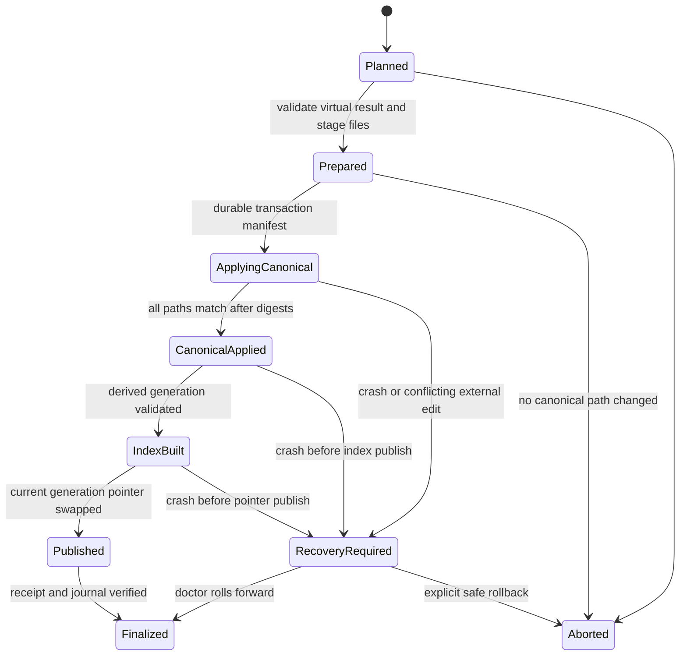

# Git-First Storage, Mutation và Database Model

**Trạng thái:** V1 storage/mutation baseline  
**Phạm vi:** Canonical workspace, mutation transaction, crash recovery, Git semantics, SQLite generations, runtime state và rebuild  
**Phụ thuộc:** [System architecture](01-system-architecture.md), [Curation UX](05-curation-lifecycle.md), [Source learning](06-source-learning-and-distillation.md), [Resolver](03-resolver-design.md), [Telemetry](04-telemetry-reproducibility-evaluation.md)

## 1. Decision summary

V1 dùng **state-based Git canonical model**, không dùng event sourcing.

```text
Current durable truth
  = validated YAML/Markdown/resource files in Git working tree

Durable audit/provenance
  = immutable operation, distill-run and decision records in Git working tree

Crash recovery
  = local write-ahead transaction directory, gitignored

Fast reads/search
  = rebuildable immutable SQLite catalog generations

Machine-local operational state
  = disposable SQLite WAL database

Telemetry
  = disposable SQLite WAL database; JSONL only as explicit export
```

`eventlog.jsonl` không phải canonical source of truth và không được replay để dựng business state.

## 2. Why not a canonical `eventlog.jsonl`

Một global append-only JSONL log có vẻ đơn giản nhưng không phù hợp với V1:

1. User khó review/edit current skill state bằng Git.
2. Rebuild phải replay toàn bộ lịch sử và giữ event upcasters mãi mãi.
3. Git merge trên một append-only file tạo hot spot/conflict.
4. Resource files lớn hoặc binary không phù hợp để nhúng vào events.
5. Compaction/snapshot tạo thêm một nguồn authority khó hiểu.
6. Event ordering giữa nhiều Agent Host/process cần distributed-log semantics không cần thiết.
7. Git đã cung cấp commit history/diff khi user chọn commit.
8. Curation cần current human-readable documents hơn là reconstructed aggregates.

Thay vào đó:

- current aggregate state nằm trong domain files;
- audit-worthy decisions nằm trong immutable, sharded records;
- transaction journal chỉ phục vụ crash recovery;
- telemetry events là disposable observation, không phải domain events.

## 3. Authority hierarchy

Khi dữ liệu mâu thuẫn, thứ tự authority là:

```text
1. Valid canonical files in workspace working tree
2. Pending recovery transaction, nếu canonical write đang dở
3. Git HEAD/history, dùng để review/restore/share—not current local truth
4. Published SQLite catalog generation
5. Operational/telemetry databases and caches
```

Git working tree, không phải Git HEAD, là local current state. Approved mutation có hiệu lực local trước khi commit.

SQLite không được reverse-sync vào canonical files. Nếu DB và files lệch nhau, files thắng và DB phải rebuild.

## 4. Workspace layout

```text
skillhub-workspace/
├── skills/<collection>/<skill>/
│   ├── SKILL.md
│   ├── skill.meta.yaml
│   ├── references/
│   ├── scripts/
│   └── assets/
├── sources/
│   ├── intake/<candidate-id>.yaml
│   ├── catalog/<source-id>.yaml
│   └── skills/LINK-<skill-id>--<source-id>.yaml
│   ├── sources/<source-id>/
│   │   ├── observations/<observation-id>.yaml
│   │   └── runs/<run-id>.yaml
│   ├── comparisons/<comparison-id>.yaml
│   └── skills/<skill-id>/
│       ├── insights/<insight-id>.yaml
│       ├── incorporations/<incorporation-id>.yaml
│       └── outcomes/<outcome-id>.yaml
├── history/
│   └── operations/<yyyy>/<mm>/<operation-id>.yaml
├── registry/
├── config/
├── evals/
├── .skillhub/
│   ├── schema-version                 # tracked
│   └── transactions/                  # gitignored recovery WAL
│       └── <operation-id>/
│           ├── manifest.json
│           ├── after/
│           └── before/                # optional rollback evidence
├── runtime/                            # entirely gitignored
│   ├── catalog/
│   │   ├── current.json
│   │   └── generations/<generation>.db
│   ├── edits/                         # 24h bounded recovery artifacts (REC-*.md)
│   ├── operational.db
│   ├── telemetry.db
│   ├── locks/
│   ├── cache/
│   └── artifacts/
├── .gitignore
└── .git/
```

`.gitignore` phải chứa tối thiểu:

```gitignore
/runtime/
/.skillhub/transactions/
```

Recovery transactions nằm ngoài `runtime/` để `rm -rf runtime && skillhub rebuild` không vô tình xóa journal của một canonical mutation bị crash.

## 5. Data classes

| Class | Examples | Canonical? | Rebuild behavior |
|---|---|---:|---|
| Active product state | skill content, metadata, routing policy | Có | Parse/validate/index |
| Source learning state | source revisions, findings, insights, outcomes | Có | Parse/validate/index |
| Durable audit | operation receipts, run records, decisions | Có | Validate/index selectively; không replay thành state |
| Derived catalog | parsed entities, relationships, FTS | Không | Rebuild hoàn toàn |
| Operational state | last check time, retry count, schedule | Không | Reset/recompute allowed |
| Telemetry | resolution timing, UX events | Không | Loss allowed |
| Cache | source responses, embeddings | Không | Refetch/recompute allowed |
| Recovery WAL | pending staged mutation | Tạm thời bắt buộc | Recover before normal operation |
| Editor recovery artifacts | temporary edits buffer with 24h TTL (`runtime/edits/`) | Không | Auto-cleanup after TTL / proposal confirm |
Không được đặt durable sequence/cursor/decision chỉ trong SQLite.

## 6. Canonical representation rules

### 6.1 Current state, not replayed state

Mỗi domain aggregate có current representation trực tiếp:

```text
Source current/distilled revision → source YAML
Insight current decision          → insights YAML
Skill current content             → SKILL.md + metadata
Routing policy                    → config/registry files
```

Rebuild đọc các files này; không replay operation receipts hay telemetry.

### 6.2 Immutable records

Các records sau immutable sau khi finalized, trừ migration có explicit supersession:

- finalized distill run;
- approved application proposal digest;
- incorporation record;
- outcome record version;
- operation receipt.

Correction tạo record mới với `supersedes`, không silently rewrite audit history.

### 6.3 Stable serialization

Canonical machine-managed YAML/JSON cần:

- UTF-8, LF;
- deterministic key ordering khi binary ghi;
- explicit schema version;
- timestamps RFC 3339 UTC;
- stable IDs independent of wording/path where possible;
- normalized repository-relative paths;
- no absolute local paths/secrets;
- no volatile `last_checked_at` fields.

Markdown/resource content giữ bytes do user quản lý, ngoài normalization được preview rõ.

### 6.4 Git-friendly file granularity

Frequently and independently mutated entities use one file per stable ID. Không dùng `intake.yaml`, `observations.yaml`, `insights.yaml` hoặc một global history file làm growing shared array.

Lợi ích:

- mutation chỉ rewrite entity liên quan;
- Git diff/review rõ;
- giảm merge conflict/hot file;
- operation before/after digest nhỏ;
- validation/index có thể incremental dù full rebuild vẫn supported.

Small low-churn policy documents có thể aggregate khi nội dung cần review atomically. Directory listing/index là derived projection; không commit generated catalog list chỉ để tăng tốc lookup.

File path là storage address, stable entity ID trong content vẫn là identity. Rename/move phải giữ ID và được operation receipt ghi nhận.

## 7. Operation receipt

Mọi successful **managed** canonical mutation có một operation ID và ghi một immutable receipt. External editor/Git changes nằm ngoài managed command path nên không được binary tự tạo receipt:

```yaml
schema_version: 1
id: OP-01J...
kind: insight_apply
occurred_at: 2026-09-28T10:30:00Z
actor:
  kind: agent_host
  client: codex
request_id: req_01J...
idempotency_key: apply:PROP-0081:sha256:...
proposal:
  id: PROP-0081
  digest: sha256:...
base_catalog_snapshot: sha256:...
result_catalog_snapshot: sha256:...
changes:
  - path: skills/software/consumer-reliability-review/SKILL.md
    before: sha256:...
    after: sha256:...
  - path: distill/skills/consumer-reliability-review/insights/INS-0042.yaml
    before: sha256:...
    after: sha256:...
status: applied
```

Rules:

- receipt stores metadata/digests, không duplicate complete file bodies;
- receipt là audit/index input, không phải event để reconstruct current state;
- source-only mutation có thể giữ same catalog snapshot before/after;
- receipt không chứa a global workspace digest that includes itself, tránh circular hash;
- rejected/no-op requests không cần canonical receipt, nhưng durable curator decisions như Insight rejection vẫn phải nằm trong canonical decision entity;
- distill run record có thể là domain-specific operation evidence, nhưng transaction vẫn có operation ID.

Operations shard theo year/month để tránh một hot append-only file.

## 8. IDs, idempotency và optimistic concurrency

### 8.1 IDs

Dùng UUIDv7/ULID ngẫu nhiên hoặc content-derived stable ID theo domain. Không dùng SQLite auto-increment cho canonical identity.

### 8.2 Idempotency

Mutation command nhận hoặc tạo `idempotency_key`:

```text
same key + same normalized command payload
→ return existing successful result

same key + different payload
→ idempotency_conflict
```

Successful key được lưu trong operation receipt và indexed vào SQLite. Nếu runtime DB bị xóa, rebuild phục hồi idempotency history từ receipts.

Retention/uniqueness policy cho idempotency records phải versioned; V1 giữ toàn bộ canonical operation receipts.

### 8.3 Preconditions

Semantic confirm pins:

```text
proposal_id
proposal_digest
base_catalog_snapshot
per-path before digests
```

Administrative mutation ít nhất pin affected path digests. Mismatch trả conflict; không last-write-wins.

## 9. Locking model

Mặc định có thể có nhiều MCP stdio processes cùng workspace.

```text
Read operation
→ shared workspace lock

Canonical mutation/rebuild/migration/recovery
→ exclusive workspace lock
```

Requirements:

- OS-level advisory file lock trong `runtime/locks/`;
- lock metadata chỉ để diagnose, không dùng PID file đơn thuần làm exclusion;
- bounded wait + actionable `workspace_busy` error;
- không giữ lock trong lúc chờ user approval hoặc chạy network/LLM;
- source fetch/distillation chuẩn bị ngoài exclusive lock;
- acquire exclusive lock lại để revalidate preconditions và commit;
- lock order cố định: workspace → transaction → database generation;
- không có hai canonical writers.

Long-running Agent work dùng prepare/confirm pattern để critical section ngắn.

## 10. Mutation protocol

### 10.1 Phases



### 10.2 Detailed algorithm

#### Phase A — plan outside write lock

1. Parse command and authorization context.
2. Read current snapshot/entities.
3. Generate proposed `WriteSet` and delete set.
4. Present preview if policy requires.
5. Pin proposal/base/path digests.

No canonical write occurs.

#### Phase B — prepare under exclusive lock

1. Acquire exclusive workspace lock.
2. Refuse normal mutation if another transaction is pending.
3. Reload canonical state.
4. Verify proposal, base snapshot and before digests.
5. Build an in-memory/temporary virtual resulting tree.
6. Run schema, reference, policy and domain invariant validation.
7. Allocate operation ID and operation receipt.
8. Add receipt to the `WriteSet` where required.
9. Stage all after-images under `.skillhub/transactions/<op>/after/`.
10. Optionally stage before-images needed for safe rollback.
11. Write transaction manifest and fsync staged files/directories.
12. Set durable phase `prepared`.

#### Phase C — apply canonical paths

Apply domain paths in deterministic order; write the operation receipt last so an `applied` receipt never precedes its domain after-images:

1. Verify current digest is expected `before` or already expected `after`.
2. Write sibling temporary file on the same filesystem.
3. fsync file.
4. Atomic rename/replace target.
5. fsync parent directory where supported.
6. After all domain paths match, write the operation receipt with the same procedure.

Deletes move/record before-image until transaction finalizes. Recovery determines progress by comparing actual digest with manifest, not by trusting a possibly stale step counter.

After all paths:

1. Validate actual canonical tree/invariants again.
2. Verify every changed path equals expected after digest.
3. Mark `canonical_applied` durably.

### 10.3 Derived publish

1. Build a fresh SQLite catalog generation from canonical files.
2. Run integrity checks and representative queries.
3. Record generation metadata and catalog snapshot.
4. Atomically replace `runtime/catalog/current.json` pointer.
5. Mark `index_published`.
6. Return operation ID, changed files, catalog snapshot and Git dirty status.
7. Remove recovery transaction only after final fsync/verification.

Active local publish occurs when canonical files and matching catalog generation are published—not when Git commit happens.

## 11. Transaction manifest

Example `.skillhub/transactions/OP-81/manifest.json`:

```json
{
  "transaction_version": 1,
  "operation_id": "OP-81",
  "command": "ConfirmInsightApplication",
  "phase": "canonical_applied",
  "created_at": "2026-09-28T10:30:00Z",
  "base_catalog_snapshot": "sha256:old",
  "files": [
    {
      "path": "skills/software/review/SKILL.md",
      "action": "replace",
      "before": "sha256:aaa",
      "after": "sha256:bbb",
      "staged": "after/skills/software/review/SKILL.md"
    }
  ],
  "expected_result_catalog_snapshot": "sha256:new"
}
```

Manifest contains no secrets or absolute paths. Paths are workspace-relative and containment-checked.

## 12. Crash recovery

Every workspace open/status/doctor checks `.skillhub/transactions/` before normal writes.

### 12.1 Deterministic classification

For each affected path:

```text
actual digest == before → not applied
actual digest == after  → applied
actual digest == neither → external conflict
```

Recovery table:

| Journal/canonical state | Action |
|---|---|
| Prepared, all paths before | Safe abort or roll forward; default abort if approval not recorded |
| Some before, some after | Roll forward from staged after-images |
| All paths after, DB old/missing | Rebuild and publish DB generation |
| DB generation built, pointer old | Validate then publish pointer |
| Any path neither before nor after | Stop as conflicted; never overwrite automatically |
| Receipt exists and operation finalized | Treat retry as idempotent success |

Default after an approved mutation is roll-forward. Rollback is explicit and only allowed when before-images/preconditions still match.

### 12.2 Recovery boundary

The journal protects against process/OS crash during a managed mutation. It cannot guarantee recovery if user manually deletes both journal and uncommitted files. Git commit/backup remains the durable off-machine boundary.

`doctor --fix` previews recovery action. Normal commands return `recovery_required` until resolved.

### 12.3 Canonical schema migration

Canonical schema migration is explicit and registry-driven. Startup, status, doctor, validation, and rebuild may report an incompatible canonical version but must not rewrite it. Doctor marks that finding non-mechanically-fixable and directs the operator to `skillhub migrate`.

Migration follows the same prepare/confirm contract as any semantic mutation:

1. `skillhub migrate --workspace <root>` resolves an ordered supported path and returns a read-only diff with source version, target version, proposal digest, base catalog snapshot, and per-path before digests.
2. The operator backs up or commits the workspace and confirms with `--to <version> --yes`.
3. Confirmation reloads and pins the source tree, then applies every migration step through the canonical WAL and exclusive workspace lock.
4. The immutable operation receipt records `source_schema_version` and `target_schema_version` in addition to normal proposal and snapshot evidence.
5. A crash uses ordinary deterministic recovery. A retry with the same normalized request is idempotent; a stale preview or changed source fails closed.

The migration registry contains the ordered transitions:
- `0 → 1`: legacy unversioned workspace to V1 canonical schema.
- `1 → 2`: V1 to V2 canonical schema, establishing the `.meta` boundary rule where hub metadata (`.meta/` and `skill.meta.yaml`) is excluded from content digests and distribution, and `.meta/distill.yaml` is excluded from the catalog snapshot. Workspaces at schema version 2 require binary version >= 1.6.0; older binaries reject the workspace via the schema version check instead of misjudging trust.

Future transitions must be ordered, deterministic, separately tested, and must never derive canonical truth from SQLite. Catalog format incompatibility remains derived maintenance: after canonical validation and recovery checks pass, it may rebuild automatically without a canonical migration.

## 13. Catalog snapshot

`catalog_snapshot` identifies behavior served to resolver/distribution. It hashes only catalog-affecting canonical inputs, for example:

```text
skill manifests and resources
registry and aliases
routing policy and eval-selected thresholds
relevant schema/normalization versions
```

It normally excludes:

```text
operation receipts
telemetry
runtime check timestamps
source intake not exposed to routing
distill proposals not yet applied
.meta/distill.yaml (lessons/coverage do not affect the catalog snapshot)
```

Canonical serialization includes normalized relative path, byte digest and role. Git commit SHA alone is insufficient because working tree may be dirty.

SQLite generation còn pin `projection_input_digest`, hash của toàn bộ canonical inputs được project/index vào generation, bao gồm source-learning entities và operation receipts nếu chúng có lookup projection. Vì vậy source/insight change có thể tạo generation mới dù `catalog_snapshot` không đổi.

```text
catalog_snapshot
→ identity of resolver/distribution behavior

projection_input_digest
→ identity of every canonical input represented in this SQLite generation
```

Operation receipt có thể chứa before/result `catalog_snapshot`, nhưng không chứa `projection_input_digest` nếu digest đó bao gồm chính receipt, tránh recursive hash.

## 14. SQLite database model

### 14.1 Split by responsibility

#### Immutable catalog generations

```text
runtime/catalog/generations/<generation-id>.db
```

Contains:

- parsed skills/manifests/resources;
- source/insight query projections;
- relationships and aliases;
- FTS5 indexes;
- resource digests;
- operation/idempotency lookup projection;
- generation metadata.

After publish it is read-only. Business mutations never update these tables row-by-row as durable writes.

#### Mutable operational database

```text
runtime/operational.db
```

SQLite WAL mode; contains disposable machine-local state:

- last check time;
- scheduler next run;
- transient availability/retry state;
- cache metadata;
- local job leases/progress that can be reconstructed or retried;
- table `skill_upstream_state`: volatile, rebuilt by the next check. Chứa trạng thái drift per-skill (`skill_id`, `source_id`, `checked_commit`, `upstream_digest`, `changed_files`, `status`, `checked_at`).

It must not contain the only copy of cursor, decision, proposal or incorporation state.
#### Telemetry database

```text
runtime/telemetry.db
```

SQLite WAL mode; bounded retention. May be merged physically with operational DB only after contention benchmarks, while remaining logically disposable.

### 14.2 Why immutable generation files

- readers can finish on old generation;
- writer builds new DB without mutating live read state;
- crash before pointer swap leaves old generation valid;
- cross-process readers do not observe half-rebuilt tables;
- generation can be validated before publish;
- Windows/open-file rename constraints are avoided because old DB is not replaced.

### 14.3 Generation pointer

`runtime/catalog/current.json`:

```json
{
  "generation": "gen-01J...",
  "database": "generations/gen-01J....db",
  "catalog_snapshot": "sha256:...",
  "projection_input_digest": "sha256:...",
  "canonical_schema_version": 2,
  "derived_schema_version": 3,
  "builder_version": "1.0.0"
}
```

Write pointer via temp file + fsync + atomic rename. Readers open the named generation and pin it for the request/session. Old generations are garbage-collected later under policy; never delete a generation potentially in use during publish.

## 15. Rebuild algorithm


### 15.1 Rebuild triggers

Cùng application service `BuildCatalogGeneration` được gọi bởi:

```text
skillhub init [path]  # path defaults to the current directory
→ create/validate empty canonical skeleton
→ rebuild

skillhub rebuild
→ explicit full rebuild

skillhub doctor --fix
→ rebuild when generation is missing, stale or corrupt

managed canonical mutation
→ rebuild/publish after canonical WriteSet succeeds

server/workspace open
→ auto-rebuild when generation is absent or derived schema is incompatible
```

### 15.2 State basis, fallback and degraded startup

Skill Hub phân biệt rõ ràng hai tầng state basis:
1. **Canonical state:** Dữ liệu chuẩn được version trong Git working tree (`skills/`, `sources/`, `distill/`).
2. **Served state:** Catalog SQLite generation (`runtime/catalog/generations/<gen>.db`) được compiled để phục vụ resolver.

**Resource-verified fallback:**
- Khi canonical files bị chỉnh sửa ngoài luồng (direct editing, git pull/merge) hoặc generation bị cũ: các skill mà files không đổi và match digest vẫn có thể servable với diagnostics báo degraded.
- Khi companion resources (`references/`, `scripts/`, `assets/`) bị sửa đổi hoặc xóa mà chưa rebuild, các resources đó không thể load được (`resource_content_unavailable`). Hub **không bao giờ đoán hoặc tái tạo historical bytes từ cache cũ**.
- **Mutation blocking:** Khi canonical workspace invalid, mọi managed mutation (`skill create`, `skill edit`, `skill activate`, etc.) bị block với `workspace_invalid` hoặc `validation_failed` cho đến khi canonical files được sửa.
- **Fresh clone:** Sau khi `git clone`, runtime directory hoàn toàn trống. Chạy `skillhub rebuild` (hoặc bất kỳ read command nào) sẽ validate canonical files và build catalog generation đầu tiên.
- **Degraded MCP startup:** Nếu SQLite catalog bị thiếu hoặc corrupt khi agent khởi động MCP stdio server (`skillhub mcp serve`), server sẽ boot ở degraded mode. Các diagnostic tools (`hub_status`, `skill_review`, `workspace_validate`, `workspace_rebuild`) vẫn hoạt động bình thường để agent chẩn đoán và khắc phục, trong khi các routing tools trả về actionable errors mà không crash stdio transport.

### 15.3 Staged validation (`validate --staged`)

Để hỗ trợ Git pre-commit workflows mà không bị ảnh hưởng bởi uncommitted working-tree changes:
- `skillhub validate --staged` đọc trực tiếp stage-0 blob objects từ Git index.
- Không chạy checkout filters, không mutate Git index, và không đụng working tree.
- Không có proprietary hook installer (`skillhub hook install` không tồn tại). Người dùng gọi trực tiếp một dòng `skillhub validate --staged` từ hook manager bất kỳ (Husky, Lefthook, pre-commit framework, hoặc script `.git/hooks/pre-commit`).

### 15.4 Editor concurrency and 24-hour recovery artifacts

Khi chỉnh sửa skill bằng external editor (`skillhub skill edit <id> --editor`):
- Trước khi mở editor, Hub ghi lại digest của canonical content hiện tại (`expectedContentDigest`).
- Khi editor đóng, Hub đối chiếu digest: nếu canonical content bị writer khác sửa trong lúc editor đang mở, Hub từ chối preview với lỗi `edit_conflict`.
- Trước khi preview và khi phát hiện conflict, Hub lưu lại buffer đã sửa vào recovery file bất biến tại `runtime/edits/REC-<proposal-id>-<timestamp>.md` với permission 0600.
- Recovery files có TTL 24 giờ và được tự động dọn dẹp khi proposal được confirm hoặc khi hết hạn.

### 15.5 Immutable build input

Rebuild không đọc trực tiếp từng file rồi vừa đọc vừa insert live DB. Nó tạo một immutable build input:

1. Check pending recovery transaction.
2. Acquire shared workspace lock để chặn managed canonical writer.
3. Enumerate known canonical roots theo normalized relative path, sorted bytewise.
4. Reject unresolved Git conflict state và unsafe path/symlink.
5. Read bytes, classify schema/resource role và compute per-file digest.
6. Parse strict schemas into in-memory/temporary typed entities.
7. Compute `catalog_snapshot` và `projection_input_digest`.
8. Release shared lock after build input is complete.

External editors không tuân advisory lock, nên publish phase phải recheck file inventory/digests. Nếu inputs đổi trong lúc scan/build, discard generation và retry/báo `canonical_changed_during_rebuild`; không publish stale generation.

### 15.3 Parse and validation passes

#### Pass 1 — identity and shape

- decode schema version strictly;
- collect Skill, Source, Observation, Comparison, Insight, Run, Incorporation, Outcome, Operation IDs;
- detect duplicate IDs and ID/path mismatch;
- validate enums, required fields and relative paths;
- compute resource digests without executing resources.

#### Pass 2 — references and invariants

- resolve aliases and relationships;
- verify source/revision/evidence references;
- verify finalized run artifacts and distilled cursor;
- verify Insight → Proposal → Incorporation → Outcome chain;
- verify active-skill requirements and routing metadata;
- validate operation receipt path/digest shape and idempotency-key uniqueness.

Operation receipts are parsed only into audit/idempotency projections. They are never replayed to construct current Skill/Source/Insight state.

### 15.4 Projection mapping

Typical mapping:

| Canonical input | Derived projection |
|---|---|
| `skill.meta.yaml` | skill, trigger, requirement and relationship rows; `provenance.origin.files_digest` for local edit verification |
| `SKILL.md` and resources | resource manifests, paths and digests; selected searchable fields only |
| `sources/catalog/*.yaml` | source/revision/query rows |
| `sources/skills/LINK-*.yaml` | learning relationship links |
| observations/comparisons | learning relationship and optional curation FTS rows |
| insights/incorporations/outcomes | inbox, provenance and outcome rows |
| operation receipts | operation/idempotency lookup rows |
| aliases/routing config | resolver lookup and compiled policy rows |

Resource bodies remain canonical files. SQLite normally stores path/digest/selected extracted text, not a second authoritative copy of every resource byte.

### 15.5 Build and verify generation

From immutable build input:

1. Create a never-before-published generation path.
2. Create derived schema for the binary's `derived_schema_version`.
3. In one SQLite transaction, insert typed rows and relationships.
4. Build FTS5 and other configured indexes.
5. Store canonical schema, derived schema, builder version, both digests and row counts.
6. Commit and close writer connection.
7. Run `PRAGMA integrity_check`, `PRAGMA foreign_key_check` and representative query smoke tests.
8. Reject generation if row counts/references/digests differ from build input.

V1 full rebuild scans all canonical inputs. Incremental rebuild may be added later only as an optimization; full rebuild remains the correctness oracle.

### 15.6 Race-safe publish

Before pointer swap:

1. Acquire exclusive workspace lock.
2. Recheck no pending transaction exists.
3. Recompute/verify lightweight canonical inventory and `projection_input_digest`.
4. If digest changed, do not publish; discard/retry generation.
5. Verify generation metadata contains matching projection/catalog digests.
6. Write and fsync temporary `current.json`.
7. Atomic rename to `runtime/catalog/current.json`.
8. Release lock and defer old-generation GC.

A build/publish failure never mutates canonical files and never invalidates the previous pointer.

### 15.7 What rebuild restores

Rebuild restores logical projections for all canonical knowledge and policy. It does not restore:

```text
last_checked_at
scheduler next-run time
transient retry/availability state
telemetry history
cache contents
raw eval run artifacts not committed to Git
```

Missing `runtime/operational.db` is recreated empty/default and sources become due according to policy. Missing `runtime/telemetry.db` starts a new telemetry history.

### 15.8 Determinism guarantee

Two machines with the same canonical bytes and compatible binary/schema versions must produce:

- same `catalog_snapshot`;
- same `projection_input_digest`;
- equivalent entities, relationships, FTS documents and query results.

SQLite files/generation IDs need not be byte-identical because page layout, SQLite/library details and local build metadata may differ.

### 15.9 Core rules

1. No network access.
2. Do not modify canonical files.
3. Do not replay telemetry or operation receipts into business state.
4. Parse current canonical entities directly.
5. Fail without pointer swap if any required canonical entity is invalid.
6. Build into a new generation path, never truncate current DB.
7. Publish only after race-safe digest recheck.
8. Preserve old valid generation on failure.
9. Operational/telemetry DB loss does not block rebuild.
10. `init` creates valid empty canonical files and invokes this same service.

## 16. Open and stale-index behavior

On open/request, binary compares current generation metadata with a lightweight canonical change detector.

```text
match
→ serve generation

known managed mutation/rebuild in progress
→ wait/busy according to lock policy

canonical files changed externally but validate
→ mark index stale; rebuild before serving new state

external canonical files invalid
→ keep last valid generation available only with explicit stale warning/policy
→ mutation commands fail until fixed
```

V1 favors correctness over transparent mixed-state serving. Resolver must never combine metadata from one generation with resources from an incompatible current file state. If an old pinned resource can no longer be served with matching digest, return `snapshot_expired` and resolve again after rebuild.

## 17. External edits and Git operations

### 17.1 External editor

Direct edits are allowed because files are canonical.

After edit:

```text
skillhub validate
skillhub rebuild
```

or System Curator Skill detects stale state and offers the same application commands.

External edit has no managed operation receipt unless user explicitly adopts/records it. Git diff remains its audit evidence. Rebuild must not silently create canonical files merely to record detection.

### 17.2 Git pull/checkout/merge

Before Git operation, no managed transaction may be pending. After operation:

1. reject unresolved Git conflict markers/index conflicts;
2. validate canonical schema/references;
3. rebuild new generation;
4. keep previous generation if validation fails;
5. report current branch/dirty state without treating Git HEAD as local truth.

Skill Hub V1 does not run automatic `git pull`, commit or push during normal curation.

### 17.3 Git commit

Commit is user-controlled durability/sharing/review boundary. Commit may group several operation receipts. One operation does not imply one commit.

## 18. Event and log policy

### 18.1 Domain events

V1 does not maintain a global canonical event stream. Domain history is represented by:

- current canonical state;
- immutable operation receipts;
- immutable distill runs/incorporations/outcomes;
- Git commits when created.

### 18.2 Telemetry events

Telemetry goes to `runtime/telemetry.db` through bounded async writes. Failure/drop must not affect command result or business state.

`skillhub telemetry export` may produce versioned NDJSON/JSONL for portability:

```text
runtime/artifacts/telemetry-export-<time>.jsonl
```

This file is an export artifact, not an authority and not replayed during rebuild.

### 18.3 Process logs

Structured logs may be emitted to stderr or rotated runtime files. They do not contain canonical decisions and are never required for recovery.

## 19. Migration

Canonical and derived schema versions are separate.

```text
canonical schema changed
→ explicit migration proposal
→ preview file diffs
→ backup/stage transaction
→ canonical mutation protocol
→ rebuild derived generation

only derived schema changed
→ rebuild generation; no canonical mutation
```

Binary upgrade never silently mutates canonical files. It may automatically rebuild disposable derived DB when compatible policy permits, but must report cost/status and never bypass a pending recovery transaction.

Migration is idempotent and records source/target schema versions in operation receipt.

## 20. Security and filesystem requirements

- Resolve every path against workspace root and reject escape/symlink traversal.
- Staged files must remain on same filesystem as targets where atomic rename is required.
- Use restrictive permissions for transaction before-images and runtime DBs.
- Do not stage secrets into canonical operation receipts.
- Limit file count/size and total transaction bytes.
- Verify staged digest before every replacement.
- Never execute resource files during scan/rebuild.
- Treat Git hooks as external executable behavior; Skill Hub does not invoke commits automatically.

## 21. Application-service boundaries

Delivery adapters call these semantics rather than writing files/DB directly:

```text
PlanMutation(command, expected base)
ConfirmMutation(proposal ID, digest, base)
ExecuteCanonicalMutation(write set, operation metadata)
RecoverPendingMutation(operation ID, strategy)
ValidateWorkspace()
BuildCatalogGeneration()
PublishCatalogGeneration()
GetWorkspaceStatus()
```

Domain-specific mutation commands compose the generic mutation service with their own invariants:
- `skill_create`: tạo draft skill mới.
- `skill_edit`: sửa metadata hoặc content của skill.
- `skill_lifecycle`: chuyển trạng thái `draft` → `active` → `deprecated` → `archived`.
- `skill_upstream_update`: áp dụng cập nhật 3-way merge từ upstream repository vào skill với các file pins và before digests.
- `source_backfill`: bổ sung source record và `provenance.origin.files_digest` cho các skill legacy.
- `source_attach`: gắn learning reference vào skill (`sources/skills/LINK-*.yaml`).
- `source_detach`: gỡ bỏ learning reference khỏi skill.
- `source_unwatch`: ngừng theo dõi và xóa source nếu không còn skill nào tham chiếu (bảo đảm no-orphan).
- `insight_apply`: áp dụng insight proposal vào `SKILL.md` qua patch composer.
Repository adapters expose controlled operations:

```go
type CanonicalRepository interface {
    Snapshot(ctx context.Context) (CanonicalSnapshot, error)
    Read(ctx context.Context, path RelPath) ([]byte, Digest, error)
    ValidateVirtual(ctx context.Context, writes WriteSet) (ValidationReport, error)
    CommitWriteSet(ctx context.Context, tx MutationTransaction) (MutationResult, error)
}

type CatalogStore interface {
    Build(ctx context.Context, snapshot CanonicalSnapshot) (Generation, error)
    Validate(ctx context.Context, generation Generation) error
    Publish(ctx context.Context, generation Generation) error
    Current(ctx context.Context) (Generation, error)
}
```

## 22. Failure semantics

| Failure | Result |
|---|---|
| Validation before staging | No write |
| Crash after staging, before canonical apply | Abort or recover safely |
| Crash during canonical path replacement | `recovery_required`; digest-based roll-forward |
| Crash after canonical apply, before DB build | Canonical wins; rebuild DB |
| DB build/integrity failure | Canonical retained; old generation retained; index stale |
| Pointer publish failure | Old generation retained; retry publish/rebuild |
| Telemetry/operational DB failure | Command business result unaffected; reset DB |
| External edit during prepared proposal | Conflict; regenerate proposal |
| External edit during recovery | Stop; no automatic overwrite |
| Git merge conflict | Validation/rebuild blocked until resolved |

Errors use `ERROR / WHY / FIX` and include operation ID when available.

## 23. Testing strategy

### Unit/property

- deterministic serialization and digest;
- path containment;
- idempotency key behavior;
- before/after digest classification;
- catalog snapshot excludes non-behavioral files;
- same canonical tree builds equivalent query state.

### Fault injection

Crash/fail after every mutation step:

```text
manifest write
staging fsync
first/middle/last canonical replace
canonical validation
DB generation build
DB integrity check
pointer temp write
pointer rename
journal cleanup
```

Every case must recover to exactly old or intended new valid state, never an accepted mixed state.

### Integration

- concurrent readers during generation build/publish;
- two stdio processes racing one mutation;
- Windows/macOS/Linux locking and atomic replacement;
- delete all runtime DBs then rebuild offline;
- invalid external edit preserves old generation;
- Git checkout between valid revisions rebuilds correctly;
- idempotent retry after lost response returns same operation.

## 24. Acceptance criteria

1. Deleting `runtime/` loses no canonical skill/source/decision state.
2. Rebuild requires no telemetry, event log or network.
3. Rebuild reads current canonical state directly; no event replay.
4. SQLite never contains the only copy of a durable cursor/decision.
5. A valid generation is never partially updated.
6. Failed generation build leaves previous generation usable.
7. Multi-file managed mutation is recoverable after injected crash at every step.
8. Pending recovery blocks conflicting normal writes.
9. Confirmed proposal cannot apply against changed base/path digests.
10. Idempotent retry cannot duplicate a successful mutation.
11. Routine unchanged source checks do not change canonical files.
12. Telemetry loss never changes routing or curation state.
13. External invalid edits are not published into a new generation.
14. Operation response identifies changed paths, operation ID, catalog snapshot and Git status.
15. No global `eventlog.jsonl` is required to initialize, open, rebuild or recover the workspace.
