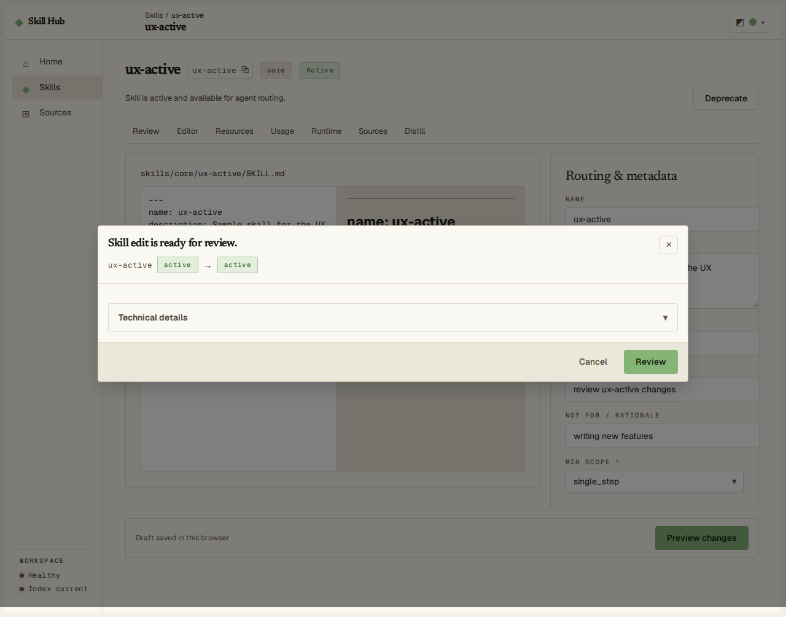
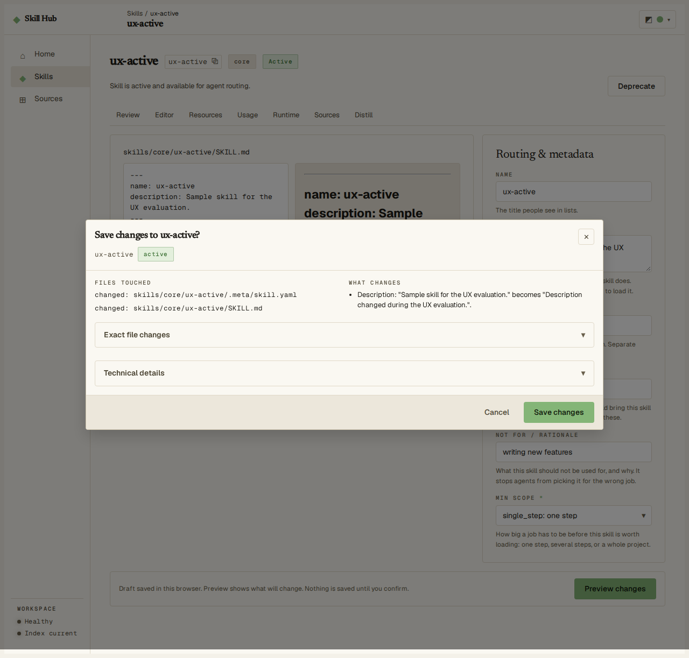
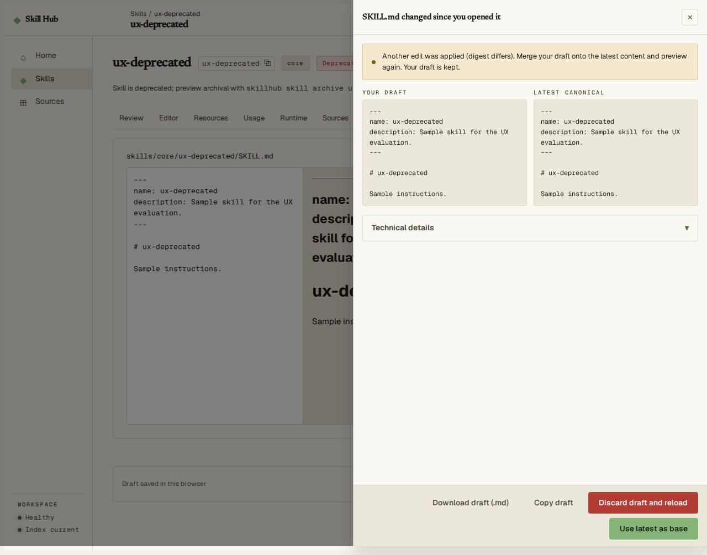
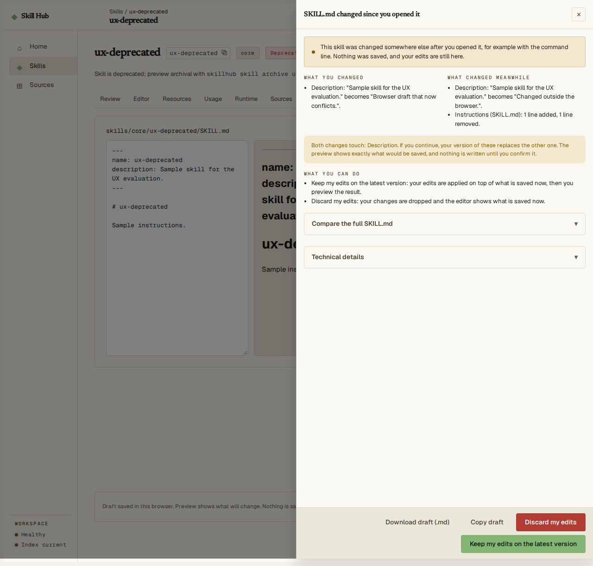
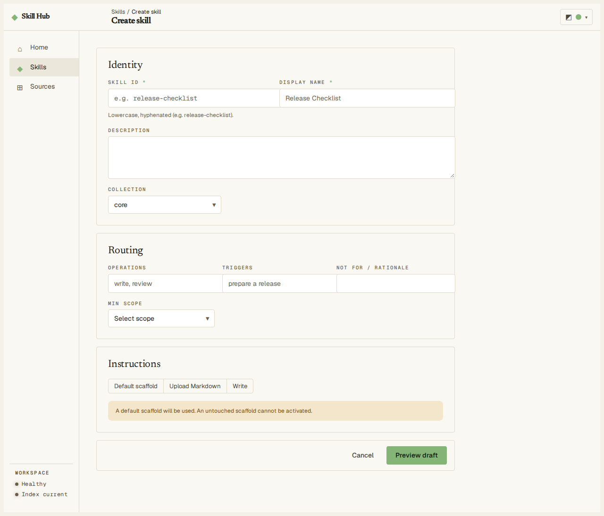
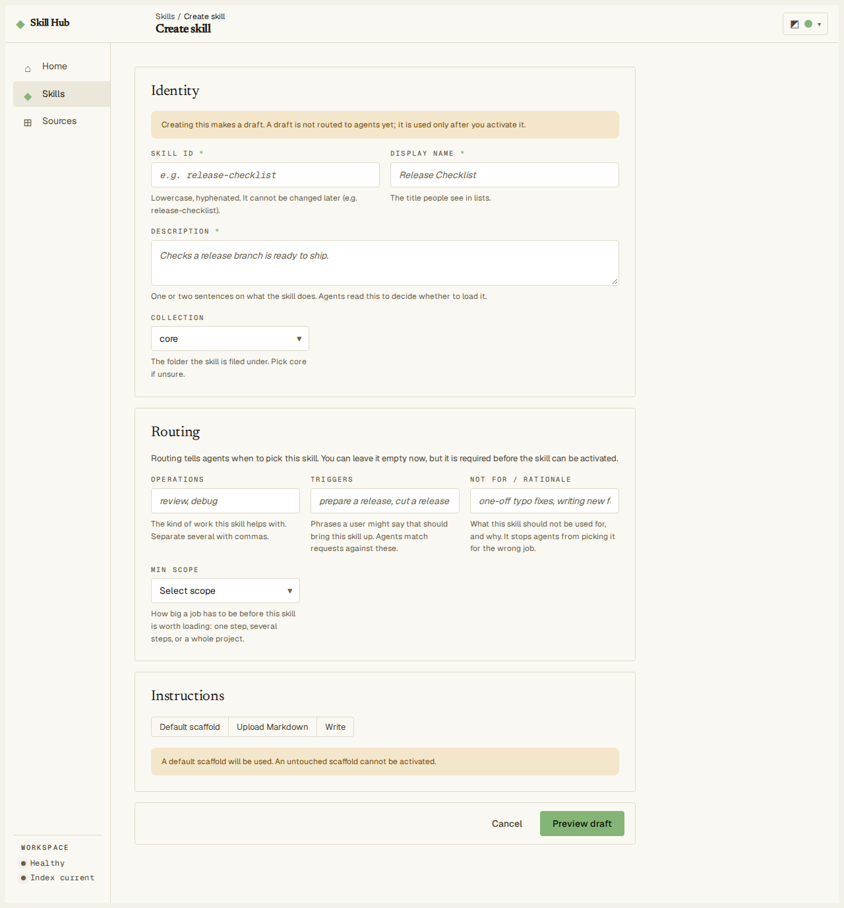
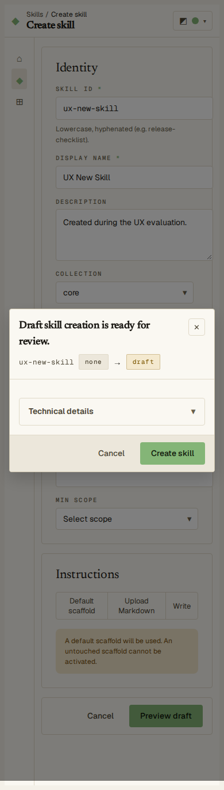
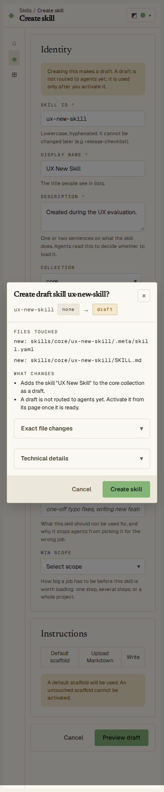
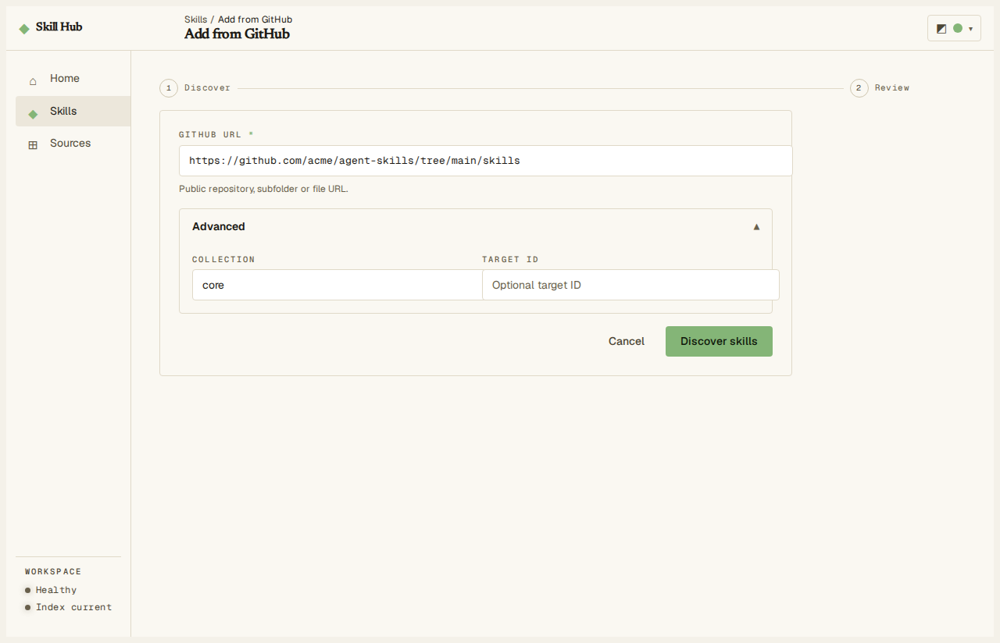
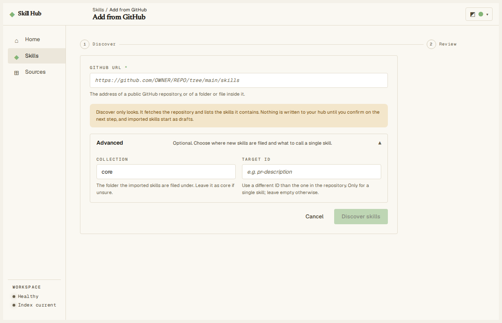

# Web UI curation scorecard

Scores for each flow, judged with [the rubric](web-ux-rubric.md) from the capture harness output
(`make web-ux`). Scale: 0 fail, 1 weak, 2 good. Plan: `plans/261010-1454-web-curation-ux-evaluation/plan.md`.

Columns: Task, Next step, Wording, State, Safety, Copyable, Mobile, Access.

## Tier 1: daily flows

Scored on the capture of the hub clone, before the Tier 1 fixes and after them. "Before" is the
state at commit `7ec5811`; "after" is the working tree that carries the fixes below.

### Before

| Flow | Task | Next | Wording | State | Safety | Copyable | Mobile | Access | Defects |
|---|---|---|---|---|---|---|---|---|---|
| home | 1 | 0 | 0 | 1 | 2 | 0 | 1 | 1 | D3, D9, D10, D11 |
| skills-list | 2 | 1 | 1 | 2 | 2 | 2 | 0 | 2 | D6, D8, D10 |
| skill-review | 1 | 2 | 1 | 2 | 2 | 1 | 0 | 2 | D2, D7, D9, D10, D12, D14, D15 |
| skill-review-draft | 1 | 1 | 1 | 1 | 2 | 1 | 0 | 2 | D7, D9, D10, D12, D14 |
| lifecycle-activate | 1 | 1 | 1 | 1 | 2 | 1 | 0 | 2 | D9, D10, D12 |
| lifecycle-deprecate | 1 | 2 | 0 | 1 | 1 | 2 | 1 | 2 | D13, D16 |

### After

| Flow | Task | Next | Wording | State | Safety | Copyable | Mobile | Access | Notes |
|---|---|---|---|---|---|---|---|---|---|
| home | 2 | 2 | 1 | 2 | 2 | 2 | 2 | 2 | Overview still lists "pending insights" and "changed sources" as raw category names; see open question. |
| skills-list | 2 | 2 | 2 | 2 | 2 | 2 | 2 | 2 | Rows stack on a phone with the column names beside each value. |
| skill-review | 2 | 2 | 2 | 2 | 2 | 2 | 2 | 2 | |
| skill-review-draft | 2 | 2 | 2 | 2 | 2 | 2 | 2 | 2 | What is missing is said once next to the button, with a link to the editor. |
| lifecycle-activate | 2 | 2 | 2 | 2 | 2 | 2 | 2 | 2 | The harness captures only the disabled state; the confirm dialog of a skill that is ready to activate is covered by the lifecycle E2E. |
| lifecycle-deprecate | 2 | 2 | 2 | 2 | 2 | 2 | 2 | 2 | Dialog says what changes and uses the action as the confirm label. |

No 0 remains on Task success, Next step or Copyable. Metrics after the fixes: no cut-off element and no
horizontal overflow at 390 px on these six flows, and no serious or critical axe finding at either width
(before: one at 390 px on home).

## Defects

D1 to D8 are the ids from the plan. D9 and up were found in this tier.

| Id | Severity | Defect | Status |
|---|---|---|---|
| D2 | High | A command could run off its box (no wrap, scroll inside the box) so it could not be read whole. | Fixed: every command wraps and the copy button copies the whole command. Covered by a unit test. |
| D3 | Medium | Home showed every count twice (Overview and Action categories). | Fixed: the second list is gone. Categories the product does not use yet read "Not set up", not 0. |
| D6 | Medium | At 390 px the Create skill button and the Routing column were pushed off screen. | Fixed: buttons wrap, rows stack with a label per value. |
| D7 | Low | Provenance title and button overlapped on a narrow card. | Fixed: the header row wraps. |
| D8 | Low | Three filters all showed "All". | Fixed: each has a visible label (Lifecycle, Collection, Upstream) and search has one too. |
| D9 | High | A missing spacing token (`--space-10`) voided the whole padding of the page area, so every page touched the header and the rail, and the title overlapped the header at 390 px. | Fixed in the shell. |
| D10 | High | At 390 px the left rail took 168 px and the header brand 200 px, leaving about 220 px for content. | Fixed: the rail is an icon strip and the brand name hides under 720 px. |
| D11 | High | Home's next action read "host integration missing" with no command, no reason, no way forward. | Fixed: plain title, a one-sentence reason and a copyable `skillhub doctor --fix`. |
| D12 | Medium | A draft that cannot be activated showed a long CLI sentence with raw backticks and a separate "Missing activation requirements"; a ready draft told the user to use the CLI next to an Activate button. | Fixed: one line lists what is missing with a link to the editor; a ready draft says it is ready. |
| D13 | Medium | The transition dialog was titled "Skill deprecated transition is ready for review.", showed an empty Diff and the button said "Confirm deprecated". | Fixed: "Deprecate ux-active?", a "What changes" line, no empty diff, button "Deprecate skill". |
| D14 | Medium | Review tab used internal words (canonical, served, validity) and always showed "Structurally valid". | Fixed: each card has a one-line explanation, the badge follows the review result. |
| D15 | Low | The header chip showed the skill's first operation as if it were its collection. | Fixed: it shows the collection. |
| D16 | Low | Dialog shadows used tokens that do not exist, so dialogs had no elevation. | Fixed: the tokens map to the design system's elevation. |

## Evidence

Before and after, 1280 px and 390 px (images in `web-ux-evidence/tier1/`):

| Flow | Before | After |
|---|---|---|
| home 1280 |  |  |
| home 390 |  |  |
| skills list 390 |  |  |
| draft review 1280 |  |  |
| draft review 390 |  |  |
| deprecate dialog 1280 |  |  |
| deprecate dialog 390 |  |  |

## Tier 2: weekly flows

Scored the same way on the capture of the hub clone, before and after the Tier 2 fixes. "Before" is the
state at commit `8d60581`. Upstream updates could not be captured with an update present: the hub clone has no
upstream-tracked skills and the CLI only adds skills from a real GitHub address, so the update review screen
was scored from its source and unit tests rather than from a screenshot.

### Before

| Flow | Task | Next | Wording | State | Safety | Copyable | Mobile | Access | Defects |
|---|---|---|---|---|---|---|---|---|---|
| editor | 1 | 1 | 1 | 2 | 2 | 2 | 1 | 2 | D20, D21, D22 |
| editor-preview | 0 | 1 | 0 | 1 | 0 | 2 | 2 | 2 | D17, D18 |
| editor-conflict | 1 | 1 | 1 | 1 | 0 | 2 | 2 | 2 | D19, D23 |
| create | 1 | 1 | 1 | 2 | 2 | 2 | 1 | 2 | D20, D22, D24, D27 |
| create-preview | 0 | 1 | 0 | 1 | 1 | 2 | 2 | 2 | D17, D24 |
| add | 1 | 1 | 1 | 1 | 2 | 2 | 1 | 2 | D22, D25, D27 |
| add-advanced | 1 | 1 | 1 | 1 | 2 | 2 | 1 | 2 | D25 |
| upstream-updates | 1 | 0 | 1 | 1 | 2 | 2 | 2 | 2 | D26 |

### After

| Flow | Task | Next | Wording | State | Safety | Copyable | Mobile | Access | Notes |
|---|---|---|---|---|---|---|---|---|---|
| editor | 2 | 2 | 2 | 2 | 2 | 2 | 2 | 2 | Every routing field has a one-line explanation and an example; Preview changes stays off until something changed. |
| editor-preview | 2 | 2 | 2 | 2 | 2 | 2 | 2 | 2 | Says in words what changes; the exact patch is one click away. |
| editor-conflict | 2 | 2 | 2 | 2 | 2 | 2 | 2 | 2 | Shows what each side changed and keeps an edit made elsewhere. |
| create | 2 | 2 | 2 | 2 | 2 | 2 | 2 | 2 | Says a draft is not routed yet; Preview draft is on the first screen at 1280 x 800. |
| create-preview | 2 | 2 | 2 | 2 | 2 | 2 | 2 | 2 | |
| add | 2 | 2 | 2 | 2 | 2 | 2 | 2 | 2 | Not captured past Discover (needs the network). The Review step is covered by unit tests. |
| add-advanced | 2 | 2 | 2 | 2 | 2 | 2 | 2 | 2 | |
| upstream-updates | 2 | 2 | 2 | 2 | 2 | 2 | 2 | 2 | Empty list explains why and how to check; the update review screen is scored from source and tests only. |

No 0 remains on Task success, Wording or Safety. Metrics after the fixes: no cut-off element, no horizontal
overflow and no serious or critical axe finding at 1280 or 390 px on these eight captures (same as before).

### Defects found in this tier

| Id | Severity | Defect | Status |
|---|---|---|---|
| D17 | High | The preview dialogs of Editor and Create were empty apart from a title and "Technical details". The web client read fields the API does not send (`impact`, `paths`, a text `diff`) and ignored the ones it does (`diff` as path lists, `full_diff`, `routing_impact`). | Fixed: one reader for the real fields; the dialog lists the files touched, what changes in words, and the exact patch behind a toggle. |
| D18 | High | Editor confirm said "Skill edit is ready for review." and the button said "Review"; the result was a toast with a raw operation id. | Fixed: "Save changes to <id>?", button "Save changes", toast "Saved 1 change to <id>."; after saving the form shows the saved text. |
| D19 | High | "Use latest as base" sent the old description back, silently undoing an edit made elsewhere; "Discard draft" reset only some fields. | Fixed: the person's edits are applied on top of the saved version and only for fields they changed; discard resets every field. Covered by unit and E2E tests. |
| D23 | High | The conflict drawer showed the same stale text on both sides ("Latest canonical" was the version the editor opened with) and the label "digest differs". | Fixed: the latest version is fetched; the drawer lists what you changed and what changed meanwhile, warns when both touched a field, and explains both ways forward. |
| D20 | Medium | Operations, Triggers, "Not for / Rationale" and "Min scope" had no explanation anywhere. | Fixed: one-line hint and an example on Create and Editor (shared text); scope choices say what they mean. |
| D21 | Medium | The readiness card's "Go to field" buttons opened the Editor without focusing the field. | Fixed: the cursor lands in the field that was named. |
| D24 | Medium | Create did not say that it makes a draft that is not routed yet, and left Description optional on the form while the server rejects an empty one. | Fixed: notes on the form and in the preview; Description is marked required and checked on the form. |
| D27 | Medium | A taken skill id or any other server-side validation failure came back as "The request conflicts with validation rules" with no reason. | Fixed in `routes_skill_write.go`: the validation message becomes the reason for create and edit previews. |
| D25 | Medium | Add from GitHub started with a made-up address that looked real, did not say what Discover does, and the Review step ignored the license, conflicts and files. | Fixed: empty field with an italic placeholder, a note that Discover only looks, hints under Advanced; the Review step shows the skills, revision, trust note, license warning, conflicts and files that would be written. |
| D26 | Low | The Skills list gave no help when no skill has an upstream update. | Fixed: the empty state says why and offers `skillhub skill outdated --check`; the filter option reads "Has an update". |
| D22 | Medium | Inputs were wider than their column (no border-box), so fields touched each other and crossed the card edge. | Fixed in the shared stylesheet; placeholders are italic so they do not pass for typed values. |

### Evidence

Before and after (images in `web-ux-evidence/tier2/`):

| Flow | Before | After |
|---|---|---|
| editor preview 1280 |  |  |
| editor conflict 1280 |  |  |
| create 1280 |  |  |
| create preview 390 |  |  |
| add, advanced open 1280 |  |  |

## Tier 3

Filled in by the later phases.
