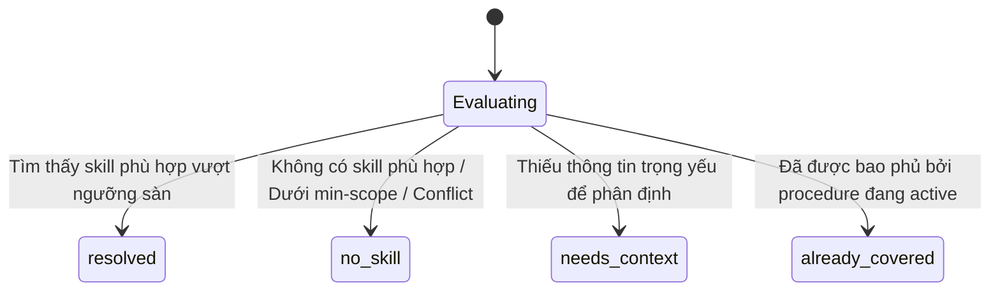
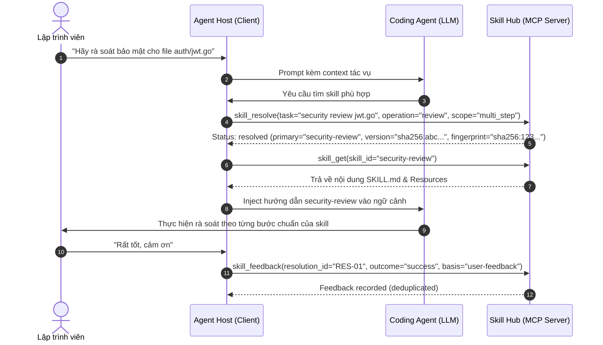
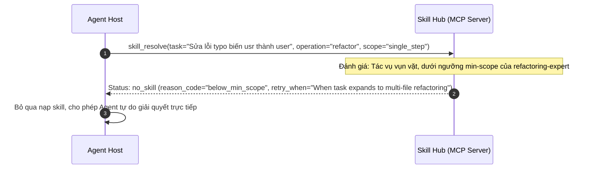

# Đặc tả Giao thức Runtime Agent ↔ Skill Hub (M2M Protocol)

**Tài liệu:** `docs/use-cases/01-agent-runtime-protocol.md`  
**Phiên bản:** v1.0 (Chuẩn hóa từ `docs/design/02-agent-hub-protocol.md` và implementation thực tế)  
**Phạm vi:** Giao tiếp Machine-to-Machine (M2M) hoàn toàn tự động giữa Coding Agent và Skill Hub MCP Server.  
**Không thuộc phạm vi:** Mọi thao tác quản trị, biên tập hoặc giao diện người dùng của con người (CLI / WebUI).

---

## 1. Bản chất & Ranh giới trách nhiệm

Giao thức Runtime Agent ↔ Skill Hub được thiết kế để giải quyết bài toán: **Làm sao để Coding Agent nhận đúng kỹ năng (procedural context) tốt nhất cho tác vụ hiện tại mà không phải nạp toàn bộ catalog vào prompt, không làm rò rỉ mã nguồn dự án, và không yêu cầu con người can thiệp thủ công.**

### 1.1 Các chủ thể tham gia (Actors)

```mermaid
flowchart LR
    subgraph Client_Side ["Môi trường Agent Client"]
        Agent["Coding Agent (LLM)<br/>Hiểu tác vụ & thực thi procedure"] 
        Host["Agent Host (Claude Code / Codex / Gemini CLI)<br/>Quản lý tool calls, permissions, instruction hierarchy"]
    end
    subgraph Hub_Side ["Skill Hub Daemon / MCP Server"]
        Resolver["Hub Resolver<br/>Recommendation & Policy Engine"]
        Distributor["Catalog & Distribution<br/>Served content & Companion resources"]
        Telemetry["Telemetry Recorder<br/>Feedback & Resolution logging"]
    end

    Agent <-->|Context & Execution| Host
    Host -->|1. skill_resolve (Evidence-first)| Resolver
    Resolver -->|Resolution Response| Host
    Host -->|2. skill_get (Authorized read)| Distributor
    Distributor -->|SKILL.md & Manifest| Host
    Host -->|3. skill_feedback (Telemetry)| Telemetry
```

| Thực thể | Quyền sở hữu & Trách nhiệm |
|---|---|
| **Agent (LLM)** | Hiểu ngữ cảnh tác vụ, lập kế hoạch thực thi, tuân thủ hướng dẫn trong skill khi được cấp. |
| **Agent Host (MCP Client)** | Quản lý vòng đời tool calls, kiểm soát quyền hạn (permissions), lưu trữ context hierarchy, quyết định khi nào kích hoạt resolver, bảo vệ dữ liệu nhạy cảm. |
| **Skill Hub Resolver** | Đánh giá chính sách định tuyến (routing policy), đo độ phù hợp (applicability), quyết định đề xuất tối đa 1 primary skill hoặc từ chối (abstain). |
| **Catalog & Distribution** | Cung cấp nội dung canonical và companion files của skill theo đúng version hash được pin. |
| **Telemetry Recorder** | Ghi nhận kết quả thực thi runtime phục vụ đo lường và audit; không làm thay đổi trực tiếp routing policy. |

---

## 2. Chu kỳ giao tiếp Runtime (Runtime Lifecycle)

Giao thức gồm 4 giai đoạn tuần tự:

```text
[1. Bootstrap & Hook] ➔ [2. Resolve Request] ➔ [3. Authorized Retrieval] ➔ [4. Feedback Recording]
```

### Giai đoạn 1: Bootstrap & Điều kiện kích hoạt

Agent Host được kết nối với Skill Hub qua lệnh cấu hình (ví dụ `skillhub connect`). Hướng dẫn bootstrap được đặt tại file chỉ dẫn gốc của dự án (`AGENTS.md`, `CLAUDE.md`, hoặc system prompt):

> *"Khi bắt đầu một tác vụ mới, hoặc khi phạm vi/ràng buộc thay đổi đáng kể, hãy gọi MCP tool `skill_resolve` trước khi chọn kỹ năng. Không gọi lại ở mỗi turn hoặc cho các sửa lỗi hiển nhiên."*

**Quy tắc kích hoạt `skill_resolve`:**
* **BẮT BUỘC GỌI:**
  - Bắt đầu một tác vụ kỹ thuật mới (Feature, Bugfix, Refactor, Review, Migration).
  - Tác vụ hiện tại đổi hướng hoặc mở rộng phạm vi (Scope tăng từ `single_step` lên `multi_step` / `project`).
  - Agent thử áp dụng một procedure nhưng gặp bế tắc hoặc vi phạm ràng buộc kỹ thuật.
* **KHÔNG ĐƯỢC GỌI:**
  - Không gọi ở mỗi turn hội thoại.
  - Không gọi cho mỗi lần đọc/ghi file hoặc chạy unit test thông thường.
  - Không gọi cho các tác vụ vụn vặt (sửa lỗi chính tả, đổi tên biến cục bộ, format code).
  - Không gọi lặp lại khi `valid_for.scope_fingerprint` vẫn còn hiệu lực.

---

### Giai đoạn 2: Yêu cầu định tuyến (`skill_resolve`)

Agent Host thu thập bằng chứng tác vụ và gọi tool `skill_resolve`.

#### Dữ liệu gửi đi (Request Payload)
Tuân thủ schema `schemas/skill-resolve-request-v1.schema.json`:
* `schema_version`: `"1"`
* `request_id`: Định danh duy nhất cho lượt yêu cầu.
* `task`:
  - `description`: Mô tả tác vụ cốt lõi (1 - 4096 ký tự).
  - `constraints`: Danh sách ràng buộc kỹ thuật (ví dụ: `["no-external-deps", "postgres-only"]`).
  - `exclusions`: Các skill_id bị loại trừ hoặc thuật ngữ không áp dụng.
  - `scope`: Phạm vi dự kiến (`single_step`, `multi_step`, `project`).
* `operation`: Loại hành động (`explore`, `design`, `implement`, `review`, `debug`, `test`, `refactor`, `migrate`, `document`, `operate`, `research`, `other`).
* `context`: Bằng chứng ngữ cảnh tối thiểu:
  - `active_artifact`: Loại file, ngôn ngữ, đường dẫn gợi ý (không gửi nội dung file code đầy đủ).
  - `facts`: Danh sách fact ngắn gọn kèm nguồn gốc (`user`, `tool`, `agent-host`, `agent-inference`).
  - `execution.capabilities`: Khả năng của môi trường (ví dụ: `git`, `bash`, `browser`).
* `activation_context`:
  - `mode`: `"allow-primary"` (tìm kỹ năng chính), `"supplement-only"` (tìm kỹ năng bổ trợ), `"coverage-check"`.
  - `active_procedures`: Danh sách các procedure đang chạy trong session để tránh trùng lặp.

#### Cơ chế xử lý của Resolver
1. Kiểm tra tính hợp lệ của schema (`NormalizeRequest`).
2. Tra cứu snapshot catalog SQLite thế hệ hiện hành (`catalog_snapshot`).
3. Đánh giá match theo từ khóa, trigger, not-for, operation và min-scope của các skill đang ở trạng thái `active`.
4. Tính toán độ tin cậy và áp dụng ngưỡng sàn (applicability floor).
5. Trả về kết quả trong thời gian thực (< 15ms).

#### Dữ liệu phản hồi (Response Payload)
Tuân thủ schema `schemas/skill-resolve-response-v1.schema.json` với 4 trạng thái độc quyền:



1. **Trạng thái `resolved` (Thành công):**
   - `primary`:
     - `id`: Định danh skill (ví dụ: `code-review`).
     - `version`: Hash SHA-256 của phiên bản skill trong catalog snapshot.
     - `uri`: Định dạng chuẩn `skill://skillhub/<catalog-hash>/<skill-id>/SKILL.md`.
     - `applicability`: Giải thích lý do phù hợp.
     - `confidence`: Mức độ tự tin (`high` hoặc `medium`).
   - `supporting`: Mảng tối đa 2 skill bổ trợ (nếu có, kích hoạt dạng `on-demand`).
   - `valid_for`: Chứa `scope_fingerprint` để Agent Host cache lại, tái sử dụng mà không cần gọi lại Hub.

2. **Trạng thái `no_skill` (Từ chối đề xuất / Abstention an toàn):**
   - Hub chủ động từ chối nếu không có skill thực sự phù hợp, tránh gây ảo giác cho agent.
   - `no_skill.reason_code`:
     - `below_applicability_floor`: Điểm phù hợp không đạt ngưỡng tin cậy tối thiểu.
     - `below_min_scope`: Tác vụ quá nhỏ so với yêu cầu phạm vi tối thiểu của skill (ví dụ skill yêu cầu `multi_step` nhưng tác vụ là `single_step`).
     - `catalog_gap`: Kho chưa có skill cho lĩnh vực này.
     - `constraint_conflict`: Tác vụ vi phạm điều kiện phủ định (`not-for`) của skill.
     - `capability_unavailable`: Môi trường thiếu công cụ bắt buộc mà skill yêu cầu.
   - `no_skill.retry_when`: Hướng dẫn khi nào nên thử lại (ví dụ: *"Khi tác vụ chuyển sang pha implementation"*).

3. **Trạng thái `needs_context` (Yêu cầu làm rõ):**
   - Trả về đúng 1 câu hỏi định hướng (`question` object) kèm các lựa chọn (`choices`).
   - `answer_from`: Bắt buộc là `"existing-context-first"` (yêu cầu agent tự tra cứu ngữ cảnh sẵn có trước khi làm phiền người dùng).

4. **Trạng thái `already_covered` (Đã được bao phủ):**
   - Thông báo tác vụ này đã nằm trong phạm vi của procedure đang chạy trong session, không cần nạp thêm.

---

### Giai đoạn 3: Nạp nội dung kỹ năng (`skill_get`)

`skill_resolve` **cố tình không trả về nội dung của file hướng dẫn** để Agent Host có quyền kiểm soát tài nguyên. Sau khi nhận được khuyến nghị, Agent Host gọi `skill_get` để lấy nội dung.

* **Tool:** `skill_get`
* **Tham số:** `{ "skill_id": "<id>" }`
* **Xử lý:**
  - Tra cứu skill trong canonical workspace và catalog generation.
  - Xác nhận skill đang ở trạng thái `active` và `routing_eligible == true`.
  - Đọc `SKILL.md` và tập hợp danh mục tài nguyên liên kết (`Manifest.Resources`: `references/`, `scripts/`, `assets/`).
  - Sinh mã kiểm tra toàn vẹn nội dung (`content_digest` dạng `sha256:...`).
* **Kết quả trả về:**
  - `content`: Toàn văn file `SKILL.md`.
  - `path`: Đường dẫn tương đối của entrypoint trong workspace.
  - `routing`: Cấu hình routing metadata (triggers, not-for, min-scope, operations).
  - `resources`: Danh sách các tài nguyên đi kèm sẵn sàng phục vụ khi cần.

---

### Giai đoạn 4: Thu thập phản hồi runtime (`skill_feedback`)

Sau khi hoàn thành hoặc hủy bỏ tác vụ, Agent Host có trách nhiệm gửi phản hồi runtime để hệ thống đo lường hiệu quả thực tế của các khuyến nghị.

* **Tool:** `skill_feedback`
* **Tham số bắt buộc:**
  - `schema_version`: `"1"`
  - `resolution_id`: Mã định danh lượt resolve tương ứng ở Giai đoạn 2.
  - `event_id`: Mã sự kiện duy nhất (chống gửi trùng lặp).
  - `outcome`: Kết quả thực tế (`"success"`, `"failure"`, `"mismatch"`, `"aborted"`).
* **Tham số bổ trợ:**
  - `reason_code`: Lý do kỹ thuật nếu thất bại hoặc mismatch.
  - `selected_skill`: Skill thực tế mà agent đã sử dụng.
  - `utility`: Đánh giá mức độ hữu ích (thang điểm chuẩn hóa).
  - `basis`: Căn cứ đánh giá (`"agent-reported"`, `"user-feedback"`, `"test-outcome"`).
* **Bất biến an toàn:** Dữ liệu feedback được lưu trữ trong telemetry SQLite log cục bộ, **TUYỆT ĐỐI KHÔNG** tự động sửa đổi routing policy của catalog. Mọi điều chỉnh policy bắt buộc phải thông qua quy trình thẩm định curation có chủ đích.

---

## 3. Các sơ đồ tương tác tuần tự (Sequence Flows)

### 3.1 Luồng tiêu chuẩn thành công (Happy Path: Resolve ➔ Get ➔ Feedback)



### 3.2 Luồng từ chối đề xuất (Abstention: `no_skill`)



---

## 4. Các bất biến an toàn của Protocol (Safety Invariants)

1. **Bất biến 1 Primary Skill:** Trong một thời điểm cho một tác vụ, Hub chỉ khuyến nghị tối đa duy nhất 1 primary skill. Hub không bao giờ ép agent phải tự chọn giữa một danh sách shortlist.
2. **Bảo mật mã nguồn tuyệt đối:** Giao thức không bao giờ truyền tải toàn bộ mã nguồn hoặc toàn bộ lịch sử chat sang Hub. Chỉ truyền tải tóm tắt tác vụ (summary), các ràng buộc (constraints), và các fact môi trường.
3. **Không đọc file cục bộ qua MCP:** Mọi truy vấn qua MCP đều được phân giải qua catalog SQLite hoặc ID trừu tượng. MCP Server không nhận raw filesystem path từ client để ngăn ngừa path traversal.
4. **Idempotency & Replay:** Mọi `resolution_id` và `event_id` đều có thể replay với catalog snapshot cố định để phục vụ regression test và đánh giá benchmark.
5. **Cửa cách ly giữa Runtime và Curation:** Runtime protocol (`skill_resolve`, `skill_get`, `skill_feedback`) là **Read-Only** đối với cấu hình hệ thống; không một tương tác runtime nào có thể ghi đè, thêm mới hay thay đổi trạng thái lifecycle của bất kỳ skill nào.