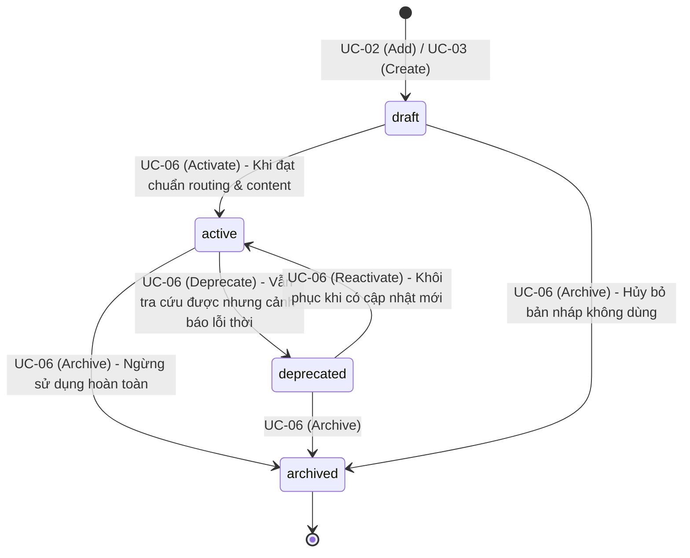
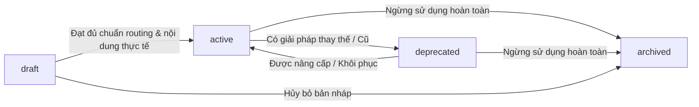

# Đặc tả Bộ Use Case Curation Cốt lõi (Core Curation Use Cases)

**Tài liệu:** `docs/use-cases/02-core-curation-use-cases.md`  
**Phiên bản:** v1.0 (Nghiệp vụ nền tảng độc lập với Delivery Surface)  
**Phạm vi:** Định nghĩa toàn bộ nghiệp vụ quản trị kho kỹ năng (Curation Domain Logic) của Skill Hub.  
**Mục đích:** Làm cơ sở chuẩn duy nhất để đối chiếu và xây dựng CLI Commands, Curator MCP Tools và WebUI.

---

## 1. Các nguyên tắc bất biến nền tảng (Foundational Invariants)

Mọi giao diện (CLI, WebUI, MCP) khi thực thi các use case dưới đây đều bắt buộc phải tuân thủ nghiêm ngặt 7 nguyên tắc an toàn cốt lõi của Skill Hub:

1. **Khởi tạo ở dạng Nháp (`draft` by default):** Bất kể kỹ năng được thêm mới từ bên ngoài hay tự tạo nội bộ, trạng thái khởi tạo luôn luôn là `draft`. Kỹ năng nháp không bao giờ được đưa vào chỉ mục tìm kiếm và không bao giờ được phục vụ cho Coding Agent cho đến khi được kích hoạt có chủ đích (`active`).
2. **Xem trước rồi mới Áp dụng (Preview before Confirm):** Mọi hành động làm thay đổi dữ liệu (tạo, sửa, đổi trạng thái vòng đời, thêm nguồn) phải sinh ra một bản đề xuất bất biến (`Proposal` với `proposal_id`, `proposal_digest`, `base_version`) để người dùng xem trước và duyệt. Không có hành động nào được tự ý ghi đè dữ liệu ngầm.
3. **Tuyệt đối không ghi đè ngầm (No Silent Overwrite):** Nếu một `skill_id` hoặc `source_id` đã tồn tại trong workspace, hệ thống sẽ dừng lại ngay lập tức và báo lỗi xung đột (`skill_conflict` hoặc `source_conflict`), không cho phép việc vô tình thay thế đè lên nội dung cũ.
4. **Bảo vệ chống tranh chấp sửa đổi (Concurrency & Stale-State Protection):** Quá trình chỉnh sửa có kiểm soát (Managed Editing) luôn kiểm tra mã băm nội dung gốc (`base_content_digest`). Nếu dữ liệu trên đĩa bị thay đổi trong lúc người dùng đang mở trình soạn thảo, bản cập nhật sẽ bị từ chối áp dụng và nội dung đang sửa được sao lưu vào vùng cứu hộ an toàn (Recovery Artifact).
5. **Skill Hub không bao giờ tự ý Commit hoặc Push Git:** Hệ thống ghi các thay đổi vào cây thư mục làm việc (working tree) chuẩn Canonical của người dùng, nhưng quyền tạo commit, quản lý branch và push lên remote hoàn toàn thuộc về con người hoặc quy trình Git của tổ chức.
6. **Mã nguồn Upstream không tự động đè lên nội dung Cục bộ:** Việc theo dõi nguồn bên ngoài (`source watch`) là để học hỏi và chắt lọc bài học. Các cập nhật từ upstream chỉ được thể hiện dưới dạng đề xuất cải tiến (Insights) để con người xem xét, không bao giờ tự động cập nhật đè lên file của người dùng.
7. **Ranh giới an toàn cho tài nguyên cục bộ (Local Boundary Safety):** Việc nhập file từ thư mục máy cục bộ chỉ được phép thực hiện thông qua môi trường có sự tương tác trực tiếp của người dùng. Các giao tiếp gián tiếp qua mạng hoặc server MCP bị cấm nhận đường dẫn file hệ thống tùy tiện để chống tấn công Path Traversal.

---

## 2. Mô hình Vòng đời Kỹ năng (Skill Lifecycle State Machine)

Một kỹ năng trong Skill Hub trải qua 4 trạng thái định danh chuẩn:



| Trạng thái | Định nghĩa nghiệp vụ | Điều kiện kích hoạt & Quyền hạn |
|---|---|---|
| **`draft`** | Kỹ năng đang trong quá trình soạn thảo, nhập khẩu hoặc kiểm thử cục bộ. | Chưa đủ điều kiện tham gia định tuyến (`routing_eligible = false`). Agent không nhìn thấy. |
| **`active`** | Kỹ năng chính thức đang hoạt động trong kho. | Đạt toàn bộ chuẩn cấu trúc, đầy đủ routing metadata, nội dung thực tế $\rightarrow$ Được chỉ mục hóa (`routing_eligible = true`), sẵn sàng phục vụ Resolver. |
| **`deprecated`** | Kỹ năng đã cũ, có giải pháp thay thế tốt hơn hoặc sắp bị loại bỏ. | Không ưu tiên cho các tác vụ mới; Resolver chỉ gợi ý nếu có yêu cầu chỉ định đặc biệt. |
| **`archived`** | Kỹ năng đã ngừng sử dụng, lưu trữ lại để phục vụ audit/lịch sử. | Rút khỏi toàn bộ chỉ mục hoạt động; file canonical vẫn được lưu trữ trong Git. |

---

## 3. Danh mục 7 Nhóm Use Case Cốt lõi

```text
UC-01: Khảo sát Hiện trạng & Điều hướng Hub (Inspect Hub Status & Guidance)
UC-02: Nạp Kỹ năng từ Nguồn bên ngoài (Add Skill via External Locator)
UC-03: Khởi tạo Kỹ năng Thủ công (Create Custom Skill)
UC-04: Soạn thảo & Tinh chỉnh Nội dung Skill (Edit Skill & Conflict Protection)
UC-05: Chẩn đoán & Đánh giá Toàn diện (Review Diagnostic & Readiness)
UC-06: Quản trị Vòng đời Kỹ năng (Manage Lifecycle State Transitions)
UC-07: Giám sát Nguồn & Học hỏi Bài học (Source Watch, Check, Distill & Insights)
```

---

### UC-01: Khảo sát Hiện trạng & Điều hướng Hub (Inspect Hub Status & Guidance)

* **Mục tiêu:** Cung cấp bức tranh toàn cảnh về sức khỏe của kho kỹ năng, tính toàn vẹn của chỉ mục tìm kiếm và đưa ra **duy nhất 1 hành động ưu tiên cao nhất tiếp theo** (Single Ranked Next Action) để hướng dẫn người dùng.
* **Tác nhân (Actor):** Curation User / Curator Agent.
* **Tiền điều kiện:** Workspace đã được khởi tạo (`skillhub init`).
* **Dữ liệu đầu vào:** Tùy chọn cờ lọc hoặc đường dẫn workspace.
* **Quy trình xử lý cốt lõi:**
  1. Kiểm tra cấu trúc thư mục canonical của workspace (`skills/`, `sources/`, `history/`).
  2. Kiểm tra tính toàn vẹn của chỉ mục tìm kiếm SQLite thế hệ hiện hành (`catalog generation`).
  3. Quét trạng thái Git của workspace (có thay đổi uncommitted hay không, branch hiện tại).
  4. Thu thập số liệu thống kê: Tổng số skill theo trạng thái (`draft`, `active`, `deprecated`, `archived`), số source đang theo dõi, số insight đang chờ xử lý trong inbox.
  5. Đánh giá thuật toán xếp hạng ưu tiên để chọn ra 1 khuyến nghị tiếp theo (ví dụ: *"Có 3 draft skills chưa kích hoạt $\rightarrow$ Hãy review và kích hoạt"*, hoặc *"Workspace có thay đổi chưa commit $\rightarrow$ Hãy tạo git commit"*).
* **Kết quả đầu ra:** Báo cáo hiện trạng gồm:
  - Tình trạng sức khỏe: `healthy`, `degraded` (kèm cảnh báo), hoặc `invalid` (kèm danh sách lỗi cấu trúc).
  - Bảng thống kê số lượng kỹ năng và nguồn.
  - Thông báo hành động khuyến nghị tiếp theo (Next Action).
* **Quy tắc an toàn & Ngoại lệ:**
  - Hoạt động thuần túy Read-Only, không làm thay đổi trạng thái hệ thống.
  - Khi workspace bị lỗi cấu trúc (`invalid`), không được hiển thị số đếm kỹ năng giả mạo hoặc báo "No skills yet" gây hiểu lầm.

---

### UC-02: Nạp Kỹ năng từ Nguồn bên ngoài (Add Skill via External Locator)

* **Mục tiêu:** Đưa một kỹ năng hoàn chỉnh từ một GitHub URL (public repo/subfolder/file) hoặc thư mục máy cục bộ vào workspace của mình dưới dạng `draft`.
* **Tác nhân:** Curation User / Curator Agent.
* **Tiền điều kiện:** Locator trỏ tới vị trí hợp lệ chứa file định nghĩa kỹ năng (`SKILL.md`).
* **Dữ liệu đầu vào:**
  - `locator`: Đường dẫn (GitHub URL hoặc đường dẫn thư mục cục bộ).
  - Tùy chọn: `skill_name` (chọn 1 skill cụ thể nếu repo có nhiều skill), `all` (nhập tất cả), `collection` (thư mục nhóm, mặc định `default`), `id_override` (đổi ID nếu cần).
* **Quy trình xử lý cốt lõi:**
  1. **Phân tích Locator:**
     - Nếu là GitHub URL: Bóc tách repository, branch/tag/ref, và subpath thư mục.
     - Nếu là Local Path: Kiểm tra đường dẫn tồn tại, chuẩn hóa path an toàn (không đi qua symlink độc hại).
  2. **Khám phá Kỹ năng (Discovery):**
     - Quét tìm file `SKILL.md`.
     - Nhận diện các tài nguyên liên kết hợp lệ (`references/`, `scripts/`, `assets/`).
     - Kiểm tra giới hạn dung lượng và số lượng file (`resource_limits`).
  3. **Trích xuất Danh tính & Giấy phép:**
     - Lấy `skill_id` từ frontmatter của `SKILL.md`; nếu không có thì lấy tên thư mục chứa.
     - Nhận diện thông tin giấy phép (license indicators); đưa ra cảnh báo nếu là giấy phép không rõ ràng hoặc độc quyền (`Proprietary`).
  4. **Kiểm tra Xung đột ID:**
     - Đối chiếu ID với danh sách skill hiện có trong workspace. Nếu đã tồn tại $\rightarrow$ Dừng lại, báo lỗi `skill_conflict`.
  5. **Tạo Bản đề xuất Nhập khẩu (Proposal Preview):**
     - Sinh proposal bất biến ghi rõ: Danh sách file sẽ tạo, tổng số bytes, trạng thái sau khi nhập (`draft`), và mã băm toàn vẹn.
  6. **Xác nhận Áp dụng (Confirm):**
     - Người dùng xác nhận $\rightarrow$ Hệ thống ghi các file canonical vào `skills/<collection>/<id>/`.
     - Tự động cập nhật chỉ mục catalog SQLite thế hệ mới.
* **Bất biến & Ràng buộc:**
  - Kỹ năng luôn ở trạng thái `draft`.
  - Mặc định **không** tự động đăng ký theo dõi nguồn (`no auto-watch`).
  - Phục hồi các file companion chính xác (scripts, docs liên quan), không chỉ copy mỗi `SKILL.md`.
  - Nếu nguồn có nhiều skill mà người dùng không chọn rõ tên hoặc cờ `--all`, hệ thống trả về lỗi `skill_selection_required` kèm danh sách skill tìm thấy.

---

### UC-03: Khởi tạo Kỹ năng Thủ công (Create Custom Skill)

* **Mục tiêu:** Định nghĩa một quy trình chuyên môn mới từ đầu hoặc từ file tài liệu có sẵn để chuẩn hóa quy trình làm việc cho đội ngũ.
* **Tác nhân:** Curation User / Curator Agent.
* **Tiền điều kiện:** `skill_id` dự kiến tạo chưa tồn tại trong workspace.
* **Dữ liệu đầu vào:**
  - `id`: Định danh duy nhất (kebab-case, ví dụ `reliability-review`).
  - `name`: Tên kỹ năng hiển thị cho người đọc.
  - `description`: Mô tả công dụng tổng quan.
  - `collection`: Tên nhóm kỹ năng (mặc định `core`).
  - Metadata định tuyến (Routing):
    - `triggers`: Các cụm từ hoặc ngữ cảnh kích hoạt.
    - `not_for` hoặc `rationale`: Ngữ cảnh phủ định (khi nào không nên dùng kỹ năng này).
    - `min_scope`: Phạm vi tối thiểu (`single_step`, `multi_step`, `project`).
    - `operations`: Các nhóm hành động nghiệp vụ liên quan (`review`, `implement`, `debug`...).
  - Nội dung hướng dẫn (Content): Truyền nội dung trực tiếp, đường dẫn file mẫu (`content_file`), hoặc để trống để sinh khung sườn mẫu.
* **Quy trình xử lý cốt lõi:**
  1. Kiểm tra tính hợp lệ cú pháp của ID và các trường metadata bắt buộc.
  2. Đối chiếu trùng lặp ID trong workspace.
  3. Tạo cấu trúc thư mục `skills/<collection>/<id>/` bao gồm `SKILL.md` và `skill.meta.yaml`.
  4. Sinh Proposal Preview thể hiện nội dung và đường dẫn file dự kiến tạo.
  5. Khi xác nhận (Confirm) $\rightarrow$ Ghi file canonical, đăng ký trạng thái `draft`.
* **Bất biến & Phòng chống lỗi:**
  - Kỹ năng tạo mới luôn ở trạng thái `draft`.
  - **Chống lỗi khung sườn rỗng (Placeholder Scaffold Guard):** Nếu kỹ năng được tạo từ khung sườn mẫu mà chưa được điền hướng dẫn thực tế (vẫn còn các dòng chữ giữ chỗ như *"1. First step"*), hệ thống sẽ từ chối không cho phép kích hoạt (`active`) ở UC-06 cho đến khi nội dung được hoàn thiện.

---

### UC-04: Soạn thảo & Tinh chỉnh Nội dung Skill (Edit Skill & Conflict Protection)

* **Mục tiêu:** Cập nhật nội dung chỉ dẫn (`SKILL.md`) hoặc các trường metadata định tuyến của một kỹ năng hiện có mà không làm mất dữ liệu hoặc xung đột phiên bản.
* **Tác nhân:** Curation User / Curator Agent.
* **Tiền điều kiện:** Kỹ năng cần sửa tồn tại trong workspace.
* **Dữ liệu đầu vào:**
  - `skill_id`: Định danh kỹ năng cần sửa.
  - Cập nhật từng trường metadata (name, description, triggers, not_for, min_scope).
  - Cập nhật toàn bộ nội dung: Thông qua file mới (`content_file`), trình soạn thảo tương tác (`editor`), hoặc sửa trực tiếp trên file (Direct editing).
* **Quy trình xử lý cốt lõi:**
  1. **Khởi tạo Phiên sửa đổi có kiểm soát (Managed Session):**
     - Đọc nội dung hiện hành của kỹ năng và ghi nhớ mã băm toàn vẹn ban đầu (`base_content_digest`).
     - Mở phiên soạn thảo hoặc nhận nội dung cập nhật mới.
  2. **Bảo tồn Bản nháp Cứu hộ (Recovery Artifact):**
     - Lưu nội dung mới vào một file tạm được bảo vệ quyền truy cập (permission `0600`), gắn liền với phiên làm việc trong 24 giờ.
  3. **Kiểm tra Xung đột Cạnh tranh (Concurrency Conflict Check):**
     - Trước khi tạo Proposal Preview, kiểm tra lại file canonical trên đĩa.
     - Nếu file canonical đã bị sửa đổi bởi một tiến trình hoặc người khác kể từ thời điểm mở phiên $\rightarrow$ Báo lỗi `stale_base_version`, không cho phép ghi đè. Giữ nguyên bản nháp cứu hộ để người dùng không bị mất công sức đã viết.
  4. **Tạo Proposal Preview & So sánh Thay đổi (Diff):**
     - Sinh bản so sánh trực quan (Unified Diff) giữa nội dung cũ và nội dung mới.
     - Hiển thị dự báo ảnh hưởng tới khả năng định tuyến (Routing impact).
  5. **Xác nhận Áp dụng (Confirm):**
     - Ghi nội dung mới vào file canonical.
     - Tự động xóa bản nháp cứu hộ tạm thời.
     - Kích hoạt tiến trình xây dựng lại chỉ mục catalog SQLite.
* **Bất biến an toàn:**
  - Luôn bảo vệ tuyệt đối chống mất mát dữ liệu của người dùng khi xảy ra lỗi ở bước preview hoặc confirm.
  - Hỗ trợ cả hai phương thức: Sửa qua giao diện có quản lý (Managed Edit) và sửa trực tiếp file trong Git (Direct Edit kèm lệnh `skillhub validate` để kiểm tra lại).

---

### UC-05: Chẩn đoán & Đánh giá Toàn diện (Review Diagnostic & Readiness)

* **Mục tiêu:** Cung cấp báo cáo chẩn đoán toàn diện, minh bạch về tính hợp lệ kỹ thuật, độ sẵn sàng hoạt động, nguồn gốc xuất xứ và các thay đổi chưa được commit của một kỹ năng.
* **Tác nhân:** Curation User / Curator Agent.
* **Tiền điều kiện:** Kỹ năng tồn tại trong thư mục canonical của workspace.
* **Dữ liệu đầu vào:** `skill_id` cần rà soát.
* **Quy trình xử lý cốt lõi:**
  1. Đọc file `SKILL.md` và `skill.meta.yaml` từ thư mục canonical.
  2. Kiểm tra tính hợp lệ cấu trúc (Structural Validation): cú pháp YAML, các trường bắt buộc, ràng buộc kích thước.
  3. Kiểm tra độ sẵn sàng định tuyến (Routing Readiness):
     - Đã có ít nhất 1 trigger hợp lệ chưa?
     - Đã có điều kiện phủ định (`not_for` hoặc `rationale`) chưa?
     - Đã chọn phạm vi tối thiểu (`min_scope`) chưa?
     - Nội dung có còn chứa các đoạn văn bản giữ chỗ (scaffold placeholders) không?
  4. Kiểm tra tài nguyên phụ trợ: Liệt kê các file trong `references/`, `scripts/`, `assets/` và kiểm tra dung lượng.
  5. Kiểm tra trạng thái Git: Có thay đổi nào chưa được commit liên quan đến kỹ năng này không.
  6. Kiểm tra nguồn gốc (Provenance): Kỹ năng được thêm từ nguồn nào (GitHub URL / Local folder), commit hash nào của upstream.
  7. Đối chiếu với Catalog đang phục vụ: Trạng thái hiện tại trong SQLite catalog là gì (`draft`, `active`...), có bị phân kỳ (diverged) so với file canonical không.
* **Kết quả đầu ra:** Báo cáo chẩn đoán đa chiều gồm:
  - `lifecycle_state`: Trạng thái vòng đời hiện hành.
  - `validation_status`: `valid` hoặc danh sách lỗi cú pháp.
  - `routing_readiness`: Đủ điều kiện kích hoạt hay chưa (nếu chưa, chỉ rõ thiếu gì).
  - `active_locally`: Agent hiện tại có thể gọi được skill này hay chưa.
  - `uncommitted_changes`: Danh sách file đang sửa đổi chưa commit.
  - `next_recommended_action`: Gợi ý hành động tiếp theo cho người bảo trì.
* **Bất biến nghiệp vụ:**
  - `review` là công cụ **chẩn đoán (Diagnostic Inspection)**, **KHÔNG PHẢI** là cổng duyệt tự động (Approval Gate) làm thay đổi trạng thái hệ thống.
  - `review` vẫn chạy được bình thường ngay cả khi toàn bộ chỉ mục catalog đang bị lỗi, giúp lập trình viên tìm ra nguyên nhân gây lỗi.

---

### UC-06: Quản trị Vòng đời Kỹ năng (Manage Lifecycle State Transitions)

* **Mục tiêu:** Thực hiện chuyển đổi trạng thái vòng đời của kỹ năng (`draft` $\rightarrow$ `active` $\rightarrow$ `deprecated` $\rightarrow$ `archived`) có kiểm soát và an toàn.
* **Tác nhân:** Curation User / Curator Agent.
* **Tiền điều kiện:** Kỹ năng tồn tại trong workspace.
* **Dữ liệu đầu vào:**
  - `skill_id`: Định danh kỹ năng.
  - `target_state`: Trạng thái đích muốn chuyển tới (`active`, `deprecated`, `archived`).
* **Quy tắc chuyển dịch trạng thái:**



* **Quy trình xử lý cốt lõi:**
  1. Kiểm tra tính hợp lệ của bước chuyển dịch theo ma trận trạng thái cho phép.
  2. **Kiểm tra Điều kiện Tiên quyết khi Kích hoạt (`active`):**
     - Kỹ năng bắt buộc phải vượt qua toàn bộ tiêu chuẩn của UC-05 (Structural Validity: `valid`, Routing Readiness: `ready`, không còn chứa placeholder rỗng). Nếu vi phạm $\rightarrow$ Dừng lại, báo lỗi không cho kích hoạt.
  3. Tạo Proposal Preview thể hiện sự thay đổi trạng thái và tác động định tuyến dự kiến.
  4. Người dùng xác nhận (Confirm) $\rightarrow$ Cập nhật trường trạng thái trong `skill.meta.yaml`.
  5. Kích hoạt cơ chế xây dựng lại catalog SQLite ngay lập tức.
* **Kết quả đầu ra:** Xác nhận trạng thái mới của kỹ năng, thông báo kỹ năng đã sẵn sàng để Agent sử dụng (hoặc đã bị rút khỏi danh mục).

---

### UC-07: Giám sát Nguồn & Học hỏi Bài học (Source Watch, Check, Distill & Insights)

* **Mục tiêu:** Kết nối với các kho tài liệu/mã nguồn uy tín bên ngoài (ví dụ kho skill của cộng đồng trên GitHub), theo dõi các thay đổi mới và chắt lọc kiến thức cải tiến cho kho skill cục bộ mà không làm mất đi các tùy biến riêng của người dùng.
* **Tác nhân:** Curation User / Curator Agent.

Nhóm này bao gồm 4 nghiệp vụ con liên kết tuần tự:

```text
[UC-07A: Watch Source] ➔ [UC-07B: Check Updates] ➔ [UC-07C: Distill Learnings] ➔ [UC-07D: Inbox & Apply Insights]
```

#### UC-07A: Đăng ký Nguồn theo dõi (Source Watch)
* **Quy trình:**
  1. Người dùng cung cấp URL một public GitHub repository (ví dụ: `https://github.com/anthropics/skills`).
  2. Hệ thống bóc tách repository, branch/tag và thư mục con (`path`).
  3. Tự động sinh `source_id` định danh an toàn (hoặc cho phép người dùng đặt tên).
  4. Thiết lập chu kỳ kiểm tra dự kiến (`cadence`: `daily`, `weekly`, `manual`).
  5. Tạo Proposal Preview $\rightarrow$ Xác nhận $\rightarrow$ Lưu bản ghi cấu hình theo dõi vào `sources/`.
* **Bất biến:** Chỉ hỗ trợ remote Git repository; từ chối theo dõi thư mục máy cục bộ (`local_watch_unsupported`). Việc watch **không** chạy tiến trình nền ngầm (no daemon) và **không** tự ý tải skill về máy.

#### UC-07B: Kiểm tra Cập nhật Nguồn (Source Check)
* **Quy trình:**
  1. Kích hoạt kiểm tra theo yêu cầu người dùng (cho 1 nguồn cụ thể, hoặc toàn bộ nguồn đã đến hạn `--all-due`).
  2. Kết nối tới Git remote để truy vấn commit hash mới nhất.
  3. So sánh commit hash với lần kiểm tra trước:
     - Nếu không đổi: Báo không có thay đổi.
     - Nếu có commit mới: Cập nhật thông tin revision mới và đánh dấu nguồn ở trạng thái `changed`, sẵn sàng để chắt lọc.
* **Bất biến:** Hoạt động kiểm tra là Read-Only đối với kho skill, tuyệt đối không tự ý sửa đổi bất kỳ file skill nào.

#### UC-07C: Chắt lọc Kiến thức từ Thay đổi (Distill Learnings)
* **Quy trình:**
  1. Chuẩn bị lượt chắt lọc (`distill prepare`) cho các nguồn có thay đổi.
  2. Agent/Hệ thống phân tích sự khác biệt (Diff analysis) giữa revision cũ và mới của upstream.
  3. Trích xuất các bài học thực tiễn, mẫu thiết kế mới, hoặc kỹ thuật hữu ích thành các bản ghi quan sát (`observations`) và phát hiện (`findings`).
  4. Đóng gói các phát hiện có giá trị ứng dụng thành các đề xuất cải tiến cụ thể (**Insights**) và đẩy vào Hộp thư đến (Inbox).

#### UC-07D: Xem xét & Áp dụng Đề xuất Cải tiến (Inbox & Apply Insights)
* **Quy trình:**
  1. Người dùng mở Hộp thư đến (`inbox`) để xem danh sách các Insights đang chờ, được xếp hạng theo mức độ ảnh hưởng và nhóm theo từng skill liên quan.
  2. Người dùng xem chi tiết 1 insight (`insight show`), bao gồm: Căn cứ phát hiện từ nguồn nào, bài học rút ra là gì, và đề xuất sửa đổi cụ thể vào file nào.
  3. **Ra quyết định (Decide):**
     - `plan`: Đồng ý đưa vào kế hoạch nâng cấp.
     - `reject`: Từ chối áp dụng (kèm lý do ghi nhận lại để không đề xuất lại).
     - `obsolete`: Đánh dấu đề xuất không còn giá trị.
  4. **Áp dụng Đề xuất (Apply):**
     - Sinh Proposal Preview thể hiện chi tiết bản vá (patch diff) sẽ áp dụng vào skill tương ứng.
     - Người dùng bấm xác nhận (Confirm) $\rightarrow$ Nội dung mới được merge có kiểm soát vào file canonical của skill.
* **Bất biến:** Upstream không bao giờ tự động ghi đè. Mọi sự tiếp thu kiến thức đều phải qua bước phê duyệt có chủ đích của con người.

---

## 4. Bảng Tra cứu Mã Lỗi Nghiệp vụ Chuẩn (Standard Business Error Codes)

Bảng mã lỗi nghiệp vụ thống nhất áp dụng cho toàn bộ các use case và mọi delivery surfaces:

| Mã lỗi (Error Code) | Tình huống nghiệp vụ | Hành động khắc phục tương ứng |
|---|---|---|
| `skill_conflict` | ID kỹ năng đã tồn tại trong workspace (UC-02, UC-03). | Chọn ID khác hoặc dùng lệnh chỉnh sửa (Edit). |
| `source_conflict` | ID nguồn đã tồn tại trong danh sách theo dõi (UC-07A). | Dùng nguồn hiện có hoặc chọn ID khác. |
| `skill_selection_required` | Nguồn repo chứa nhiều kỹ năng mà chưa chỉ định rõ (UC-02). | Chọn cụ thể tên skill (`--skill <name>`) hoặc nhập tất cả (`--all`). |
| `resource_limits_exceeded` | Kỹ năng vượt quá giới hạn file hoặc dung lượng cho phép. | Loại bỏ các file nhị phân lớn hoặc file rác không cần thiết. |
| `stale_base_version` | Nội dung file canonical bị thay đổi trong lúc đang soạn thảo (UC-04). | Xem diff bản nháp trong recovery artifact và hợp nhất lại nội dung. |
| `scaffold_unmodified` | Kỹ năng còn chứa placeholder rỗng, không thể kích hoạt (UC-06). | Hoàn thiện nội dung hướng dẫn thực tế trước khi kích hoạt. |
| `routing_incomplete` | Kỹ năng thiếu trigger, not-for hoặc min-scope khi kích hoạt (UC-06). | Bổ sung đầy đủ metadata định tuyến theo chuẩn. |
| `local_watch_unsupported` | Người dùng yêu cầu theo dõi một thư mục máy cục bộ (UC-07A). | Chỉ hỗ trợ theo dõi remote GitHub repository. |
| `source_not_found` / `skill_not_found` | Không tìm thấy thực thể theo ID chỉ định. | Kiểm tra lại danh sách bằng `skill list` hoặc `source list`. |
| `invalid_request` | Tham số đầu vào sai kiểu dữ liệu hoặc vi phạm quy tắc an toàn. | Chuẩn hóa tham số đầu vào theo tài liệu đặc tả. |