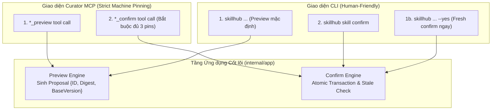

# Đặc tả Ánh xạ Giao diện CLI & Curator MCP (Delivery Surface Mapping)

**Tài liệu:** `docs/use-cases/03-cli-and-curator-mcp-mapping.md`  
**Phiên bản:** v1.0 (Ánh xạ 1:1 từ `02-core-curation-use-cases.md` sang các bề mặt vận hành)  
**Phạm vi:** Hai bề mặt giao tiếp quản trị kỹ năng hiện có:
1. **CLI Commands:** Dành cho con người thao tác trực tiếp trên Terminal hoặc CI/CD script.
2. **Curator MCP Tools:** Dành cho Curator Agent (ví dụ Claude Code hỗ trợ người dùng bảo trì qua hội thoại).

---

## 1. Cơ chế Xác nhận Thay đổi (Confirmation Mechanics)

Tất cả các hành động đột biến (Mutations) đều tuân theo nguyên tắc **Preview trước, Confirm sau**. Tuy nhiên, cách thức xác nhận được tối ưu hóa theo đặc thù của từng môi trường:



| Tiêu chí | CLI (Dành cho Người) | Curator MCP (Dành cho Agent) |
|---|---|---|
| **Xem trước (Preview)** | Mặc định khi chạy lệnh không có cờ `--yes`. In bảng diff và hướng dẫn. | Gọi công cụ `*_preview`. Trả về đối tượng JSON proposal bất biến. |
| **Xác nhận tức thì** | Thêm cờ `--yes` (chỉ xác nhận đúng preview vừa được sinh ra trong lượt chạy đó). | Không có cờ `--yes`. Agent bắt buộc phải gọi công cụ `*_confirm`. |
| **Xác nhận qua mã lưu vết** | Chỉ cần mã ngắn: `skillhub skill confirm <proposal-id>`. CLI tự tra cứu digest và base-version. | **BẮT BUỘC ĐỦ 3 PINS:** `proposal_id`, `proposal_digest`, và `base_version`. Sai hoặc thiếu bất kỳ pin nào sẽ bị từ chối ngay. |
| **Ranh giới thư mục cục bộ** | Cho phép nhập từ đường dẫn thư mục máy cục bộ (`./path`, `/abs/path`, `~/path`). | **TỪ CHỐI** mọi đường dẫn cục bộ (`invalid_request`). Chỉ chấp nhận public GitHub URL. |

---

## 2. Ánh xạ Chi tiết 1:1 theo 7 Nhóm Use Case

---

### UC-01: Khảo sát Hiện trạng & Điều hướng Hub (Inspect Hub Status & Guidance)

#### 1. CLI Command
```bash
# Xem báo cáo dạng bảng text trực quan
skillhub status

# Xuất dạng JSON envelope máy đọc
skillhub status --json

# Chế độ im lặng (chỉ xuất exit code)
skillhub status --quiet
```
* **Output mẫu:**
  ```text
  Workspace: /home/user/skillhub (healthy)
  Skills: 12 total (8 active, 3 draft, 1 deprecated)
  Sources: 2 watched (0 due for check)
  Inbox: 1 insight pending review

  Recommended next:
  Review draft skill 'pdf' with `skillhub skill review pdf`
  ```

#### 2. Curator MCP Tool
* **Tool Name:** `hub_status`
* **Annotations:** `read_only = true`
* **Input Parameters:** Không yêu cầu tham số (`{}`).
* **Return Payload:** `app.CurationHome`
  - `Workspace`: Đường dẫn và trạng thái sức khỏe (`healthy`, `degraded`, `invalid`).
  - `Counts`: Số lượng skill theo từng trạng thái.
  - `Actions`: Mảng các hành động được xếp hạng ưu tiên (`RankedActions`).
  - `NextRecommended`: Hành động đơn lẻ được đề xuất thực hiện trước tiên.

---

### UC-02: Nạp Kỹ năng từ Nguồn bên ngoài (Add Skill via External Locator)

#### 1. CLI Commands
```bash
# Nạp 1 skill cụ thể từ public GitHub repo (Xem trước proposal)
skillhub skill add https://github.com/anthropics/skills --skill pdf

# Nạp và xác nhận áp dụng ngay
skillhub skill add https://github.com/anthropics/skills/tree/main/skills/pdf --yes

# Nạp toàn bộ các skill có trong repo
skillhub skill add https://github.com/anthropics/skills --all --yes

# Nạp từ thư mục máy cục bộ (chỉ hỗ trợ trên CLI)
skillhub skill add ./local-skills/my-helper --yes

# Xác nhận proposal đã sinh trước đó
skillhub skill confirm PROP-4a8f9c1b
```

#### 2. Curator MCP Tools
* **Bước 1 (Preview):** `skill_add_preview`
  - **Tham số:**
    - `locator` (string, bắt buộc): Phải là public GitHub URL. Nếu truyền local path sẽ trả về lỗi `invalid_request`.
    - `selection` (string, tùy chọn): Tên skill cụ thể muốn nạp.
    - `all` (boolean, tùy chọn): Đặt `true` nếu muốn nạp toàn bộ skill.
    - `collection` (string, tùy chọn): Mặc định `default`.
    - `idempotency_key` (string, tùy chọn).
  - **Kết quả:** Trả về `app.SkillAddProposal` kèm 3 pins xác nhận (`proposal_id`, `proposal_digest`, `base_version`).
* **Bước 2 (Confirm):** `skill_add_confirm`
  - **Tham số bắt buộc:**
    - `proposal_id`: Chuỗi định danh proposal.
    - `proposal_digest`: Mã băm SHA-256 của proposal.
    - `base_version`: Mã băm phiên bản workspace làm căn cứ.
  - **Kết quả:** Trả về `app.SkillMutationResult` (ghi nhận danh sách file canonical đã tạo và trạng thái `draft`).

---

### UC-03: Khởi tạo Kỹ năng Thủ công (Create Custom Skill)

#### 1. CLI Commands
```bash
# Khởi tạo kèm các metadata định tuyến cơ bản (Xem trước proposal)
skillhub skill create reliability-review \
  --collection software \
  --name "Reliability Review" \
  --description "Review service failure modes and operational risks" \
  --trigger "review reliability" \
  --not-for "design a new service" \
  --min-scope multi_step

# Khởi tạo và áp dụng ngay, lấy nội dung từ file có sẵn
skillhub skill create reliability-review \
  --collection software \
  --name "Reliability Review" \
  --description "Review service failure modes and operational risks" \
  --trigger "review reliability" \
  --not-for "design a new service" \
  --min-scope multi_step \
  --content-file ./drafts/review-guide.md \
  --yes
```

#### 2. Curator MCP Tools
* **Bước 1 (Preview):** `skill_create_preview`
  - **Tham số:**
    - `skill_id` (string, bắt buộc): Định danh duy nhất (kebab-case).
    - `name` (string, bắt buộc): Tên hiển thị.
    - `description` (string, bắt buộc): Mô tả.
    - `collection` (string, tùy chọn): Mặc định `core`.
    - `content` (string, tùy chọn): Nội dung ban đầu dạng Markdown.
    - `routing` (object, tùy chọn): `operations`, `triggers`, `not_for`, `min_scope`.
    - `rationale` (string, tùy chọn).
* **Bước 2 (Confirm):** `skill_create_confirm`
  - **Tham số bắt buộc:** Đủ 3 pins (`proposal_id`, `proposal_digest`, `base_version`).

---

### UC-04: Soạn thảo & Tinh chỉnh Nội dung Skill (Edit Skill & Conflict Protection)

#### 1. CLI Commands
```bash
# Mở trình soạn thảo mặc định của hệ thống ($EDITOR / $VISUAL)
skillhub skill edit reliability-review --editor

# Cập nhật nội dung từ file Markdown mới
skillhub skill edit reliability-review --content-file ./new-guide.md --yes

# Cập nhật metadata định tuyến
skillhub skill edit reliability-review \
  --trigger "audit reliability" \
  --min-scope project \
  --yes

# Sửa trực tiếp file canonical bằng công cụ bên ngoài rồi kiểm tra lại
$EDITOR skills/software/reliability-review/SKILL.md
skillhub validate
skillhub diff
```

* **Xử lý xung đột trên CLI:** Nếu file bị sửa đổi trong lúc đang mở `$EDITOR`, CLI thông báo lỗi `stale_base_version` và lưu giữ bản nháp vừa sửa tại `/home/user/.skillhub/recovery/PROP-...-edit.md`.

#### 2. Curator MCP Tools
* **Bước 1 (Preview):** `skill_update_preview`
  - **Tham số:**
    - `skill_id` (string, bắt buộc).
    - `content` (string, tùy chọn): Nội dung Markdown mới.
    - `routing` (object, tùy chọn): Các trường routing cập nhật.
    - `expected_content_digest` (string, tùy chọn): Mã băm nội dung mong đợi để kiểm tra xung đột cạnh tranh.
* **Bước 2 (Confirm):** `skill_update_confirm`
  - **Tham số bắt buộc:** Đủ 3 pins (`proposal_id`, `proposal_digest`, `base_version`).

---

### UC-05: Chẩn đoán & Đánh giá Toàn diện (Review Diagnostic & Readiness)

#### 1. CLI Commands
```bash
# Xem báo cáo chẩn đoán tóm tắt cho con người
skillhub skill review reliability-review

# Xem chi tiết toàn diện (kèm thông tin snapshot, catalog served state)
skillhub skill review reliability-review --verbose

# Xuất dạng JSON envelope
skillhub skill review reliability-review --json
```
* **Output mẫu:**
  ```text
  Skill: reliability-review [draft] (software)
  Validity: VALID
  Routing Readiness: READY (3 triggers, 1 not-for, scope: multi_step)
  Active locally: false (Skill is in draft state)
  Content: 4,120 bytes, no placeholder scaffolds detected
  Resources: 2 files in references/, 1 script in scripts/ (clean)
  Git status: Uncommitted changes in skills/software/reliability-review/
  
  Next recommended:
  Activate skill with `skillhub skill activate reliability-review --yes`
  ```

#### 2. Curator MCP Tool
* **Tool Name:** `skill_review`
* **Annotations:** `read_only = true`
* **Tham số:** `{ "skill_id": "reliability-review" }`
* **Return Payload:** `app.SkillReviewResult`
  - Chứa đầy đủ các trường: `Validation`, `Readiness`, `Resources`, `Provenance`, `GitStatus`, `ServedAssessment`, `NextAction`.
  - Hoạt động offline, không đòi hỏi catalog phải compile thành công.

---

### UC-06: Quản trị Vòng đời Kỹ năng (Manage Lifecycle State Transitions)

#### 1. CLI Commands
```bash
# Kích hoạt kỹ năng (từ draft -> active)
skillhub skill activate reliability-review --yes

# Đánh dấu kỹ năng lỗi thời (active -> deprecated)
skillhub skill deprecate old-tool --yes

# Lưu trữ kỹ năng không còn dùng (active/draft -> archived)
skillhub skill archive obsolete-skill --yes

# Liệt kê danh sách theo trạng thái vòng đời
skillhub skill list --state draft
skillhub skill list --state active
```

#### 2. Curator MCP Tools
* **Bước 1 (Preview):** `skill_transition_preview`
  - **Tham số:**
    - `skill_id` (string, bắt buộc).
    - `target_state` (string, bắt buộc): `"active"`, `"deprecated"`, hoặc `"archived"`.
* **Bước 2 (Confirm):** `skill_transition_confirm`
  - **Tham số bắt buộc:** Đủ 3 pins (`proposal_id`, `proposal_digest`, `base_version`).
* **Tra cứu danh sách:** `skill_list`
  - **Tham số:** `{ "state": "draft|active|deprecated|archived" }`

---

### UC-07: Giám sát Nguồn & Học hỏi Bài học (Source Watch, Check, Distill & Insights)

#### 1. CLI Commands
```bash
# 7A: Đăng ký theo dõi repository GitHub và gắn với skill
skillhub source watch https://github.com/anthropics/skills --skill-id pdf --cadence weekly --yes

# 7B: Kiểm tra cập nhật của các nguồn đã đến hạn
skillhub source check --all-due
# Hoặc dùng alias tương đương:
skillhub check --all-due
```
# 7C: Chuẩn bị và thực hiện chắt lọc bài học từ các nguồn có commit mới
skillhub distill prepare --all-changed
skillhub distill start RUN-01

# 7D: Kiểm tra Hộp thư đến và duyệt Insight
skillhub inbox
skillhub insight show INS-101
skillhub insight decide INS-101 --decision plan --reason "Useful pattern for error handling"
skillhub insight apply INS-101 --proposal-file ./patch.json
skillhub insight confirm --proposal PROP-99 --proposal-digest sha256:... --base-version sha256:...
```

#### 2. Curator MCP Tools
* **Đăng ký nguồn:**
  - Preview: `source_watch_preview` (`locator`, `source_id`, `ref`, `path`, `cadence`).
  - Confirm: `source_watch_confirm` (3 pins).
* **Kiểm tra nguồn:** `source_check` (`source_ids`, `all_due`, `all`).
* **Quy trình Distill:**
  - `curation_run_start` (`source_ids` hoặc `all_changed = true`).
  - `curation_run_get` (`run_id`).
  - `curation_run_submit` (`run_id`, `submission`).
* **Hộp thư & Áp dụng Insight:**
  - `inbox_list` (liệt kê danh sách insight phân trang).
  - `insight_get` (`insight_id`).
  - `insight_decide` (`insight_id`, `decision`: `"plan"|"reject"|"obsolete"|"reopen"`).
  - `insight_apply_preview` (`insight_id`, `proposal`).
  - `insight_apply_confirm` (3 pins).

---

### UC-08: Kiểm tra và cập nhật skill từ upstream (Upstream Check, Outdated & 3-way Merge)

#### 1. CLI Commands
```bash
# 8A: Kiểm tra độ lệch upstream của tất cả skills
skillhub skill outdated --check

# Chế độ CI/script: exit code 1 khi có skill cần cập nhật/chú ý
skillhub skill outdated --check --exit-code

# 8B: Xem chi tiết repository upstream và commit mới nhất của một skill
skillhub skill upstream pdf --check

# 8C: Áp dụng cập nhật upstream qua 3-way merge
skillhub skill update pdf
# Nếu có xung đột, giải quyết tường minh hoặc ghi file conflict ra thư mục:
skillhub skill update pdf --accept "references/spec.md=upstream" --yes

# 8D: Xác nhận proposal sau khi đã giải quyết sạch xung đột
skillhub skill confirm PROP-upstream-123

# 8E: Tái gắn source và provenance cho skill vendored từ trước
skillhub source backfill --yes
```

#### 2. Curator MCP Tool
* **Tool Name:** `skill_upstream_status`
* **Annotations:** `read_only = true`
* **Tham số:** `{ "skill_id": "pdf" }` (tùy chọn; để trống để lấy toàn bộ).
* **Return Payload:** `app.SkillUpstreamStatusResult`
  - Danh sách skills kèm trạng thái drift: `up_to_date`, `update_available`, `modified`, `diverged`, `upstream_removed`, `pinned`, `unavailable`, `untracked`.
  - Chi tiết commit đã check, committer date (`latest_committed_at`), số file thay đổi trong thư mục skill (`changed_files`).
* **Ranh giới an toàn tuyệt đối (Quyết định D10):**
  - Agent qua MCP **chỉ được đọc trạng thái drift**, hoàn toàn **không có tool preview hay apply cập nhật upstream**.
  - Cập nhật upstream đưa mã nguồn bên thứ ba vào workspace và chuyển trạng thái skill thành `review_required`, đòi hỏi con người xem xét diff và quyết định qua CLI (`skillhub skill update`) hoặc WebUI. Các công cụ confirm MCP thông thường chủ động từ chối proposal loại `upstream_update`.

---

### UC-09: Gắn nguồn học cho skill (Attach & Manage Learning References)

#### 1. CLI Commands
```bash
# 9A: Gắn một source có sẵn hoặc URL repo làm learning reference cho skill
skillhub source attach https://github.com/example/reliability-reference --skill-id consumer-reliability-review --yes

# 9B: Gỡ bỏ learning reference khỏi skill
skillhub source detach reliability-reference --skill-id consumer-reliability-review --yes

# 9C: Đăng ký watch repo mới và gắn ngay với skill (bảo đảm no-orphan)
skillhub source watch https://github.com/example/reference --skill-id my-skill --cadence weekly --yes

# 9D: Ngừng theo dõi và xóa source nếu không còn skill nào trỏ tới
skillhub source unwatch reliability-reference --yes

# 9E: Triage candidate sang learning reference hoặc import
skillhub source triage SRCQ-001 --decision accept --skill-id my-skill
skillhub source triage SRCQ-002 --decision accept --new-skill new-skill-draft
skillhub source triage SRCQ-003 --decision import --path skills
```

#### 2. Curator MCP Tools
* **Đăng ký và liên kết nguồn:**
  - `source_watch_preview` và `source_watch_confirm` (bắt buộc truyền `skill_id` để ngăn source mồ côi).
* **Triage ứng viên:**
  - `source_triage`: `decision` hỗ trợ `"accept"`, `"defer"`, `"reject"`, `"import"`. Quyết định `accept` bắt buộc cung cấp `skill_id` hoặc `new_skill`.

---

## 3. Ma trận Đối chiếu Bề mặt Vận hành (Parity Matrix Table)

Bảng tổng hợp đối chiếu trực tiếp giữa Core Use Case, lệnh CLI và công cụ Curator MCP:

| Core Use Case | CLI Command (Interactive/Script) | Curator MCP Tool (Preview) | Curator MCP Tool (Confirm) | Kiểu Xác nhận (Confirmation) | Ranh giới Đặc thù (Boundaries) |
|---|---|---|---|---|---|
| **UC-01: Status** | `skillhub status` | `hub_status` | *(Read-only)* | Không cần confirm | Hỗ trợ fallback ngay cả khi catalog hỏng |
| **UC-02: Add Skill** | `skillhub skill add <loc>` | `skill_add_preview` | `skill_add_confirm` | CLI: `--yes` hoặc Short ID<br/>MCP: Đủ 3 pins | CLI nhận local folder;<br/>MCP **chỉ nhận GitHub URL** |
| **UC-03: Create Skill** | `skillhub skill create <id>` | `skill_create_preview` | `skill_create_confirm` | CLI: `--yes` hoặc Short ID<br/>MCP: Đủ 3 pins | Chặn kích hoạt nếu nội dung còn placeholder rỗng |
| **UC-04: Edit Skill** | `skillhub skill edit <id>` | `skill_update_preview` | `skill_update_confirm` | CLI: `--yes` hoặc Short ID<br/>MCP: Đủ 3 pins | Lưu recovery artifact 24h khi có xung đột phiên bản |
| **UC-05: Review Skill** | `skillhub skill review <id>` | `skill_review` | *(Read-only)* | Không cần confirm | Chẩn đoán đa chiều, không phải approval gate |
| **UC-06: Lifecycle** | `skillhub skill activate\|deprecate\|archive` | `skill_transition_preview` | `skill_transition_confirm` | CLI: `--yes` hoặc Short ID<br/>MCP: Đủ 3 pins | Kích hoạt tự động rebuild SQLite catalog |
| **UC-07A: Source Watch** | `skillhub source watch <url> --skill-id <id>` | `source_watch_preview` | `source_watch_confirm` | CLI: `--yes` hoặc Short ID<br/>MCP: Đủ 3 pins | Bắt buộc gắn với skill (No orphan); không chạy daemon ngầm |
| **UC-07B: Source Check** | `skillhub source check` / `check` | `source_check` | *(Read-only)* | Không cần confirm | Thăm dò Git commit hash, không sửa file skill |
| **UC-07C: Distill** | `skillhub distill prepare\|start` | `curation_run_start` | `curation_run_submit` | Bounded submission package | Phân tích bài học, không ghi đè tự động |
| **UC-07D: Insights** | `skillhub inbox` / `insight apply` | `insight_apply_preview` | `insight_apply_confirm` | CLI: Pin flags<br/>MCP: Đủ 3 pins | Đề xuất sửa đổi phải được con người phê duyệt |
| **UC-08: Upstream Drift & Merge** | `skillhub skill outdated`<br/>`skillhub skill update` | *(Read-only)* `skill_upstream_status` | *(Không có)* | CLI: `--yes` hoặc Short ID<br/>MCP: **Không hỗ trợ apply** | Agent chỉ đọc metadata drift; apply là quyết định con người qua CLI/WebUI |
| **UC-09: Learning References** | `skillhub source attach\|detach\|unwatch` | `source_watch_preview` | `source_watch_confirm` | CLI: `--yes`<br/>MCP: Đủ 3 pins | Quản lý quan hệ học tập; ngăn source mồ côi |
| **Workspace Maintenance** | `skillhub validate [--staged]`<br/>`skillhub diff` | `workspace_validate`<br/>`workspace_diff` | *(Read-only)* | Không cần confirm | `validate --staged` đọc trực tiếp Git index blob |
---

## 4. Chuẩn hóa Khung Kết quả Máy đọc (JSON Result Envelope)

Tất cả các lệnh CLI khi chạy với `--json` và các phản hồi từ Curator MCP tools đều tuân thủ cấu trúc Result Envelope chung được định nghĩa tại `docs/contracts/result-envelope.md`:

```json
{
  "schema_version": "1",
  "status": "success",
  "data": { ... },
  "warnings": [
    "License indicator detected as Proprietary; verify redistribution rights."
  ],
  "error": null
}
```

Khi xảy ra lỗi nghiệp vụ, trường `error` được trả về với mã lỗi chuẩn (xem Bảng mã lỗi ở tài liệu `02-core-curation-use-cases.md`):

```json
{
  "schema_version": "1",
  "status": "error",
  "data": null,
  "warnings": [],
  "error": {
    "code": "skill_conflict",
    "message": "Skill 'reliability-review' already exists in collection 'software'",
    "retryable": false,
    "suggested_action": "Choose a different skill ID or edit the existing skill."
  }
}
```