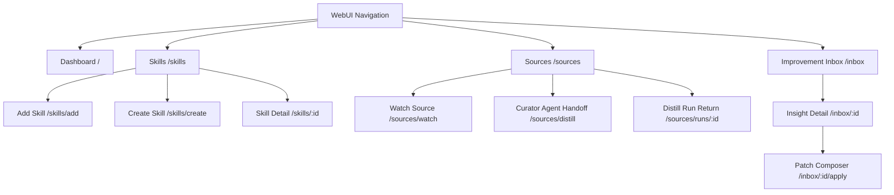
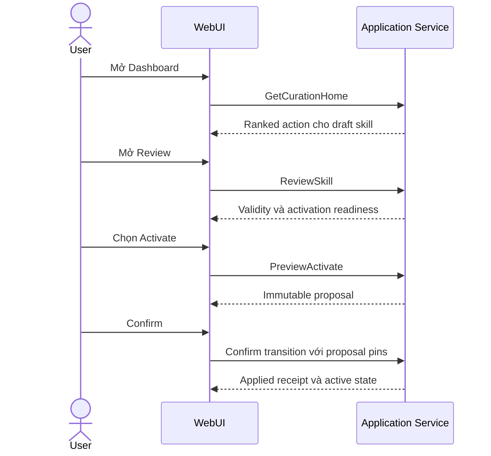
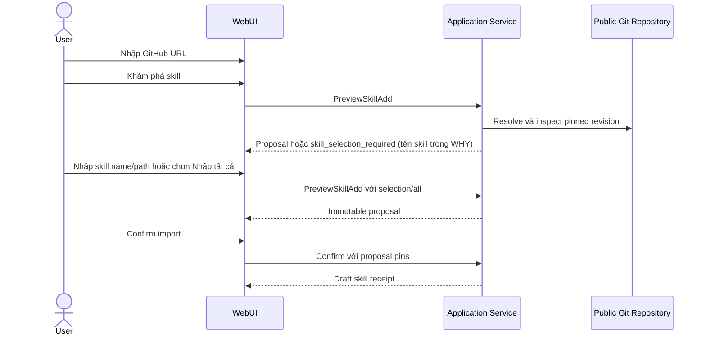
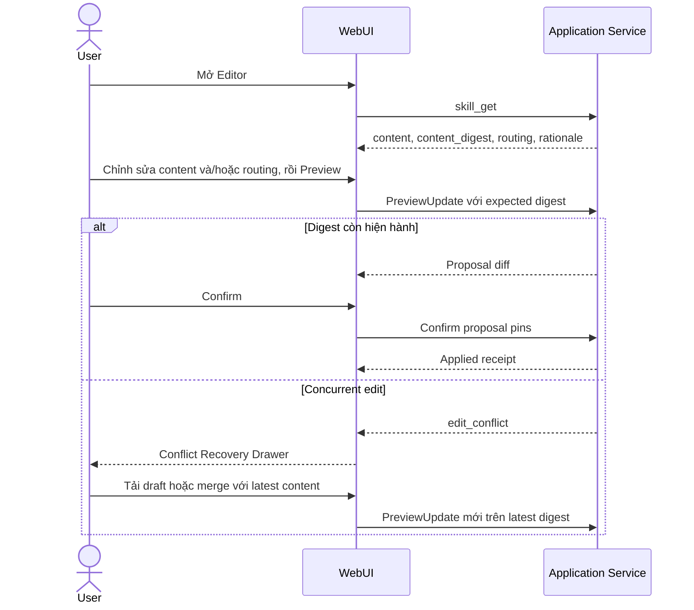

# Đặc tả Luồng Người dùng & Giao diện WebUI

**Tài liệu:** `docs/use-cases/04-webui-user-flows-and-screen-specs.md`  
**Phiên bản:** v1.2 — Đã đối chiếu contract runtime (2026-10-02)  
**Phạm vi:** Kiến trúc thông tin, màn hình, trạng thái, luồng tương tác, xác nhận thay đổi, lỗi, responsive và accessibility cho WebUI của Skill Hub.  
**Căn cứ:** `02-core-curation-use-cases.md`, `03-cli-and-curator-mcp-mapping.md`, `docs/contracts/error-codes.md` và các application service trong `internal/app`.  
**Design brief:** [`05-webui-design-brief.md`](05-webui-design-brief.md) — visual direction, theme light/dark, wireframe, English copy và sample data cho Claude Design.

---

## 0. Quyết định sản phẩm và ranh giới v1

Các quyết định sau là ràng buộc đầu vào cho screen design:

1. **Mô hình triển khai:** WebUI v1 là giao diện local-first, một người dùng, được phục vụ bởi backend chạy trong workspace đáng tin cậy. Đăng nhập, RBAC và cộng tác nhiều người dùng nằm ngoài phạm vi v1.
2. **Nguồn nhập skill:** WebUI chỉ nhận public GitHub URL. Nhập từ thư mục máy cục bộ tiếp tục dùng CLI vì trình duyệt không có host-granted file-selection contract tương đương. Không hiển thị ô nhập local path hoặc nút chọn folder trong WebUI v1.
3. **Nguồn sự thật:** Khi tài liệu use case và implementation khác nhau, contract hiện hành trong `internal/app` là nguồn sự thật cho field, action, lifecycle transition và error code. Thay đổi contract phải được cập nhật vào tài liệu này trước khi thiết kế lại màn hình.
4. **Mutation safety:** Create, add, update, lifecycle transition, source watch và insight apply luôn đi qua hai bước Preview → Confirm bằng `proposal_id`, `proposal_digest` và `base_version`/`base_catalog_version`.
5. **Không force overwrite:** Xung đột chỉnh sửa phải được giải quyết bằng cách đọc phiên bản mới, merge và tạo proposal mới. WebUI không cung cấp hành động ghi đè bỏ qua concurrency guard.
6. **Không tự động Git commit/push:** WebUI chỉ hiển thị working-tree state và changed paths do application service trả về.
7. **Thiết bị:** Desktop là bề mặt chính. Tablet và mobile vẫn phải sử dụng được theo quy tắc responsive tại mục 7; editor/diff không được cắt mất nội dung.
8. **Delivery adapter:** `internal/delivery` hiện chỉ có `cli/` và `mcpserver/`. WebUI v1 cần một HTTP adapter local (backend scope) gọi cùng application service và sử dụng chuẩn hóa lỗi của application layer (`app.ClassifyError`) vì nhiều service trả plain Go error. Screen design dùng error code đã chuẩn hóa tại mục 6.
9. **Mutation trực tiếp có chủ đích:** `insight_decide`, `curation_run_cancel` và `source_check` không có Preview → Confirm trong contract. Cancel run và Obsolete insight dùng destructive confirmation; Check source được ghi rõ là có cập nhật revision/trạng thái source.

### Ngoài phạm vi v1

- Authentication, organization, team workspace và role-based permissions.
- Private repository credentials và OAuth GitHub.
- Chọn thư mục local từ trình duyệt.
- Quản lý file companion bằng upload/delete, xem nội dung companion file và multi-file Insight Apply; tab Resources v1 chỉ hiển thị metadata, Patch Composer v1 chỉ sửa `SKILL.md`.
- Discovered-skill chooser dạng danh sách khi Add Skill (contract chỉ trả tên trong text `WHY`).
- Resume distill run không có `idempotency_key` gốc; đọc package hoặc start run theo `run_id`.
- Trạng thái source unavailable bền vững qua refresh (chỉ có trong kết quả `source_check` của phiên).
- Recent operations timeline tổng hợp; chỉ hiển thị operation receipt sau từng mutation.
- Hiển thị branch, generation ID hoặc số file Git thay đổi nếu application service chưa trả về các field đó.

---

## 1. Kiến trúc thông tin và điều hướng



### 1.1 Route table

| URL | Màn hình | Use case | Presentation |
|---|---|---|---|
| `/` | Dashboard / Hub Status | UC-01 | Page |
| `/skills` | Skills Catalog | UC-01, UC-06 | Page |
| `/skills/add` | Add Skill | UC-02 | Route-backed wizard page |
| `/skills/create` | Create Skill | UC-03 | Route-backed form page |
| `/skills/:id` | Skill Detail | UC-04, UC-05, UC-06 | Page với tabs |
| `/sources` | Watched Sources & Run Recovery | UC-07B, UC-07C | Page |
| `/sources/watch` | Watch Source | UC-07A | Route-backed form page |
| `/sources/distill` | Curator Agent Distill Handoff | UC-07C | Route-backed handoff page |
| `/sources/runs/:id` | Distill Run Return | UC-07C | Route-backed status/recovery page |
| `/inbox` | Improvement Inbox | UC-07D | Page |
| `/inbox/:id` | Insight Detail | UC-07D | Route-backed detail page |
| `/inbox/:id/apply` | Insight Patch Composer | UC-07D | Route-backed authoring page |

Proposal preview, destructive confirmation và short-form decision dùng modal. Form dài, wizard và conflict recovery không dùng nested modal.

### 1.2 Quy tắc navigation

- Browser Back từ route form/detail quay lại list trước đó và giữ filter, search, page index trong URL query.
- Refresh route phải tải lại dữ liệu canonical; draft chưa submit được phục hồi từ browser storage nếu còn hợp lệ.
- Khi form có thay đổi chưa preview, rời route phải hiện unsaved-changes confirmation.
- Modal đóng bằng Cancel, `Escape` hoặc browser Back nếu modal đã đẩy history entry. Sau khi đóng, focus quay lại control đã mở modal.
- Tab Skill Detail dùng query `?tab=review|editor|resources` để deep-link và refresh không mất vị trí.

### 1.3 Data-contract matrix

Screen design chỉ sử dụng các field dưới đây. Field không có trong contract không được giả lập trong mockup.

| Màn hình | Application contract | Field/hành động được phép hiển thị |
|---|---|---|
| Dashboard | `GetCurationHome` → `CurationHome` | `workspace.health/index/git_configured/git_dirty/recovery_pending`, `actions[]` (`kind`, `id`, `count`, `priority`, `summary`), `categories[]` (`kind`, `count`, `availability`), `home_summary` |
| Skills Catalog | `ListSkills` → `SkillListResult` | `id`, `name`, `collection`, `lifecycle_state`, `routing_eligible`; fallback chỉ có trong `summary` text |
| Add Skill | `PreviewSkillAdd` → `SkillAddProposal`, `ConfirmSkillAdd` | `skill_id`/`skill_ids[]`, `collection`, `name`, `description`, `origin`, `license`, `resources[]`, `total_bytes`, `diff`, `assessment`, confirmation pins |
| Create/Edit/Lifecycle | skill create/update/transition preview + confirm | `SkillProposal` (`diff`, `full_diff`, `routing_impact`, confirmation pins), `SkillMutationResult` (`lifecycle_state`, `routing_eligible`, `changed_paths`, `operation_id`, `git_dirty`) |
| Skill Detail | `ReviewSkill` → `SkillReviewResult`; `skill_get` cho Editor | review: validity, `canonical_issues`, `activation_readiness`, `resource_status`, canonical/served facts, `diverged`, changed/missing resources, provenance, Git summary, `next_action`; `skill_get`: `path`, `content`, `content_digest`, `routing`, `rationale`, `resources[]` metadata |
| Sources | `ListSources` → `SourceListResult`, `CheckSources`, source watch preview/confirm | `Record` (`id`, `locator`, `status`, `license`, `trust`, `monitoring`, `current_revision`, `distilled_revision`); `SourceCheckItem` (`status`, `revision`, `error`) chỉ trong kết quả check |
| Distill | handoff brief cho agent; WebUI chỉ gọi `curation_run_get` và `curation_run_cancel` | `Run` (`id`, `source_id`, `state`, `attempt`, from/to revision, `changed_resources`, `package_digest`, `coverage`, finding/comparison/insight IDs, `outstanding_decisions`, `failure`); không có workspace-wide run list |
| Inbox | `inbox_list`, `insight_get`, `insight_decide`, insight apply preview/confirm, `skill_get` | groups (`skill_id`, `category`, items `insight` + `rank`), detail (`insight`, direct `findings[]`, `comparisons[]`), `SKILL.md` content/digest, caller-authored `changes[]`/`mappings[]`, `diff`, `path_pins`, application receipt |

Các field tương lai như recent operations, branch name, per-row trigger summary hoặc updated timestamp phải được thêm vào application contract trước khi thêm vào design.

---

## 2. Đặc tả màn hình

### 2.1 Dashboard / Curation Home (`/`)

**Mục tiêu:** Cho biết Hub có an toàn để vận hành không và hành động quan trọng nhất tiếp theo là gì.

#### Thành phần

1. **Single Ranked Next Action**
   - Chỉ hiển thị action đầu tiên trong danh sách đã xếp hạng.
   - Gồm summary, count nếu có và CTA theo bảng mapping bên dưới. `actions[].command` là tên tool/lệnh, không phải route; WebUI không điều hướng bằng field này.
   - Nếu không có action: hiển thị trạng thái “Không có việc cần xử lý”.

   | `kind` (priority) | CTA WebUI |
   |---|---|
   | `repair_workspace` (110) | Hiển thị diagnostic summary + `Copy lệnh` `skillhub doctor --fix`; WebUI không tự repair |
   | `recover_workspace` (105) | `Copy lệnh` `skillhub doctor --fix`; khóa mutation CTA khác đến khi refetch hết recovery |
   | `resume_run` (100) | Mở `/sources/runs/:id` bằng `actions[].id` (run failed/interrupted đầu tiên); `count` > 1 ghi “và N run khác chưa có ID trong WebUI” |
   | `rebuild_index` (90) | `Copy lệnh` `skillhub rebuild`; counts hiển thị “Không khả dụng” |
   | `retry_unavailable_sources` (80) | Mở `/sources`; CTA `Kiểm tra tất cả nguồn` (gửi toàn bộ source ID đang monitoring) vì list không đánh dấu nguồn nào unavailable; kết quả check hiển thị nguồn còn lỗi |
   | `distill_changed_sources` (70) | Mở `/sources` với filter “Sẵn sàng distill” |
   | `check_due_sources` (60) | Mở `/sources`; CTA `Kiểm tra các nguồn đến hạn` |
   | `review_insights` (40) | Mở `/inbox` |
   | `first_run_commit` (20) | Hướng dẫn commit workspace và `skillhub connect`; `Copy lệnh`; WebUI không commit |
   | `review_git_changes` (10) | Thông báo “Có thay đổi canonical chưa commit”; `Copy lệnh` `git status`; WebUI không commit/push |
   | kind không xác định | Hiển thị `summary` read-only, không có CTA |
2. **Workspace Health**
   - `health`: valid/invalid theo giá trị backend; không tự suy diễn trạng thái giả.
   - `index`: `current`, `missing`, `stale`, `corrupt`, `incompatible`, `unknown` theo payload; giá trị khác hiển thị như `unknown`.
   - `git_configured`, `git_dirty`, `recovery_pending` hiển thị dưới dạng status rows có text và icon.
   - Nếu invalid, ưu tiên lỗi và recovery CTA; không hiển thị số liệu như thể chúng đầy đủ.
3. **Home Summary**
   - Active skills, watching sources, sources due, pending insights, high-value insights, failed/interrupted runs, unavailable sources và recovery items.
   - Chỉ render count khi `health=valid` và `index=current`; nếu không, hiển thị “Không khả dụng”. Đây là proxy cho cờ nội bộ `CountsKnown` (không được serialize).
4. **Action Categories**
   - Danh sách category, count và `availability`: `available`, `not_configured` (“Chưa cấu hình trong v1”), `unavailable` (“Không khả dụng vì index/workspace chưa sẵn sàng”). Text giải thích lấy từ enum này, không suy đoán thêm nguyên nhân.

Không có Recent Operations widget trong v1.

### 2.2 Skills Catalog (`/skills`)

**Mục tiêu:** Duyệt và điều hướng toàn bộ skill canonical.

#### Toolbar

- Search client-side theo `id` và `name`.
- Filter trạng thái: All, Draft, Active, Deprecated, Archived.
- Filter collection dựa trên các giá trị có trong result.
- Primary actions: `Thêm từ GitHub` và `Tạo skill`.
- Search/filter/page được phản ánh trong URL query.

#### Skills table

| Cột | Nội dung |
|---|---|
| Skill | name và id |
| Collection | collection |
| Lifecycle | draft/active/deprecated/archived badge |
| Routing | “Có thể được định tuyến” hoặc “Chưa được định tuyến” từ `routing_eligible` |
| Actions | Review; menu lifecycle chỉ chứa Deprecate (active) và Archive (deprecated). Activate chỉ có trong Skill Detail vì list không trả activation readiness |

Không hiển thị triggers, updated time hoặc per-skill Git state vì list contract hiện chưa cung cấp các field này. Khi catalog được phục vụ từ fallback generation, hiển thị notice bằng nguyên văn `summary`; không có field riêng.

### 2.3 Add Skill (`/skills/add`)

**Mục tiêu:** Nhập một hoặc nhiều skill từ public GitHub repository vào trạng thái draft.

#### Bước 1 — Locator và discovery

- `GitHub URL` bắt buộc; helper text nêu rõ public repository/subfolder/file URL.
- Advanced options:
  - Collection, mặc định `default`.
  - Target ID override, chỉ khi nhập một skill.
- CTA `Khám phá skill` gọi preview service.
- Trong khi clone/inspect: khóa submit, hiển thị progress không xác định và cho phép Cancel request.
- Nếu backend trả `skill_selection_required`: hiển thị nguyên văn `WHY` (chứa tên các skill tìm thấy), một ô `Skill name hoặc path` (gửi `selection`) và CTA `Nhập tất cả` (gửi `all=true`). Không parse `WHY` thành danh sách chọn và không tự chọn ngầm. Chooser dạng danh sách cần backend trả `discovered[]` có cấu trúc (ngoài v1).

#### Bước 2 — Immutable proposal preview

- Một skill: skill ID, name, description và collection đích. Nhập tất cả: danh sách `skill_ids[]` và collection; name/description/resources chỉ áp dụng cho proposal một skill.
- Origin repository/ref/commit/path.
- License và cảnh báo nếu unknown/proprietary.
- Resources, file count và total bytes.
- Diff/file summary, assessment và trạng thái đích `draft`.
- Proposal pins hiển thị trong phần technical details có thể thu gọn.
- Actions: `Quay lại`, `Hủy`, `Xác nhận nhập`.

Khi confirm thành công, hiển thị receipt và CTA đến Review của skill. Nếu nhập nhiều skill, CTA về catalog với filter `draft`.

### 2.4 Create Skill (`/skills/create`)

**Mục tiêu:** Tạo skill thủ công ở trạng thái draft.

#### Fields

1. Identity: skill ID, display name, description, collection.
2. Routing: operations, triggers, not-for hoặc rationale, min scope.
3. Initial instructions:
   - default scaffold;
   - upload một file Markdown để đọc nội dung vào form;
   - soạn trực tiếp.

Validation chạy khi blur và khi submit; client validation chỉ hỗ trợ sớm. UI không tự sửa ID người dùng nhập; Proposal Preview hiển thị `skill_id` do backend trả về làm giá trị cuối cùng.

CTA `Xem trước bản nháp` mở Proposal Preview. Confirm tạo skill ở trạng thái draft; nếu dùng scaffold chưa sửa, success message phải nhắc rằng skill chưa thể activate.

### 2.5 Skill Detail (`/skills/:id`)

Header hiển thị name, ID, collection, lifecycle badge và next recommended action.

#### Tab Review

- Structural validity và canonical issues.
- Activation readiness (`ready`, `untouched_scaffold`, `missing_fields`, `warnings`); mỗi missing field có CTA đến đúng control trong Editor: `content` → Markdown editor, `trigger` → Triggers, `not_for or rationale` → Not-for/Rationale, `min_scope` → Min scope.
- Resource status, changed/missing resources.
- Canonical facts so với served facts; banner divergence nếu có.
- Provenance và Git summary.
- Review là read-only diagnostic, không tự đổi trạng thái.

#### Lifecycle action matrix

Matrix này phản ánh implementation hiện hành:

| Current state | Action được phép | UI behavior |
|---|---|---|
| draft | Activate | Enable khi activation readiness đạt; nếu thiếu điều kiện, disabled kèm danh sách thiếu |
| active | Deprecate | Mở Proposal Preview mô tả routing impact |
| deprecated | Archive | Mở destructive confirmation rồi Proposal Preview |
| archived | Không có transition | Chỉ đọc |

Không hiển thị Reactivate, draft→archive hoặc active→archive cho đến khi backend hỗ trợ các transition đó.

#### Tab Editor

Nguồn dữ liệu: `skill_get` (`content`, `content_digest`, `path`, `routing`, `rationale`, `name`, `description`). Mutation: `skill_update_preview` → `skill_update_confirm`.

- **Section Instructions:** split Markdown editor và rendered preview trên desktop; chế độ chuyển tab Edit/Preview trên màn hình hẹp.
- **Section Routing & metadata:** name, description, operations, triggers, not-for, rationale, min scope. Đây là nơi duy nhất sau Create để đáp ứng activation requirements.
- Khi tải nội dung, giữ `content_digest` làm `expected_content_digest`.
- Browser draft autosave (chỉ browser storage) theo skill ID và digest; không gửi canonical mutation ngầm.
- CTA `Xem trước thay đổi` gọi update preview chỉ với các field đã đổi cùng `expected_content_digest`; content và routing có thể đi chung một proposal.
- Proposal Diff hỗ trợ unified và side-by-side khi viewport đủ rộng.
- Confirm thành công xóa browser draft tương ứng, refetch Review và hiển thị changed paths/operation receipt.
- Nếu `skill_get` trả `resource_content_unavailable` (canonical đã lệch catalog đã publish), Editor không mở; hiển thị divergence banner và `Copy lệnh` `skillhub rebuild`, rồi `Tải lại`.

#### Tab Resources

- Read-only tree cho `references/`, `scripts/`, `assets/` từ `skill_get.resources[]` / `review.resource_status.resources[]`: path, kind, size, digest.
- Đánh dấu changed/missing từ `changed_resources`/`missing_resources` của review.
- Không xem nội dung resource trong v1 vì chưa có canonical resource-read contract cho mọi lifecycle state; không upload/delete.
- Missing/changed resource hiển thị recovery guidance: `skillhub rebuild` nếu chỉ lệch catalog, khôi phục/re-add nếu file bị mất.

### 2.6 Watched Sources & Run Recovery (`/sources`)

**Mục tiêu:** Theo dõi public Git repositories, kiểm tra revision và mở lại các curation run có ID đã biết.

#### Sources toolbar

- `Theo dõi nguồn mới` → `/sources/watch`.
- `Kiểm tra các nguồn đến hạn` gọi `CheckSources(all_due=true)`. Check không có Preview → Confirm: nó cập nhật `current_revision`/`status` của source và operational state, không sửa skill. Button khóa trong khi chạy.
- `Kiểm tra tất cả nguồn` gọi `CheckSources` với toàn bộ source ID đang monitoring; dùng để retry nguồn unavailable.
- `Distill với Curator Agent` → `/sources/distill` với các source đã chọn; WebUI không tự start analyzer.

#### Sources table

Nguồn dữ liệu: `ListSources` → `sources[]` (candidate intake không hiển thị trong v1).

- Source ID và `locator` (repository/path/ref).
- `monitoring.enabled` và `monitoring.cadence`.
- `trust.source`/`trust.reviewed` và `license`.
- `current_revision.value` và `distilled_revision.value` (hoặc “Chưa distill”).
- Status hiển thị, suy ra theo thứ tự, không dựa vào thời gian client:

| Điều kiện | Label | Cho phép chọn để distill |
|---|---|---|
| Kết quả `source_check` trong phiên hiện tại có `status=unavailable` | Không truy cập được (kèm `error`; label “theo lần kiểm tra vừa rồi”) | Không |
| `status=changed` | Có thay đổi | Có |
| `status=distill_pending` | Đang chờ distill | Có |
| `distilled_revision` rỗng | Chưa distill lần nào | Có |
| Còn lại (`watching`) | Đã cập nhật | Không |

- Trạng thái unavailable không có trong list contract nên mất sau refresh; không giả lập lại nó. Dashboard `home_summary.unavailable_sources` là nguồn đếm bền vững duy nhất.
- Kết quả check hiển thị theo từng source: `up_to_date`, `needs_analysis`, `changed`, `unavailable` cùng `error`; summary `checked/changed/unchanged/unavailable`.
- Filter “Sẵn sàng distill” = các hàng có cột “Cho phép chọn” là Có; cùng tập với `distill_changed_sources` trên Dashboard.
- Actions: `Kiểm tra ngay` (gọi `CheckSources` với một source ID); checkbox chọn source cho handoff.

#### Open run & browser-local recent runs

Public contract không có workspace-wide run list. WebUI không được tự gắn nhãn panel này là toàn bộ runs.

- Ô `Run ID` cho phép paste ID do Curator Agent trả về; submit điều hướng tới `/sources/runs/:id`.
- Mỗi run ID mở thành công được lưu vào browser storage cùng source ID, `idempotency_key` của handoff đã tạo nó (nếu run được paste từ handoff trên trình duyệt này), state cuối đã thấy và thời điểm mở.
- `Recent runs on this browser` chỉ render các ID cục bộ đó; có label giải thích đây không phải lịch sử đầy đủ của workspace.
- Cho phép xóa ID khỏi browser history mà không cancel hoặc xóa canonical run.
- Empty state: “Chưa có run nào được mở trên trình duyệt này” cùng CTA đến Curator Agent Handoff.
- Dashboard action `resume_run` cung cấp thêm đúng một run ID failed/interrupted; WebUI mở ID đó nhưng không tuyên bố đó là danh sách đầy đủ.

Batch handoff có thể trả nhiều run IDs; WebUI nhận danh sách ID bằng paste, mở từng ID qua `curation_run_get` và báo lỗi độc lập. Không tuyên bố phát hiện run bằng refresh nếu ID chưa được cung cấp.

#### Curator Agent Distill Handoff (`/sources/distill`)

**Producer:** Curator Agent có Curator MCP là bên duy nhất gọi `curation_run_start`, `curation_run_retry` và `curation_run_submit`, đọc immutable revision package và phân tích. WebUI v1 không gọi start/retry/submit và không có structured-submission editor.

Màn hình trước khi start gồm:

- Danh sách source đã chọn (changed, distill_pending hoặc chưa distill) cùng current/distilled revision. Changed-resource scope chưa tồn tại trước Start nên không hiển thị ở screen này.
- WebUI tạo một `handoff_request_id` ổn định khi mở screen, giữ trong browser draft và đưa vào brief làm `idempotency_key`; copy lại cùng handoff không tạo batch trùng. Backend dùng key theo từng source (`<key>:<source_id>`).
- Handoff brief có thể copy, yêu cầu Curator Agent:
  1. gọi `curation_run_start` với đúng `source_ids` và `idempotency_key`;
  2. đọc `revision_package` trả về trong `items[].prepared` và đọc target-revision resources trong bounded scope;
  3. tạo `coverage`, `findings`, `comparisons`, `insights`, `outstanding_decisions`;
  4. gọi `curation_run_submit` cho từng run;
  5. trả lại danh sách run IDs và final state cho người dùng.
- `curation_run_start` có thể partial: item lỗi có `error` riêng; brief yêu cầu agent báo lại source lỗi thay vì bỏ qua.
- CTA `Copy handoff` và vùng `Paste run IDs returned by agent`; không có CTA Start trong WebUI.
- ID được paste thành công được lưu vào browser-local recent runs cùng `idempotency_key` rồi mở qua `curation_run_get`.
- Nếu Curator Agent/Curator MCP không khả dụng, screen dừng tại handoff instruction; không tạo run mồ côi.

#### Distill Run Return (`/sources/runs/:id`)

- Run ID, source ID, state, attempt, from/to revision, package digest và `changed_resources` summary.
- CTA `Refresh status`, `Copy resume handoff` (khi resume khả dụng), `Cancel run` (khi state không phải `finalized`/`cancelled`).
- `curation_run_get` chỉ dùng để đọc đúng run ID; không list runs, tải source content hoặc chạy analysis.
- Khi screen đang mở, WebUI có thể refetch đúng ID định kỳ; polling chỉ đọc trạng thái và chỉ announce khi state đổi.
- `Cancel run` gọi `curation_run_cancel` sau destructive confirmation nêu rõ: source cursor không advance, agent đang làm việc trên run này sẽ submit thất bại. Không có preview.

**Resume payload.** WebUI không gọi Retry. Revision package chỉ lấy lại được bằng cách replay `curation_run_start` với cùng `idempotency_key` và `source_id`; replay trả `items[].prepared.revision_package` của run cũ (item có thể kèm error “cannot transition” nếu run đã `in_progress`, agent bỏ qua lỗi đó). Vì vậy `Copy resume handoff` chỉ khả dụng khi browser-local record có `idempotency_key` của run. Payload:

```text
run_id, source_id, state, idempotency_key, decision (chỉ khi awaiting_decision)
1. Gọi curation_run_start(source_ids=[source_id], idempotency_key) để lấy lại revision_package của run_id; không dùng key mới.
2. Nếu state là failed hoặc awaiting_decision: gọi curation_run_retry(run_id, decision).
3. Phân tích trong bounded scope và gọi curation_run_submit(run_id, submission).
4. Trả lại run_id và final state.
```

Nếu không có `idempotency_key` (run mở từ trình duyệt khác, từ Dashboard hoặc ID do agent tự tạo): ẩn `Copy resume handoff`, giải thích lý do và chỉ cho `Cancel run` rồi tạo handoff mới từ `/sources/distill`. Nếu source đã được check sang revision mới sau khi run được tạo, replay sẽ bị từ chối; UI hướng dẫn Cancel và handoff mới.

| Run state | UI |
|---|---|
| `prepared` | “Run chưa được start”; Copy resume handoff hoặc Cancel |
| `in_progress` | “Chờ Curator Agent gửi kết quả”; Refresh, Copy resume handoff (nếu producer đã mất) và Cancel; không có progress percentage |
| `awaiting_decision` | Hiển thị `outstanding_decisions` (kind/resource/question); ô decision/correction bắt buộc trước khi Copy resume handoff; hoặc Cancel |
| `failed` | `failure` summary; Copy resume handoff hoặc Cancel |
| `finalized` | Summary `coverage`, số finding/comparison/insight IDs và CTA đến Inbox |
| `cancelled` | Read-only receipt |
| state khác | Safe fallback read-only, hiển thị raw state |

WebUI không tự suy diễn findings từ changed-resource metadata và không thể khám phá run không có ID.

### 2.7 Watch Source (`/sources/watch`)

- Public GitHub URL bắt buộc.
- Optional: source ID, ref, repository path, cadence, monitoring enabled, trust và license.
- Nếu monitoring disabled, cadence phải là manual.
- Preview hiển thị resolved repository/ref/path/commit, monitoring policy và canonical diff.
- Confirm thành công quay về Sources và focus hàng vừa tạo.
- Local path bị từ chối ngay tại client và vẫn phải xử lý `local_watch_unsupported` từ server.

### 2.8 Improvement Inbox (`/inbox`)

Nguồn dữ liệu: `inbox_list` (snapshot-bound page, `limit` ≤ 100, `cursor`). Inbox chỉ chứa insight `pending` và `planned`.

- Insight groups theo `skill_id`/`category`.
- Mỗi item hiển thị `recommendation`, `priority`, `status` (pending/planned), `rank.score`, `rank.impact`, `rank.evidence_sources`, `rank.evidence_findings` và stale indicator từ `rank.stale`.
- Contract không có server-side filter. Filter status (pending/planned), category và priority chỉ lọc các trang đã tải; UI ghi rõ “Lọc trên N nhóm đã tải” và giữ CTA `Tải thêm` khi còn `next_cursor`.
- URL chỉ giữ filter; không giữ cursor. Refresh tải lại từ trang đầu. Nếu `Tải thêm` trả `snapshot_expired` (dữ liệu đã đổi), hiển thị notice và tải lại từ trang đầu.
- Empty state phân biệt “không có insight pending/planned” với “filter không có kết quả trong các trang đã tải”.
- Insight rejected/obsolete/incorporated không xuất hiện trong Inbox; chỉ mở được qua `/inbox/:id` khi đã biết ID.

### 2.9 Insight Detail (`/inbox/:id`)

Nguồn dữ liệu: `insight_get` → `insight`, direct `findings[]`, `comparisons[]`.

- Recommendation, rationale, status, decision history, direct findings và comparisons (`subject`, `verdict`, `tradeoffs`, `observation_ids`, `stale`).
- Stale được suy ra ở client: một finding có `status` khác `active` hoặc thiếu, hoặc một comparison có `stale=true`. Backend không chặn apply insight stale; WebUI chặn `Soạn bản áp dụng` cho insight stale và giải thích cần distill lại nguồn.
- Quyết định qua `insight_decide` (mutation trực tiếp, không preview; rationale bắt buộc). Chỉ hiển thị action hợp lệ theo `status`:

| Status | Action |
|---|---|
| `pending` | Plan, Reject, Obsolete, Soạn bản áp dụng |
| `planned` | Reject, Obsolete, Soạn bản áp dụng |
| `rejected` | Reopen (server có thể từ chối nếu chưa có evidence mới; UI không tự kiểm tra trước), Obsolete |
| `obsolete`, `incorporated` | Chỉ đọc |

- Obsolete dùng destructive confirmation vì không có transition quay lại.
- Retry decide sau lỗi mạng an toàn: backend tự suy idempotency key từ insight, decision, rationale và evidence digest.
- Apply là flow authoring riêng tại `/inbox/:id/apply`.

#### Insight Patch Composer (`/inbox/:id/apply`)

**Producer:** Curation user là người viết patch `SKILL.md` trong WebUI v1. Recommendation/evidence chỉ là căn cứ; backend không tự sinh `changes` hoặc `mappings`.

- Chỉ mở cho insight `pending` hoặc `planned` và không stale.
- **Target cố định:** `path` do `skill_get(insight.skill_id)` trả về (dạng `skills/<collection>/<id>/SKILL.md`); v1 không cho chọn companion file.
- **Editor:** tải `content` và `content_digest` từ `skill_get`; yêu cầu full replacement content thực sự thay đổi (backend thêm newline cuối nếu thiếu, nên chỉ khác newline cuối vẫn bị coi là unchanged).
- **Evidence mapping:** required set = `insight.observation_ids` ∪ `observation_ids` của mọi comparison trong `comparisons[]`. Direct observation hiển thị nội dung từ `findings[]`; comparison-member observation hiển thị ID và subject/verdict của comparison chứa nó. Mỗi observation cần ít nhất một mapping tới entrypoint path với `concept` không rỗng; được phép nhiều concept cho cùng một observation; bộ ba (observation, path, concept) trùng bị chặn.
- UI hiển thị coverage counter `mapped/required` và khóa Preview đến khi mọi observation trong required set được cover.
- Browser draft lưu theo insight ID, `insight.evidence_digest` và `content_digest`. Nếu evidence hoặc content thay đổi, composer giữ draft và yêu cầu rebase trước khi preview.
- **Stale content check:** backend không nhận expected digest cho insight apply và luôn diff trên file hiện tại. Vì vậy ngay trước mỗi lần Preview, WebUI gọi lại `skill_get` và so `content_digest`; nếu khác, chặn Preview và mở Conflict Recovery Drawer (mục 4.3) với latest content. Proposal Preview nhắc người dùng đọc diff như kiểm chứng cuối cùng.
- CTA: `Lưu draft cục bộ`, `Xem trước áp dụng`, `Hủy`.
- `Xem trước áp dụng` gửi chính xác:
  - `changes[]`: đúng một `{ path: <entrypoint_path>, contents }`;
  - `mappings[]`: `{ observation_id, artifact_path: <entrypoint_path>, concept }`.
- Confirm gửi `proposal_id`, `proposal_digest`, `base_version` (= `base_catalog_version` của preview); replay cùng pins trả lại receipt cũ.
- Companion-file apply nằm ngoài phạm vi v1 cho đến khi có canonical resource-read contract.


---

## 3. Luồng người dùng end-to-end

### 3.1 Review và Activate draft skill



Nếu readiness không đạt, UI không gọi PreviewActivate; hiển thị `missing_fields` và CTA đến đúng control trong Editor (Instructions hoặc Routing & metadata). Người dùng bổ sung qua `skill_update_preview` → confirm, Review refetch, rồi Activate. Skill nhập từ GitHub thường thiếu triggers/min scope nên luôn đi qua bước này.

### 3.2 Add Skill từ GitHub



### 3.3 Create Skill

1. Người dùng nhập identity, routing và instructions.
2. Client validation chỉ hỗ trợ sớm; backend validation là quyết định cuối.
3. Preview trả proposal và canonical file diff.
4. Confirm tạo draft.
5. UI chuyển đến Review; scaffold chưa sửa được đánh dấu chưa sẵn sàng activate.

### 3.4 Edit và xử lý concurrency conflict



Không có Force overwrite.

### 3.5 Watch, Check và Distill Source

1. Watch Source: nhập URL → preview resolved revision/policy → confirm.
2. Check: chạy cho một source hoặc all due; UI hiển thị result từng source.
3. Khi revision changed, người dùng chọn source và mở `/sources/distill`; chưa có run nào được tạo.
4. Người dùng copy handoff brief cho Curator Agent có Curator MCP và workspace access.
5. Curator Agent gọi `curation_run_start`; tool chuẩn bị immutable package và chuyển run sang `in_progress`, đồng thời trả package trong `items[].prepared.revision_package`.
6. Curator Agent đọc bounded resources, tạo structured coverage/findings/comparisons/insights/outstanding decisions và gọi `curation_run_submit`.
7. Agent trả danh sách run IDs/final states; người dùng paste IDs vào Handoff/Open Run. WebUI lưu các ID đã mở trong browser-local recent runs, không tự khám phá workspace runs.
8. Return screen xử lý:
   - `finalized` → summary và link đến Inbox;
   - `awaiting_decision` → nhập decision/correction, copy resume payload để agent replay start (cùng key), Retry và submit lại;
   - `failed` → copy resume payload hoặc Cancel;
   - `prepared` hoặc `in_progress` mất producer → copy resume payload hoặc Cancel;
   - `cancelled` → receipt read-only.
9. Resume chỉ khả dụng khi browser-local record có `idempotency_key`; nếu không, Cancel và tạo handoff mới. WebUI không bao giờ gọi Retry/Start/Submit.
10. Không có Curator Agent thì WebUI không start run; source giữ nguyên trạng thái.

### 3.6 Decide, Author và Apply Insight

1. Mở inbox group → Insight Detail; đọc recommendation, findings và comparisons.
2. Người dùng có thể Plan/Reject/Obsolete/Reopen với rationale, hoặc chọn `Soạn bản áp dụng`.
3. Trong Patch Composer, người dùng là patch producer:
   - tải current `SKILL.md` và digest qua `skill_get`;
   - viết full replacement content cho entrypoint;
   - map mọi observation trong required set (direct + comparison-member) tới entrypoint path và concept.
4. Ngay trước Preview, WebUI gọi lại `skill_get`; nếu `content_digest` đã đổi thì mở Conflict Recovery Drawer thay vì preview.
5. Khi coverage đầy đủ và digest còn hiện hành, WebUI gửi một `changes[]` item cùng caller-authored `mappings[]` tới Preview Apply.
6. Backend trả immutable patch diff và path pins; user review rồi Confirm bằng proposal pins.
7. Success hiển thị incorporation/operation receipt và CTA đến Skill Review.
8. Stale evidence, canonical content hoặc proposal giữ browser draft và yêu cầu rebase/re-preview.

### 3.7 Deprecate và Archive

1. Action menu chỉ hiển thị transition hợp lệ theo current state.
2. Preview giải thích lifecycle/routing impact.
3. Archive dùng destructive confirmation nêu rõ skill sẽ không còn được định tuyến.
4. Confirm trả resulting state; UI cập nhật badge từ response, không optimistic-update trước khi server xác nhận.

---

## 4. Thành phần UI tái sử dụng

### 4.1 Proposal Preview

- Header: operation, target entity và trạng thái đích.
- Summary: affected paths, diff summary, routing impact và warnings.
- Diff: unified mặc định; side-by-side chỉ khi viewport đủ rộng.
- Technical details: proposal ID/digest/base version, thu gọn mặc định nhưng copy được.
- Footer: Cancel và Confirm; Confirm khóa trong khi request đang chạy.
- `stale_proposal` giữ người dùng tại context hiện tại và cung cấp CTA tạo preview mới.

### 4.2 Lifecycle badge

| State | Visual token | Text |
|---|---|---|
| draft | amber + edit icon | Draft — Agent chưa sử dụng được |
| active | green + active icon | Active — Có thể được định tuyến |
| deprecated | orange + warning icon | Deprecated — Không ưu tiên cho việc mới |
| archived | neutral + archive icon | Archived — Đã rút khỏi định tuyến |

Màu không phải tín hiệu duy nhất; luôn có text và icon có accessible label.

### 4.3 Conflict Recovery Drawer

- Dùng cho `edit_conflict` của Editor và cho stale content check của Patch Composer.
- Hiển thị expected digest và latest `content_digest` (tải lại qua `skill_get`) ở technical details.
- Giữ nguyên browser draft.
- Hiển thị draft của người dùng và latest canonical content.
- Actions:
  1. Tải draft `.md`;
  2. Copy draft;
  3. Dùng latest làm base và merge thủ công;
  4. Reload và bỏ draft, có confirmation.
- Không có Force overwrite.

### 4.4 Async operation feedback

- Inline progress cho action kéo dài; toast không thay thế progress/error detail.
- Success toast kèm operation receipt link/copy action.
- Partial batch result dùng summary banner và expandable item errors.
- Retry chỉ xuất hiện khi error payload hoặc workflow cho phép retry.
- Confirm bị lỗi mạng: thử lại với đúng pins là an toàn vì replay trả lại receipt cũ; không tạo preview mới chỉ vì timeout.
- Refresh khi đang mở Proposal Preview: modal đóng; draft vẫn còn; người dùng tạo preview mới (proposal server-side có hạn và không được khôi phục từ URL trong v1).

---

## 5. Screen-state matrix

Mọi screen design phải có các biến thể dưới đây; không dùng blank canvas trong loading/error state.

| Surface | Loading | Empty | Degraded/Error | Success/Updated |
|---|---|---|---|---|
| Dashboard | Skeleton theo widget | Không có ranked action | Workspace invalid, index unavailable, recovery required | Refetch sau mutation |
| Skills | Table skeleton | Chưa có skill / filter không khớp | `index_stale` hoặc fallback notice | Hàng/state cập nhật từ response |
| Add/Create | Submit progress | Không áp dụng | Field error, selection required, discovery failure (`invalid_request`), conflict, stale proposal | Receipt + next CTA |
| Skill Detail | Header/tab skeleton | Resource tab trống | `not_found`, divergence, `resource_content_unavailable`, edit conflict, activation requirements thiếu | Review refetch |
| Sources | Table + check progress | Chưa watch source / chưa có browser-local run ID | Check item unavailable, partial check, invalid/unknown run ID | Revision cập nhật / run mở bằng ID |
| Distill Handoff | Source/revision skeleton | Chưa chọn source đủ điều kiện | Agent/MCP unavailable, returned run ID invalid | Run IDs được paste và lưu cục bộ cùng key |
| Distill Run Return | Run skeleton | Không áp dụng | Awaiting decision, failed, cancelled, resume không khả dụng (thiếu key), state không xác định | Finalized summary + Inbox CTA |
| Inbox | Group skeleton | Inbox trống / filter trống trên trang đã tải | `snapshot_expired`, stale insight, failed detail load | Decision/apply receipt |
| Patch Composer | Evidence + `SKILL.md` skeleton | Không áp dụng | Unmapped evidence, unchanged content, stale evidence, content digest đổi | Proposal Preview |

Quy tắc chung:

- Error phải có `what happened`, `why` nếu backend cung cấp và action khắc phục.
- Không xóa form input khi request thất bại.
- Retry phải idempotent hoặc tạo request/proposal mới đúng contract.
- Empty state luôn có CTA khả thi; không đề xuất action bị unavailable.
- Unknown/unsupported state hiển thị safe fallback và correlation/operation information, không crash UI.

---

## 6. Error handling mapping

Bảng dưới là code mà WebUI thực sự nhận được sau chuẩn hóa qua `app.ClassifyError`. Không dùng `stale_base_version` hoặc `scaffold_unmodified` làm transport code. Mọi error render theo `ERROR`/`WHY`/`FIX` của backend; UI không tự viết lại nguyên nhân.

| Error code | Nguồn thực tế | UI feedback | Recovery action |
|---|---|---|---|
| `workspace_invalid` | Curation Home, workspace checks | Full-width blocking banner | Hiển thị diagnostic; `Copy lệnh` `skillhub doctor --fix` |
| `recovery_required` | Mutation khi journal chưa phục hồi | Blocking recovery card | `Copy lệnh` `skillhub doctor --fix`; refetch Dashboard |
| `index_stale` | Catalog missing/stale/corrupt | Banner “Index cần rebuild”; counts “Không khả dụng” | `Copy lệnh` `skillhub rebuild`, rồi `Tải lại` |
| `skill_conflict` | Add Skill trùng ID | Inline error tại Target ID | Đổi Target ID hoặc mở skill hiện có |
| `source_conflict` | Watch trùng source ID/policy | Inline error tại source ID | Mở source hiện có hoặc đổi ID |
| `skill_selection_required` | Add Skill nhiều skill | Hiện nguyên văn WHY + ô selection + `Nhập tất cả` | Nhập tên/path hoặc nhập tất cả |
| `ambiguous_ref` | Add/Watch | Inline error tại URL/ref | Chỉ định branch/tag/commit rồi preview lại |
| `local_watch_unsupported` | Watch với local path | Inline URL error | Dùng public GitHub URL |
| `edit_conflict` | `skill_update_preview` khi digest đã đổi | Mở Conflict Recovery Drawer | Merge trên latest digest rồi preview lại |
| `stale_proposal` | Mọi confirm khi proposal hết hạn/pins sai/base đổi | Giữ modal, khóa Confirm | Tạo proposal mới |
| `stale_context` | Mutation planning gặp canonical state đã đổi | Banner trong context hiện tại | Tải lại object rồi tạo preview/request mới |
| `snapshot_expired` | Cursor `inbox_list`/list hết hạn; snapshot không còn | Notice không chặn | Tải lại từ trang đầu |
| `resource_content_unavailable` | `skill_get` khi canonical lệch manifest đã publish | Divergence panel trong Editor/Composer | `Copy lệnh` `skillhub rebuild`, rồi `Tải lại` |
| `resource_digest_mismatch` | Đọc resource lệch digest | Integrity error panel | Validate và rebuild; không dùng nội dung |
| `source_unavailable` | Item lỗi trong `curation_run_start`, revision không còn | Item/row error | Kiểm tra lại source |
| `not_found` | `skill_get` với ID không tồn tại | Not-found page | Về Skills Catalog |
| `invalid_request` | Input sai, transition không hợp lệ, thiếu activation requirements, repo không truy cập được, vượt limit nguồn, mapping thiếu/trùng ở insight apply, run state không cho phép | Inline/field error theo WHY; khi activate: Activation requirements panel | Sửa input; khi activate: đi đến control tương ứng trong Editor |
| `operation_cancelled` | Request bị hủy trước publish | Notice “Không có thay đổi nào được áp dụng” | Chạy lại khi sẵn sàng |
| `permission_denied` | Quyền file workspace | Blocking error | Sửa quyền workspace |
| `internal_error` | Lỗi không phân loại, workspace lock bận | Safe generic message | Giữ input; hiển thị `correlation_id` nếu có; thử lại một lần |
| Code không xác định | — | Render như `internal_error` | Giữ input |

**Partial result không phải error code:** `CheckSources` trả per-item `status`/`error`; `curation_run_start` trả `prepared`/`started`/`failed` và per-item `error`; app result có thể mang `status: partial_failure`. UI dùng summary banner và lỗi từng item (mục 4.4), không báo thành công toàn phần.

**Validation client-side:** Các lỗi validation như nội dung `SKILL.md` không đổi, thiếu rationale, Plan khi insight không ở `pending` hoặc Reopen khi insight không ở `rejected` nay đều trả về `invalid_request`, và WebUI vẫn chủ động validate phía client để tránh các round-trip không cần thiết.

**Code có trong registry nhưng runtime chưa phát ra:** `source_changed`, `validation_failed`, `resource_limits_exceeded`, `ambiguous_locator`, `partial_distill_failure`, `run_interrupted`. Không thiết kế state riêng cho chúng trong v1; nếu xuất hiện, render theo ERROR/WHY/FIX chung.

---

## 7. Responsive và accessibility

### 7.1 Responsive

- **Desktop ≥ 1280 px:** navigation đầy đủ; tables; editor/diff side-by-side.
- **Tablet 768–1279 px:** navigation thu gọn; table ưu tiên cột chính, secondary data vào row details; editor/diff chuyển đổi view khi thiếu chiều rộng.
- **Mobile 360–767 px:** stacked cards thay tables; sticky primary action; modal toàn màn hình; diff unified; tabs có thể cuộn ngang với label đầy đủ.
- Không dùng horizontal page scroll. Code/diff block được phép cuộn trong container riêng.
- Primary action không bị che bởi virtual keyboard hoặc safe-area inset.
- **Skill Editor:** desktop gồm Instructions và Routing & metadata trong cùng page (routing ở panel phụ); tablet/mobile xếp dọc, routing thành section thu gọn được, không đặt trong modal.
- **Patch Composer:** desktop chia hai cột (editor `SKILL.md` | evidence mapping); tablet/mobile chuyển thành tabs `Nội dung`, `Mapping (mapped/required)`, coverage counter luôn hiển thị trong sticky action bar.
- **Run Return:** summary dạng key-value list; `changed_resources` và `outstanding_decisions` thành danh sách có thể thu gọn trên mobile; handoff text trong code block cuộn riêng với nút Copy.

### 7.2 Accessibility

- Mục tiêu WCAG 2.2 AA.
- Mọi chức năng dùng được bằng keyboard; thứ tự focus theo visual order.
- Modal/drawer có focus trap, title association, Escape behavior và focus return.
- Loading/success/error mutation dùng live region phù hợp; không đọc lặp toàn bộ page.
- Badge và diff không truyền nghĩa chỉ bằng màu. Diff có prefix/label Added, Removed, Unchanged.
- Icon-only action cần accessible name và tooltip không phải nguồn thông tin duy nhất.
- Form error liên kết với field bằng description/error association; focus summary sau submit thất bại.
- Editor có plain-text editing mode; preview không thay đổi focus bất ngờ.
- Tôn trọng reduced motion, zoom 200% và high-contrast mode.
- Khi điều hướng route trong SPA: cập nhật `document.title`, chuyển focus tới heading `h1` của route mới và có skip link tới main content.
- Polling Run Return chỉ announce qua live region khi `state` thay đổi.
- Coverage counter của Patch Composer là live region polite; observation chưa map có text “Chưa map”, không chỉ dùng màu.

---

## 8. Content và interaction rules

- CTA dùng động từ cụ thể: `Xem trước thay đổi`, `Xác nhận nhập`, `Kích hoạt skill`; tránh `OK` hoặc `Submit`.
- Destructive action nêu entity và hậu quả trong confirmation.
- Technical identifiers dùng monospace và có copy action nhưng không thay thế tên dễ đọc.
- Không dùng toast cho lỗi cần quyết định hoặc dữ liệu dài.
- Disabled action luôn có giải thích nhìn thấy được; tooltip chỉ bổ sung.
- Server response là nguồn sự thật sau mutation; không tự đoán resulting state.
- Không gọi mutation từ hover, auto-save hoặc page load.

---

## 9. Screen-design acceptance checklist

Tài liệu/design chỉ được sign-off khi mỗi màn hình đáp ứng:

- [ ] Mỗi visible field map tới data-contract matrix hoặc backend gap được duyệt.
- [ ] Mỗi CTA map tới application action và success/error result.
- [ ] Mutation có Preview → Confirm và xử lý stale proposal.
- [ ] Lifecycle action tuân theo matrix hiện hành.
- [ ] Có loading, empty, error/degraded và success state.
- [ ] Có desktop, tablet và mobile layout.
- [ ] Có keyboard/focus/screen-reader behavior cho component tương tác.
- [ ] Error dùng runtime code hiện hành và đưa ra recovery action khả thi.
- [ ] Route, Back, refresh và unsaved draft behavior đã rõ.
- [ ] Không có local-path picker, force overwrite, resource exclusion hoặc field chưa được backend hỗ trợ trong v1.
- [ ] Mỗi workflow dài ghi rõ producer, handoff payload, return state và điều kiện hoàn thành; Start không bị mô tả như background processing nếu contract chỉ đổi state.
- [ ] Insight Apply có UI tạo đầy đủ `changes[]` và `mappings[]`; không giả định backend tự sinh patch.
- [ ] Pre-start Distill Handoff không hiển thị changed-resource scope; scope chỉ xuất hiện sau khi agent tạo package.
- [ ] Run recovery dùng agent-returned/pasted ID và browser-local recent IDs; UI không tuyên bố list hoặc tự khám phá workspace runs.
- [ ] Patch Composer v1 chỉ sửa `SKILL.md` bằng content/digest từ `skill_get`; companion-file apply không xuất hiện; digest được kiểm tra lại ngay trước Preview.
- [ ] Editor cho sửa routing fields để mọi `missing_fields` của activation readiness đều có control.
- [ ] Dashboard có CTA cho mọi action kind theo bảng mục 2.1; recovery/repair dùng `Copy lệnh`.
- [ ] Resume run chỉ hiển thị khi có `idempotency_key`; WebUI không gọi Retry/Start/Submit.
- [ ] Inbox không giả lập server-side filter và không giữ cursor trong URL.
- [ ] Tab Resources chỉ hiển thị metadata.
