# Skill Hub user guide

This guide explains how to use Skill Hub day to day. If you have not set it up yet, follow the Quickstart in the [README](../README.md) first.

For collecting, creating, reviewing, editing, and improving skills, use the dedicated [curating skills guide](curating-skills.md).

Run `skillhub help` for the command list and `skillhub help <command>` for the flags and an example of each command. Connected projects automatically resolve the workspace from their configuration. For standalone CLI use outside connected projects, you can export the workspace location once:

```bash
export SKILLHUB_WORKSPACE=~/skillhub
```

Without it, pass `--workspace ~/skillhub` to each command, or run the command from inside the workspace folder.

## Concepts in plain words

**Workspace.** A Git repository that holds your skills, your sources, and a history of changes. You create it with `skillhub init`. It is the only thing you need to back up.

**Skill.** A folder with a `SKILL.md` (the instructions your agent follows) and a small metadata file (when the skill applies and when it does not). Skills are grouped in collections such as `software`.

**Skill states.** A skill moves through four states:

- `draft`: being written or newly imported. The agent does not use it yet.
- `active`: ready. The agent may be recommended it.
- `deprecated`: still stored, being phased out.
- `archived`: retired, kept for history.

Transitions go in order: draft to active to deprecated to archived. You cannot jump from active straight to archived.

**Source.** A remote Git repository tied to skills in one of two roles: an *upstream* source (the repository a vendored skill was copied from) or a *learning reference* (a repository your curator agent monitors for improvement ideas). Skill Hub tracks upstream commit revisions and local changes without background daemons, letting you check drift and 3-way merge updates on demand. Sources never exist as unreferenced orphans; watching or attaching a source always connects it directly to one or more skills.

**Intent-first skill addition.** You can add existing skills directly from a GitHub repository or a local folder with `skillhub skill add <locator>`. Skills start as drafts and retain provenance.

**Diagnostic review.** `skillhub skill review <id>` compiles comprehensive offline diagnostic facts (schema validity, activation readiness, missing routing fields, resource inventories, git working-tree status). It is an informational diagnostic report, not an approval flag.

**Insight and inbox.** When watched sources change, the agent reads the changes and proposes ideas for your skills. These proposals are called insights and wait in the inbox. Nothing is applied until you approve it.

**State basis (canonical vs served).** Skill Hub maintains two distinct layers of state:
- *Canonical state:* Validated YAML and Markdown files in your Git working tree (`skills/`, `sources/`, `distill/`). This is your durable authority.
- *Served state:* The compiled SQLite catalog generation (`runtime/catalog/generations/<gen>.db`) used for agent routing. If canonical files change, unchanged skills remain servable with degraded diagnostics, while changed or deleted companion resources become unavailable (`resource_content_unavailable`). Historical bytes are never guessed.

**Preview, confirmation, and recovery.** Mutating operations preview first. CLI JSON previews include a runnable `cli` confirmation command pinned to the proposal ID, digest, base version, and workspace; suggested actions include their CLI counterpart in `suggested_actions[].cli`, while `command` retains its existing MCP/application meaning. Automation should execute the bound command only after the user approves the preview, not regenerate it with a bare `--yes`. Interactive users can still confirm by short proposal ID (`skillhub skill confirm <proposal-id>`). When using external editors (`--editor`), Skill Hub detects concurrent modifications via content digests (`edit_conflict`) and saves bounded 24-hour recovery files to `runtime/edits/` so edits are never lost.

**Nothing commits for you.** Skill Hub writes files but never runs `git commit` or `git push`. You decide when to commit. `skillhub status` reminds you when there are uncommitted changes with the exact git commit command.
## Set up and connect agents

### Create the workspace

```bash
skillhub init                    # preview the current directory
skillhub init --yes              # initialize the current directory

skillhub init ~/skillhub         # preview a dedicated workspace
skillhub init ~/skillhub --yes   # create it
git -C ~/skillhub add -A
git -C ~/skillhub commit -m "Initialize Skill Hub workspace"
```

When the path is omitted, `init` uses the current directory. The target must be an empty directory (or a non-existent path). If it is non-empty and is not already a workspace, `init` refuses with a message suggesting a dedicated path; override with `--force` only when intentional. `init` also writes agent connection files inside the workspace, so an agent opened in the workspace itself already works.

### Connect one project (recommended)

```bash
cd your-project
skillhub connect --workspace ~/skillhub          # preview
skillhub connect --workspace ~/skillhub --yes    # write files
```

By default `connect` acts on the current folder. Use `--project <dir>` to name another folder, and `--host claude`, `--host codex`, or `--host gemini` to limit it to one agent (repeat the flag or separate names with commas).

Then restart your agent so it loads the new server. Connected projects auto-resolve their workspace on subsequent commands without requiring `--workspace` or `SKILLHUB_WORKSPACE`.

### Connect every project at once

```bash
skillhub connect -g --workspace ~/skillhub --yes
```

`-g` (or `--global`) registers the hub in your user account, so every project sees it and you do not touch project folders. Use it when you want the hub everywhere. Use the per-project form when you want the hub in some projects only, or want the connection files visible in the project.

### What gets written

| Scope | Files & Permissions |
|---|---|
| Project | `.mcp.json`, `.codex/config.toml`, `.gemini/settings.json` (server registration); `CLAUDE.md`, `AGENTS.md`, `GEMINI.md` (a short block marked by `skillhub:bootstrap` comments); the `system-curator` skill under `.claude/skills/`, `.agents/skills/`, and `.gemini/skills/` |
| Global (`-g`) | `~/.claude.json`, `~/.codex/config.toml`, `~/.gemini/settings.json`; `~/.claude/CLAUDE.md`, `~/.codex/AGENTS.md`, `~/.gemini/GEMINI.md`; the `system-curator` skill under `~/.claude/skills/`, `~/.agents/skills/`, and `~/.gemini/skills/` |
| Host Permissions | `connect` and `doctor --fix --yes` configure filesystem access to `runtime/cache/skills`, `runtime/envs`, and `runtime/config`: Claude Code `permissions.additionalDirectories` (project `.claude/settings.local.json`, also honoring directory allowances in `.claude/settings.json`; user `~/.claude/settings.json`), Codex `[sandbox_workspace_write] writable_roots`, and Gemini CLI `context.includeDirectories`. Claude Code also gets the CLI rules below. Connect appends missing entries without removing or reordering user rules; it does not track ownership or write permission receipts. |

The registration stores the absolute path of the `skillhub` binary and of your workspace. If you move either, run `skillhub connect` again.

If a host already has the global `skillhub:bootstrap` instruction block,
`connect` and `doctor --fix` reuse it rather than adding a duplicate project
block. Existing managed project blocks are still checked and repaired. The
project's server registration and other connection artifacts remain local.

Claude Code uses only `skillhub --profile runtime`: runtime resolution stays on
MCP, while `system-curator` curates through the CLI. No `/mcp` curation toggle is
needed. This decision is independent of the verified server-toggle evidence.
Codex and Gemini are unchanged in this wave: one full `skillhub` entry, with
their toggle and permission mechanisms still unverified.

In the same Claude Code permissions file, connect adds exactly these rules:

| Permission | Rule |
|---|---|
| allow | `Bash(skillhub:*)` |
| ask | `Bash(skillhub * --yes*)` |
| ask | `Bash(skillhub * confirm *)` |
| deny | `Bash(skillhub * --approve-content*)` |

Existing rules keep their order and are never duplicated by a rerun. Claude Code
asks before `skillhub` commands containing `--yes` or `confirm`, and blocks
`--approve-content`. On first opening the project, its trust dialog lists the
pre-approved `Bash(skillhub:*)` permission. These behaviors were
[verified by the user on Claude Code 2.1.296](plans/2026-10-10-curator-via-cli.md#5-an-toàn-ranh-giới-người-duyệt);
permission-bypass modes do not enforce these rules.

`connect` (also available as `integrate`) shows short CLI curation guidance when
the Claude Code registration or permissions change. With `--json`, guidance is a
separate optional `curation_guidance` string; other result fields keep their
meaning. Repeating an unchanged connection writes nothing and omits guidance.
Older single full entries and wave-4 runtime/curation pairs are not broken:
`doctor` suggests re-running connect, and `connect --yes` or
`doctor --fix --yes` migrates them. Connect removes a prior `skillhub-curation`
entry only when its complete contents match the managed registration; custom
entries remain untouched.

Existing `CLAUDE.md`, `AGENTS.md`, and `GEMINI.md` files keep your own text. Skill Hub only manages the marked block.

> **Caution on committing connection files:** Project connection files (`.mcp.json`, `.codex/config.toml`, `.gemini/settings.json`) contain machine-specific absolute paths to your local binary and workspace. We recommend adding `.mcp.json`, `.codex/`, and `.gemini/` to your project's `.gitignore` rather than committing them to shared repositories. Similarly, do not commit connection files that embed machine-specific paths into your canonical skills repository.
### Undo a connection

Connection removal is manual:

- Remove the `skillhub` registration from the relevant project or user config.
- Remove the marked `skillhub:bootstrap` instruction block and native
  `system-curator` folder when no remaining connection needs them.
- Review permission rules and runtime directory allowances separately. Connect
  does not record which entries it added; preserve any user rules or directory
  access still needed by another connection.

Your workspace and canonical skills are untouched.

## Curate skills

Skill curation has its own task-oriented guide:

- [Curating skills](curating-skills.md) covers source collection, draft imports, skill creation and editing, review, lifecycle transitions, upstream learning, inbox decisions, and Git review.
- Start with `skillhub status` or ask a connected agent, “Curate my Skill Hub.” Both return the current state and one recommended next action.
- Human `skillhub status` inventory includes both active and draft skills; a draft-only hub is not reported as empty. Existing JSON count fields keep their meanings.
- The bundled `system-curator` prefers CLI curation when shell commands are available and `skillhub version` works; it uses `--json` and `--workspace` when needed. Hosts without a working CLI use the same skill through MCP curation tools. Runtime resolution remains MCP-backed; Claude Code connect now registers only the runtime profile.
- Preview skill addition, creation, editing, transitions, watching, and `skillhub source import <locator> [--skill <name> | --all] --json` before approving anything. Source import discovers skills and conflicts without changing canonical files; confirmation creates drafts only. Never ask the agent to approve third-party content. Network checks (`skillhub check`) require an explicit request.
- `skillhub eval routing --json` returns the common result envelope with the report under `metrics`. CLI curation skips the MCP-only `curation_session_record` telemetry call.
- Return here for workspace setup, agent connections, routing behavior, migration, and troubleshooting.

## How the agent picks a skill

The connection block tells your agent to call the hub's `skill_resolve` tool at the start of each new substantial task. It does not do this for trivial edits. The hub compares the task with skill descriptions, triggers, examples, and "not for" entries in the catalog and answers with a recommendation, or with "no skill fits".

The answer is only a recommendation. Your agent host still decides whether to load the skill. Only active skills are candidates; a draft is not recommended.

When your agent activates a skill via `skill_get` (or `skills/get`), the hub responds with a `local` execution payload:
- `local.path`: a digest-pinned, read-only snapshot (`0444`) of the skill files at `runtime/cache/skills/<id>@<digest16>/`.
- `local.state_directory`: an isolated writable directory at `runtime/envs/<id>@<deps16>/` where dependency manifests and build caches survive SKILL.md edits.
- `local.env`: exports `SKILLHUB_SKILL_DIR`, `SKILLHUB_STATE_DIR`, and `SKILLHUB_CONFIG_DIR`.
- `local.preflight`: check and setup commands with live platform verification checks.

If a skill's setup status is `setup_required`, the agent receives instructions on what setup command to run before executing scripts.

If a third-party skill's content has not been approved (`review_required`), the agent receives no content and cannot read any of the skill's files until you explicitly approve the content digest in your terminal (`skillhub skill edit <id> --approve-content <digest>`).

You can try the same lookup by hand. Write a request file and run it:

```bash
echo '{"schema_version":"1","request_id":"r1","task":{"description":"review the retry policy for reliability"},"operation":"review"}' > request.json
skillhub resolve --request request.json
```

The request format is [schemas/skill-resolve-request-v1.schema.json](../schemas/skill-resolve-request-v1.schema.json). Add `--json` for the full response. If the request is ambiguous, `resolve` provides guidance on how to refine it.
## Run skills that need tools or secrets

Some skills need external CLI tools (e.g. `ffmpeg`, `gh`), dependencies, or private API keys. Skill Hub categorizes skills into four execution models:

| Case | Kind | Behavior |
|---|---|---|
| **A** | Prompt-only | No external tools or env required. Agent follows instructions directly. |
| **B** | Standard bins | Requires system binaries (e.g. `git`, `python3`). Preflight verifies presence on host. |
| **C** | Secret tokens | Requires private API keys. Set securely via `skillhub skill env set <id> <KEY>`. |
| **D** | State & packages | Requires installed packages or virtualenvs. Installed into `$SKILLHUB_STATE_DIR`, never globally. |

### Per-skill secret environment

Store credentials (API tokens, private keys) per skill without committing them to Git:

```bash
skillhub skill env set <skill-id> <KEY>           # reads value securely from terminal (without echo)
echo "$SECRET_TOKEN" | skillhub skill env set <skill-id> <KEY>  # pipe from stdin
skillhub skill env list <skill-id>                # lists variable names only, never values
skillhub skill env unset <skill-id> <KEY>         # removes variable
```

Values are stored with file permission `0600` under `runtime/config/<id>/env`. They are never logged, never exposed to WebUI or MCP list responses, and never tracked in Git. Variable names starting with `SKILLHUB_` are reserved.

> **Windows caveat:** The env file uses POSIX `KEY=value` syntax with single-quoted values. PowerShell agent hosts should parse lines or set `$env:NAME` rather than dot-sourcing. Node ESM does not support `NODE_PATH`, so ESM dependencies should be installed inside `$SKILLHUB_STATE_DIR`.

### Terminal doctor diagnostics

Before executing or to debug issues, run the doctor in your terminal:

```bash
skillhub skill doctor <skill-id>
skillhub skill doctor <skill-id> --json
```

- Probes binary availability and version constraints, verifies env variable presence (in terminal env or stored config), and executes `runtime.setup.check` inside the skill's state directory.
- Results are marked `basis: terminal` and cached for agent resolution hints.
- Untrusted third-party skills are not cached by design.
- Exit codes: `0` (ready), `1` (setup required or unsupported platform), `2` (invalid request or unknown skill).
## Local Web UI

Skill Hub includes an embedded browser dashboard for visual skill curation, diff reviews, upstream tracking, and insight drafting.

### Start the Web UI

From your workspace or project directory, run:

```bash
skillhub serve web
```

Skill Hub starts an embedded HTTP server and prints the authenticated URL:
```text
Skill Hub web UI: http://127.0.0.1:7421/#token=36dee9ed913f3c4e56d973ef16a0f612741760c0f33d9495cdd4a6c17d72666a
```

Unless `--no-open` is passed, Skill Hub automatically opens your default browser to this URL. The token in the URL fragment is held in memory by the browser application and sent as a Bearer token on API calls.

### Do common tasks in the Web UI

The pictures below use invented skills and a demo hub, so your screens will list your own skills. Each task starts from the menu on the left: Home, Skills and Sources. The Web UI never commits, pushes or approves content for you; the steps that need the terminal are written as commands you can copy.

#### See what needs your attention

Open **Home**. The box at the top says what to do next and has one button for it. Under it, *Workspace* tells you whether the hub is healthy, whether the search index is current and whether Git has uncommitted changes. *Overview* counts the sources that are ready to distill and the lessons waiting for your decision.

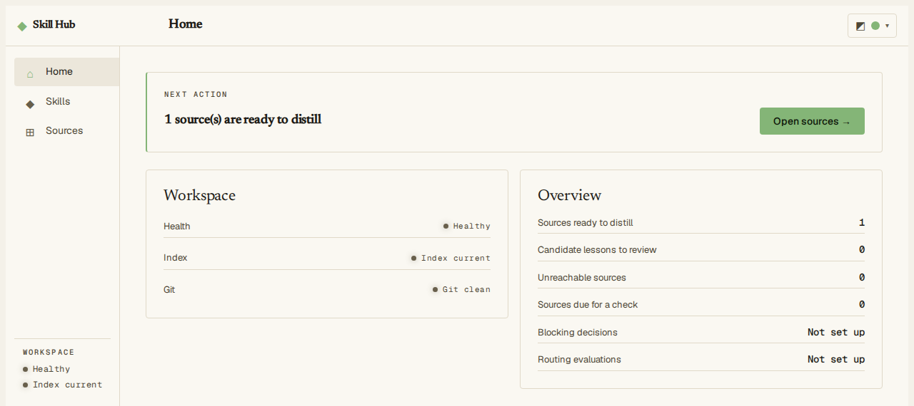

#### Find a skill

1. Open **Skills**.
2. Type part of a name or id in **Search**, or narrow the list with **Lifecycle** (draft, active, deprecated), **Collection** or **Upstream**.
3. Click a row to open the skill. The **Routing** column says whether agents can be recommended the skill (*Routable*) or not yet (*Not routed*).

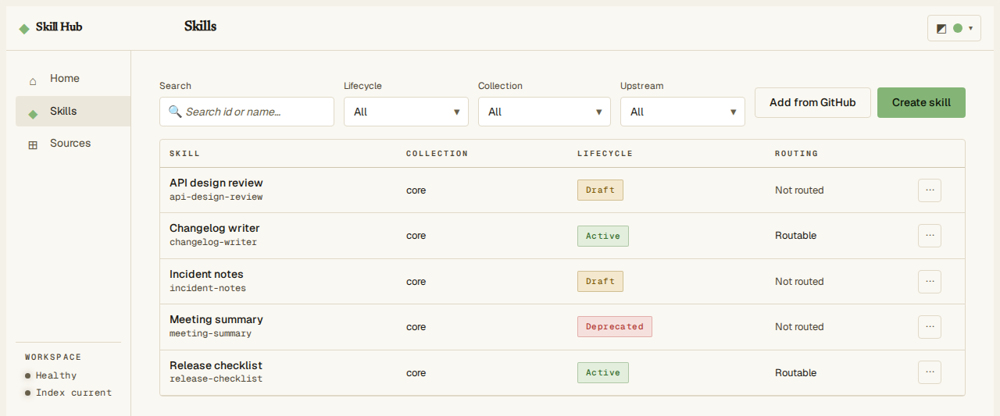

On a phone-width screen the same list stacks each skill into a card.

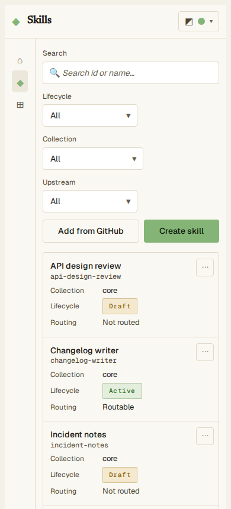

#### Check one skill

Open a skill; the **Review** tab opens first. *Validity* says whether the skill file follows the required format. *Activation readiness* lists what a draft needs before agents can use it. *In Git vs what agents see* tells you whether the search index matches the files.

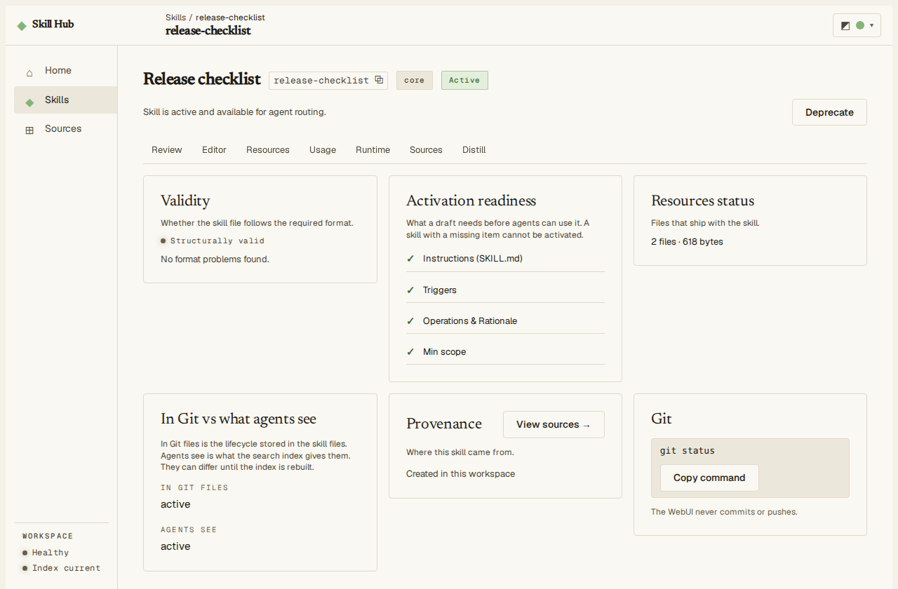

A skill you added from someone else's repository also shows a **Content trust** card. Agents get no content from such a skill until you have read it and approved it. Approval happens only in your terminal; the card shows the exact command to copy:

```bash
skillhub skill edit <skill-id> --approve-content <digest>
```

If a draft is not ready, the page says so next to the **Activate skill** button and each missing item has a **Go to field** link that opens the editor on the field to fill in.

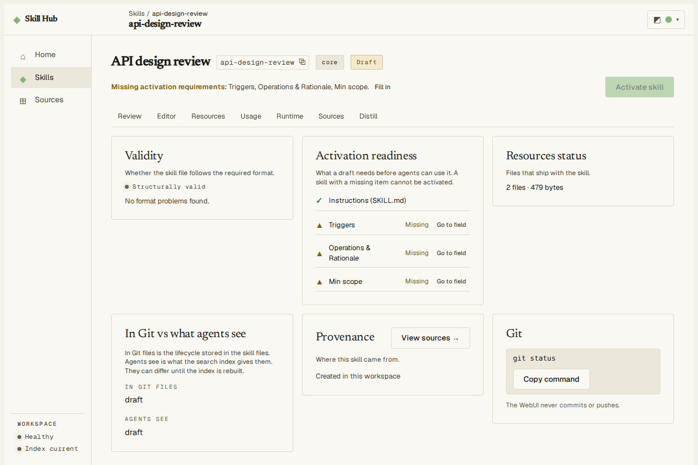

#### Activate, deprecate or archive a skill

1. Open the skill and click **Activate skill** (or **Deprecate** for an active one). The button stays off until the draft is ready.
2. A confirmation lists the files that will change and says in words what changes. Open **Exact file changes** to see the patch.
3. Click **Activate skill** in the confirmation to save, or **Cancel** to leave everything as it was.

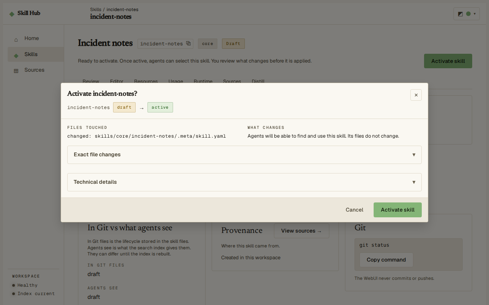

Skills move in order: draft, active, deprecated, archived. Archiving is done with `skillhub skill archive <skill-id>`.

#### Fix a skill's description and routing fields

1. Open the skill and choose the **Editor** tab.
2. Change the fields. Each routing field has a short explanation and an example under it. Your draft is kept in this browser while you work.
3. Click **Preview changes**. The dialog lists the files touched and describes the change in words.
4. Click **Save changes** to write it, or **Cancel**.

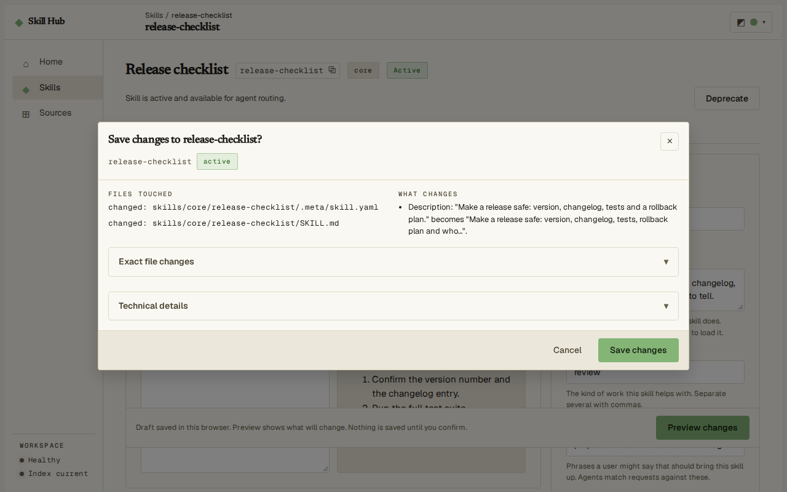

If the skill was changed somewhere else while the form was open (for example with the command line), a drawer opens when you preview. It shows what you changed and what changed meanwhile, and warns when both touched the same field. Choose **Keep my edits on the latest version** to apply your edits on top of the saved version, or **Discard my edits** to drop them. **Copy draft** and **Download draft** keep a copy of your text first.

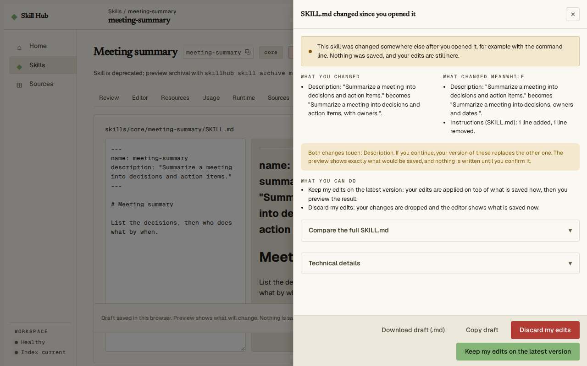

#### Create a skill

1. Open **Skills** and click **Create skill**.
2. Fill in the skill id, display name and description. The id cannot be changed later.
3. Fill in the routing fields (operations, triggers, not for, minimum scope). You can leave them empty now, but they are needed before the skill can be activated.
4. Click **Preview draft**, check the files that will be written, then confirm.

The new skill is a draft: agents do not use it until you activate it.

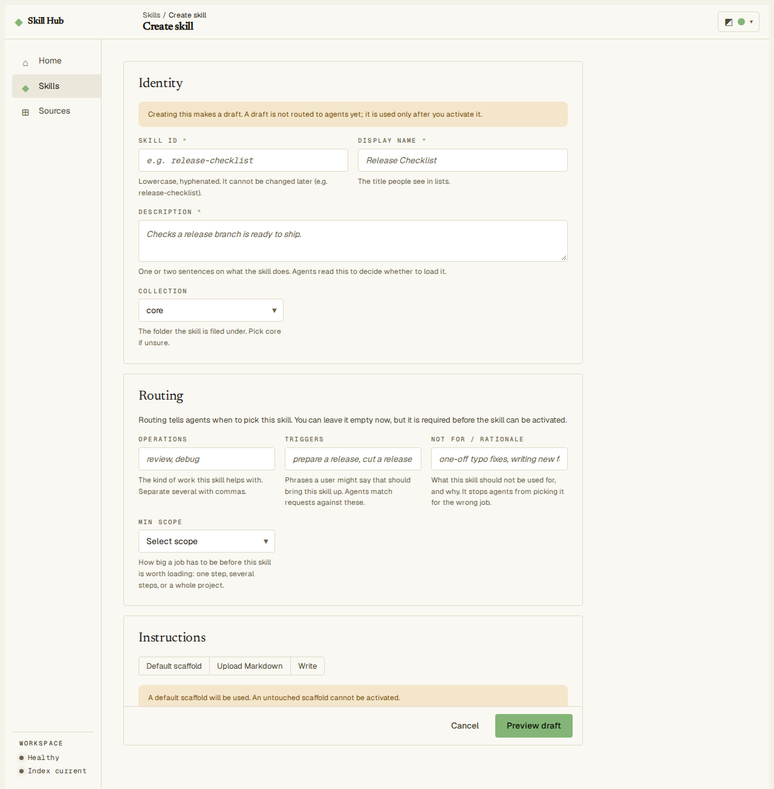

#### Add skills from GitHub

1. Open **Skills** and click **Add from GitHub**.
2. Paste the address of a public repository, or of a folder or file inside it, and click **Discover skills**. Discover only looks: it lists the skills it finds and writes nothing.
3. On the next step, read where the skills come from, the revision, the trust note, the files that would be written and any conflicts. Choose the skills (or **Import all**), then click **Confirm import**. Imported skills start as drafts and a third-party skill needs your content approval (see above) before agents receive it.

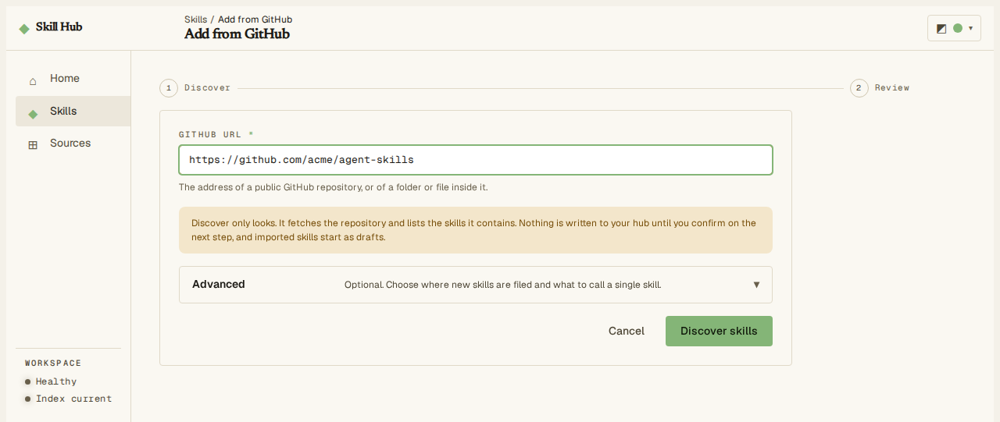

#### Act on upstream updates

A skill added from GitHub remembers where it came from. To see which ones have news:

1. In **Skills**, set **Upstream** to *Has an update*. To refresh the information first, run `skillhub skill outdated --check` in your terminal, or open a skill and click **Check now** in its *Upstream repository* section.
2. Open a skill marked *Update available* and click **Review update**.
3. For each changed file choose **Take upstream**, **Keep mine** or **Edit manually**, then click **Apply choices**.

#### Link and check sources

Open **Sources**. A source is a repository your skills learn from or track for updates. Each row shows when it was last checked and what its last check found; *Changed* means it has commits no skill has learned from yet. Use **Check now** on one row, **Check due sources** or **Check all** to look for news.

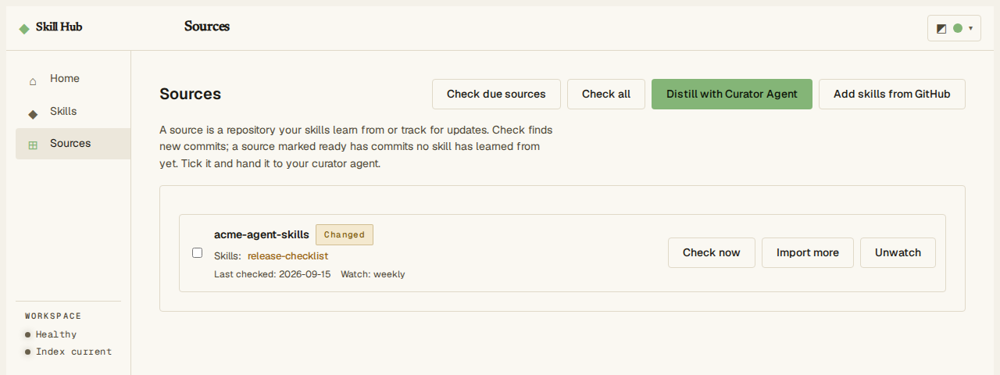

#### Hand a source to your curator agent

1. On **Sources**, tick the sources you want learned from and click **Distill with Curator Agent**.
2. Click **Copy handoff** and paste the text to your curator agent, an agent that has the distill-lab skill.
3. The agent records its lessons in each skill. Read them in the skill's **Distill** tab, where you decide what to keep.

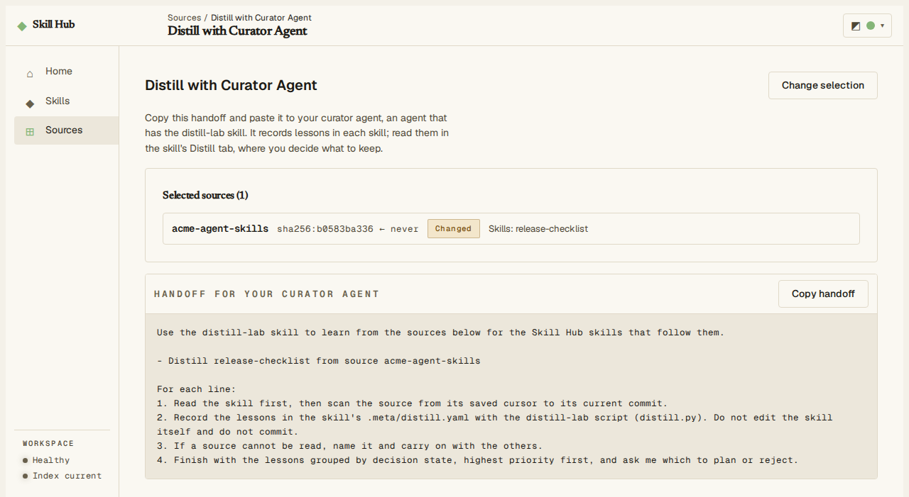

#### Change the theme

Use the appearance button at the top right of any screen to switch between light, dark and the system setting.

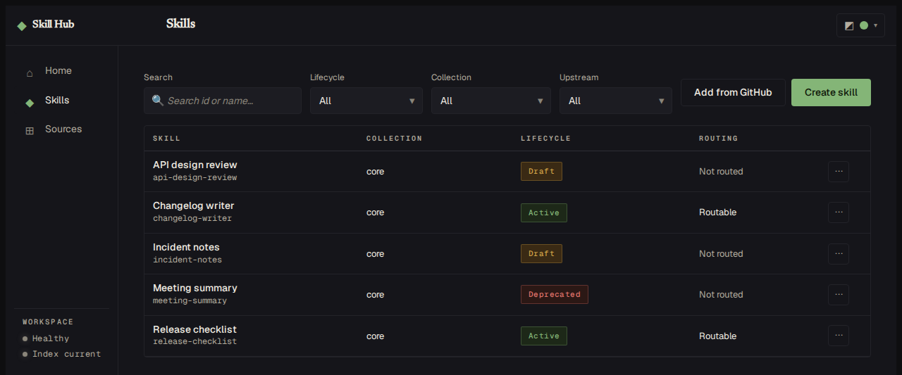

### Network Binding and Host Protection

- **Multi-IP environments:** When your computer has multiple non-loopback network interfaces (e.g. Wi-Fi, Ethernet, Docker bridges, or Tailscale/VPNs), `skillhub serve web` binds to `0.0.0.0` so you can access the UI across local interfaces. On single-interface machines, it binds strictly to `127.0.0.1`.
- **Force loopback:** To ensure the server binds exclusively to the local loopback address:
  ```bash
  skillhub serve web --loopback-only
  ```
- **Custom hostnames or reverse proxies:** Accessing the dashboard through custom domain names or reverse proxies requires passing `--allow-host <host[:port]>`. Requests with unapproved `Host` headers return `421 Misdirected Request` to protect against DNS rebinding attacks.
- **Port override:** To specify an explicit port or address:
  ```bash
  skillhub serve web --addr 127.0.0.1:8080
  ```
- **Plain HTTP warning:** The embedded server speaks unencrypted HTTP. Do not expose it to untrusted public networks without a TLS reverse proxy.

## Move to another machine

Your skills live in Git, so moving is a clone:

```bash
git clone <your-workspace-remote> ~/skillhub
skillhub rebuild --workspace ~/skillhub
cd your-project
skillhub connect --workspace ~/skillhub --yes    # or add -g
```

Push the workspace to a remote first. Skill Hub never pushes for you. Install the binary on the new machine as described in the README.
## Troubleshooting

**Something feels wrong.** Run:

```bash
skillhub doctor
```

`doctor` checks the workspace, the current project's connection, and global connections. Its text output prints the same repair commands as the JSON `suggested_actions`, including the command to restore a native curator that differs from the bundled version. If it lists repairs, preview and apply them:
Confirmed `doctor --fix --yes` also repairs already-registered hosts in the
current project and user scope **for this workspace**; it does not install extra
hosts or redirect connections belonging to another workspace. Blocked workspace
remediation leaves external connections unchanged.

```bash
skillhub doctor --fix
skillhub doctor --fix --yes
```

**Host approval and trust prompts after connect.**
When connecting Skill Hub to agent hosts, each host may prompt for permission on initial launch:
- **Claude Code:** The first project trust dialog lists `Bash(skillhub:*)`. Review that permission before trusting the folder. Commands containing `--yes` or `confirm` ask for approval; `--approve-content` is blocked by the installed rules. The host may separately ask to trust the stdio MCP command.
- **Codex / Gemini CLI:** Look for host trust prompts regarding newly added MCP tools or instruction files. Approve the `skillhub` server to allow tool resolution.

**Windows SmartScreen or unsigned binary warnings.**
Skill Hub binaries are checksum-verified and Sigstore-attested via GitHub CI. On Windows, Windows SmartScreen or antivirus may flag newly downloaded unsigned executables. Choose "More info" -> "Run anyway" if prompted, or verify the file's SHA-256 against `checksums.txt` published with the release.

**Windows firewall prompt on `serve web`.**
On Windows, when `skillhub serve web` binds to `0.0.0.0` on a multi-adapter machine, Windows Defender Firewall may display a prompt asking whether to allow network traffic. Click "Allow access" on private networks, or pass `--loopback-only` to bind strictly to `127.0.0.1` and avoid the firewall prompt entirely.

**`connect -g` refuses because of a symbolic link.**
The error states that a host integration path contains a symbolic link (for example, if `~/.claude` or `~/.agents` is symlinked). Skill Hub refuses to write through symlinks for security. Workarounds:
1. Connect per project instead: `cd your-project && skillhub connect --workspace ~/skillhub --yes`
2. Specify only unaffected hosts: `skillhub connect -g --host codex,gemini --workspace ~/skillhub --yes`
3. Replace the symlink with a real directory.

**The search index is stale or degraded.**
If you edit workspace files by hand, Skill Hub read commands (`skill list`, `skill show`, `status`) will automatically attempt an offline rebuild if canonical files validate. If validation fails or you want to rebuild manually, run:

```bash
skillhub validate    # shows exact file:line errors with fixes
skillhub rebuild
```

Rebuild checks an active skill's entrypoint at
`skills/<collection>/<id>/SKILL.md`, alongside—not inside—`.meta/`.
Missing or invalid frontmatter produces a servability warning: `name` must match
the skill ID and `description` must be non-empty. Fix the entrypoint and rebuild.
Hub metadata under `.meta/` is not counted as a distributed resource.

**Validating staged files before committing (`validate --staged`).**
To verify that staged commits are structurally valid without running into working-tree differences, run:

```bash
skillhub validate --staged
```

`validate --staged` reads literal stage-0 blobs directly from the Git index without applying working-tree filters or checkout modifications, and it never mutates the index or working tree. Skill Hub does not ship a proprietary hook installer (`skillhub hook install` does not exist). You can call this one-line command from any hook manager (Husky, Lefthook, pre-commit, or directly in `.git/hooks/pre-commit`):

```bash
#!/bin/sh
skillhub validate --staged
```

**Fresh clone or moving to a new machine.**
After cloning a workspace repository onto a new workstation (`git clone <remote> ~/skillhub`), runtime SQLite databases do not exist. Run `skillhub rebuild` once to validate the canonical Git files and compile a fresh catalog generation.

**Degraded MCP server startup.**
If the SQLite catalog generation is missing or corrupt when an agent host starts `skillhub mcp serve`, the server launches in degraded fallback mode. Diagnostic tools (`hub_status`, `skill_review`, `workspace_validate`, `workspace_rebuild`) remain operational so the agent can inspect and repair the hub, while routing tools return actionable errors without crashing the connection.
**"review_required" — third-party skill content withheld.**
Third-party skills (imported from GitHub or Git sources) require explicit human approval before agents receive instructions or files. To review and approve:
1. Inspect changes: `skillhub skill review <id> --verbose`
2. Approve content: `skillhub skill edit <id> --approve-content <digest>`

**"setup_failed" reported by an agent.**
An agent reported that a skill's script or tool failed due to a missing dependency. Run:
```bash
skillhub skill doctor <id>
```
to see which binary, environment variable, or setup check failed.

**Missing host permission entries.**
If agent hosts refuse to read or write into skill runtime folders, run:
```bash
skillhub doctor --fix --yes
```
This re-applies directory access permissions in `.claude/settings.local.json`, `.codex/config.toml`, or `.gemini/settings.json`.

**`local.path` expired in a long session.**
If temporary cache folders were cleaned up or expired during a multi-hour session, the agent simply calls `skill_get` again to export a fresh read-only snapshot.

**Telemetry is degraded.**
`skillhub telemetry health` reports an error such as "file is not a database". Telemetry is a disposable local record of usage. Discard and recreate it:

```bash
skillhub telemetry purge --yes
```

**"no workspace found".**
Connected projects auto-resolve the workspace. Outside a connected project, pass `--workspace <path>`, set `SKILLHUB_WORKSPACE`, or run the command inside the workspace directory.

**The agent does not see the hub.**
Restart the agent after `connect`. Check that the `skillhub` binary still exists at the path recorded in the registration file. If you moved the binary or workspace, run `skillhub connect` again.
## Command cheat sheet

| Task | Command |
|---|---|
| Create a workspace | `skillhub init [path] [--force] --yes` |
| Connect a project | `skillhub connect [--workspace <path>] --yes` |
| Connect all projects | `skillhub connect -g --workspace <path> --yes` |
| Health and next step | `skillhub status` |
| Diagnose and repair | `skillhub doctor [--fix [--yes]]` |
| Add a skill (GitHub or local) | `skillhub skill add <locator> [--skill <n>\|--all] [--yes]` |
| Create a draft | `skillhub skill create <id> --collection <c> --name <n> --description <d> [flags] [--yes]` |
| Review diagnostic facts | `skillhub skill review <id> [--verbose]` |
| Approve third-party content | `skillhub skill edit <id> --approve-content <digest>` |
| Edit instructions or metadata | `skillhub skill edit <id> [--description ...] [--editor] [--yes]` |
| Attach runtime block | `skillhub skill edit <id> --runtime-file <spec.yaml>` |
| Add routing examples | `skillhub skill edit <id> --example <text> / --counter-example <text>` |
| Test skill requirements | `skillhub skill doctor <id> [--json]` |
| Manage secret environment | `skillhub skill env set\|unset\|list <id> [<KEY>]` |
| Confirm a proposal | `skillhub skill confirm <proposal-id>` |
| List skills | `skillhub skill list [--state <state>]` |
| Read a skill (any state) | `skillhub skill show <id>` |
| Change lifecycle state | `skillhub skill activate\|deprecate\|archive <id> [--yes]` |
| Check skill drift from upstream | `skillhub skill outdated [--check] [--all] [--exit-code] [--json]` |
| Inspect upstream details | `skillhub skill upstream <id> [--check] [--json]` |
| Apply upstream 3-way update | `skillhub skill update <id> [--yes] [--json]` |
| List candidates, sources, groups | `skillhub source list [--status <s>]` |
| Watch and link learning source | `skillhub source watch <locator> --skill-id <id> [--cadence <c>] [--yes]` |
| Attach learning reference | `skillhub source attach <source-id\|url> --skill-id <id> [--yes]` |
| Detach learning reference | `skillhub source detach <source-id> --skill-id <id> [--yes]` |
| Stop watching source | `skillhub source unwatch <source-id> [--yes]` |
| Backfill legacy provenance | `skillhub source backfill [--skill <id>] [--yes]` |
| Check watched sources for updates | `skillhub source check --all-due` or `--all` (alias: `skillhub check`) |
| Review the inbox | `skillhub inbox` |
| Act on an insight | `skillhub insight show\|decide\|apply\|confirm` |
| Save an intake candidate | `skillhub source capture <url> --reason <text>` |
| Triage candidate sources | `skillhub source triage <id> --decision accept\|defer\|reject\|import ...` |
| Import skills from source | `skillhub source import <locator\|source-id> [--ref <r>] [--path <subdir>] [--skill <name>\|--all] [--yes]` |
| Ask for a skill recommendation | `skillhub resolve --request <file>` |
| Evaluate routing quality | `skillhub eval routing [--no-skill <file>] [--policy <file>]` |
| See uncommitted changes | `skillhub diff` |
| Validate canonical files | `skillhub validate` |
| Validate staged Git index | `skillhub validate --staged` |
| Rebuild search catalog | `skillhub rebuild [--verbose]` |
| Inspect funnel usage | `skillhub telemetry funnel [--since <Nd\|YYYY-MM-DD>]` |
| Import local transcripts | `skillhub telemetry import-transcripts --project <dir>` |
| Telemetry inspection | `skillhub telemetry health\|export\|purge --yes` |
| Update binary in place | `skillhub update [--yes]` |
| Migrate file format | `skillhub migrate [--to <n>] [--yes]` |
| Version | `skillhub version` |

Most commands accept `--workspace <path>` and `--json`.
